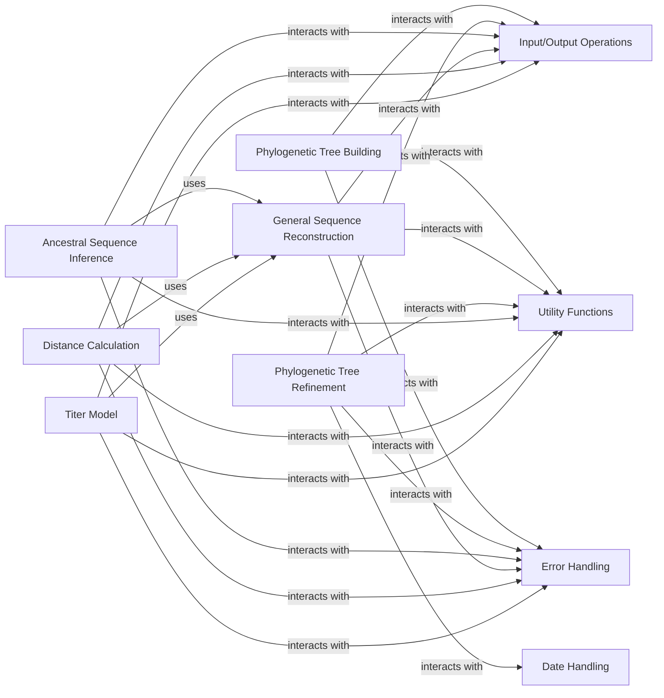

## Details

The `Phylogenetic Tree Operations` subsystem in `augur` is a comprehensive suite for the construction, refinement, and analysis of phylogenetic trees. It encompasses the core algorithms for tree inference, methods for enhancing tree quality and incorporating temporal data, and functionalities for reconstructing ancestral genetic information. This subsystem is designed to provide a robust framework for evolutionary analysis, from raw sequence data to insightful evolutionary models.

### Phylogenetic Tree Building
Responsible for the de novo construction of phylogenetic trees from sequence alignments. This includes algorithms for generating tree topologies and branch lengths, and preparing input data by masking sites in multiple sequence alignments.

**Related Classes/Methods**:

- <a href="https://github.com/nextstrain/augur/augur/tree.py#L1-L1" target="_blank" rel="noopener noreferrer">`augur/tree.py` (1:1)</a>
- <a href="https://github.com/nextstrain/augur/augur/mask.py#L1-L1" target="_blank" rel="noopener noreferrer">`augur/mask.py` (1:1)</a>

### Phylogenetic Tree Refinement
Focuses on enhancing and adjusting existing phylogenetic trees. Its functionalities include rooting the tree, incorporating and handling date information for time-resolved phylogenies, and collecting node-specific data.

**Related Classes/Methods**:

- <a href="https://github.com/nextstrain/augur/augur/refine.py#L1-L1" target="_blank" rel="noopener noreferrer">`augur/refine.py` (1:1)</a>

### Ancestral Sequence Inference
Dedicated to inferring the genetic sequences of ancestral nodes within a phylogenetic tree and identifying mutations along branches.

**Related Classes/Methods**:

- <a href="https://github.com/nextstrain/augur/augur/ancestral.py#L1-L1" target="_blank" rel="noopener noreferrer">`augur/ancestral.py` (1:1)</a>

### General Sequence Reconstruction
Provides a generalized capability for reconstructing sequences for internal nodes of a tree or other specific purposes. It serves as a lower-level utility that other components, like ancestral inference, distance calculation, or titer modeling, might leverage.

**Related Classes/Methods**:

- <a href="https://github.com/nextstrain/augur/augur/reconstruct_sequences.py#L1-L1" target="_blank" rel="noopener noreferrer">`augur/reconstruct_sequences.py` (1:1)</a>

### Input/Output Operations
Centralizes and manages all file-related operations, including reading and writing various data formats (FASTA, VCF, metadata, JSON) and executing shell commands for external tool integration.

**Related Classes/Methods**:

- <a href="https://github.com/nextstrain/augur/augur/io/sequences.py#L1-L1" target="_blank" rel="noopener noreferrer">`augur/io/sequences.py` (1:1)</a>
- <a href="https://github.com/nextstrain/augur/augur/io/metadata.py#L1-L1" target="_blank" rel="noopener noreferrer">`augur/io/metadata.py` (1:1)</a>
- <a href="https://github.com/nextstrain/augur/augur/io/file.py#L1-L1" target="_blank" rel="noopener noreferrer">`augur/io/file.py` (1:1)</a>
- <a href="https://github.com/nextstrain/augur/augur/io/shell_command_runner.py#L1-L1" target="_blank" rel="noopener noreferrer">`augur/io/shell_command_runner.py` (1:1)</a>
- <a href="https://github.com/nextstrain/augur/augur/io/print.py#L1-L1" target="_blank" rel="noopener noreferrer">`augur/io/print.py` (1:1)</a>
- <a href="https://github.com/nextstrain/augur/augur/io/json.py#L1-L1" target="_blank" rel="noopener noreferrer">`augur/io/json.py` (1:1)</a>
- <a href="https://github.com/nextstrain/augur/augur/io/strains.py#L1-L1" target="_blank" rel="noopener noreferrer">`augur/io/strains.py` (1:1)</a>
- <a href="https://github.com/nextstrain/augur/augur/io/__init__.py#L1-L1" target="_blank" rel="noopener noreferrer">`augur/io/__init__.py` (1:1)</a>

### Utility Functions
Provides a comprehensive collection of general-purpose utility functions, including reading tree files, parsing command-line arguments, loading genomic features, and general data structures.

**Related Classes/Methods**:

- <a href="https://github.com/nextstrain/augur/augur/utils.py#L1-L1" target="_blank" rel="noopener noreferrer">`augur/utils.py` (1:1)</a>
- <a href="https://github.com/nextstrain/augur/augur/argparse_.py#L1-L1" target="_blank" rel="noopener noreferrer">`augur/argparse_.py` (1:1)</a>
- <a href="https://github.com/nextstrain/augur/augur/types.py#L1-L1" target="_blank" rel="noopener noreferrer">`augur/types.py` (1:1)</a>
- `augur/data.py` (1:1)
- <a href="https://github.com/nextstrain/augur/augur/version.py#L1-L1" target="_blank" rel="noopener noreferrer">`augur/version.py` (1:1)</a>
- <a href="https://github.com/nextstrain/augur/augur/debug.py#L1-L1" target="_blank" rel="noopener noreferrer">`augur/debug.py` (1:1)</a>
- <a href="https://github.com/nextstrain/augur/augur/util_support/node_data_file.py#L1-L1" target="_blank" rel="noopener noreferrer">`augur/util_support/node_data_file.py` (1:1)</a>
- <a href="https://github.com/nextstrain/augur/augur/util_support/node_data_reader.py#L1-L1" target="_blank" rel="noopener noreferrer">`augur/util_support/node_data_reader.py` (1:1)</a>
- <a href="https://github.com/nextstrain/augur/augur/util_support/auspice_config.py#L1-L1" target="_blank" rel="noopener noreferrer">`augur/util_support/auspice_config.py` (1:1)</a>
- <a href="https://github.com/nextstrain/augur/augur/util_support/warnings.py#L1-L1" target="_blank" rel="noopener noreferrer">`augur/util_support/warnings.py` (1:1)</a>
- <a href="https://github.com/nextstrain/augur/augur/util_support/color_parser.py#L1-L1" target="_blank" rel="noopener noreferrer">`augur/util_support/color_parser.py` (1:1)</a>

### Error Handling
Defines and manages custom error types, primarily `AugurError`, used consistently across the project for specific issues and exceptions.

**Related Classes/Methods**:

- <a href="https://github.com/nextstrain/augur/augur/errors.py#L1-L1" target="_blank" rel="noopener noreferrer">`augur/errors.py` (1:1)</a>

### Date Handling
Specializes in managing date-related operations, including parsing, validating, and handling ambiguous dates, and defining date-specific error types.

**Related Classes/Methods**:

- `augur/dates.py` (1:1)
- <a href="https://github.com/nextstrain/augur/augur/dates/ambiguous_date.py#L1-L1" target="_blank" rel="noopener noreferrer">`augur/dates/ambiguous_date.py` (1:1)</a>
- <a href="https://github.com/nextstrain/augur/augur/dates/errors.py#L1-L1" target="_blank" rel="noopener noreferrer">`augur/dates/errors.py` (1:1)</a>

### Distance Calculation
Responsible for calculating genetic distances between sequences, often leveraging reconstructed sequences from the `General Sequence Reconstruction` component.

**Related Classes/Methods**:

- <a href="https://github.com/nextstrain/augur/augur/distance.py#L1-L1" target="_blank" rel="noopener noreferrer">`augur/distance.py` (1:1)</a>

### Titer Model
Implements models related to antibody titers, which are measures of antibody concentration. It can utilize reconstructed sequences to infer or model changes in antigenic properties over time.

**Related Classes/Methods**:

- <a href="https://github.com/nextstrain/augur/augur/titer_model.py#L1-L1" target="_blank" rel="noopener noreferrer">`augur/titer_model.py` (1:1)</a>
- <a href="https://github.com/nextstrain/augur/augur/titers.py#L1-L1" target="_blank" rel="noopener noreferrer">`augur/titers.py` (1:1)</a>

### [FAQ](https://github.com/CodeBoarding/GeneratedOnBoardings/tree/main?tab=readme-ov-file#faq)