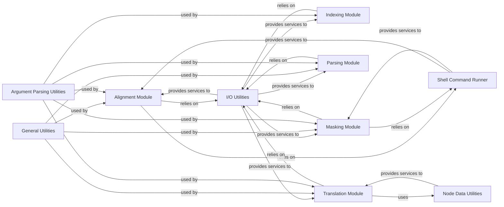

## Details

To perform fundamental bioinformatics operations on genetic sequences, including alignment, masking, parsing, translation, and indexing, ensuring efficient and accurate data handling for downstream analyses.

### Alignment Module
This module is responsible for preparing, aligning, and post-processing genetic sequences. It handles reading and validating input sequences, managing reference strains, generating alignment commands for external tools, and refining the alignment output.

**Related Classes/Methods**:

- <a href="https://github.com/nextstrain/augur/augur/align.py#L0-L0" target="_blank" rel="noopener noreferrer">`augur.align` (0:0)</a>

### Indexing Module
This component focuses on creating indices for VCF (Variant Call Format) and FASTA sequence files. Indexing facilitates quick and efficient access to specific data points within large genomic datasets.

**Related Classes/Methods**:

- <a href="https://github.com/nextstrain/augur/augur/index.py#L0-L0" target="_blank" rel="noopener noreferrer">`augur.index` (0:0)</a>

### Masking Module
The Masking Module provides functionalities to mask specific regions within genetic sequences, applicable to both VCF and FASTA formats. This is crucial for excluding problematic or uninformative sites from downstream analyses.

**Related Classes/Methods**:

- <a href="https://github.com/nextstrain/augur/augur/mask.py#L0-L0" target="_blank" rel="noopener noreferrer">`augur.mask` (0:0)</a>

### Parsing Module
This module is dedicated to parsing and standardizing sequence metadata, particularly focusing on date formats. It ensures data consistency, which is vital for accurate phylogenetic and epidemiological analyses.

**Related Classes/Methods**:

- <a href="https://github.com/nextstrain/augur/augur/parse.py#L0-L0" target="_blank" rel="noopener noreferrer">`augur.parse` (0:0)</a>

### Translation Module
This component handles the translation of nucleotide sequences into amino acid sequences. It supports both FASTA and VCF inputs and manages gene feature information to accurately assign amino acid mutations.

**Related Classes/Methods**:

- <a href="https://github.com/nextstrain/augur/augur/translate.py#L0-L0" target="_blank" rel="noopener noreferrer">`augur.translate` (0:0)</a>

### I/O Utilities
This is a foundational component that provides a unified interface for all input/output operations. It includes functionalities for reading and writing various sequence formats (FASTA, VCF), general file handling, and printing.

**Related Classes/Methods**:

- `augur.io` (0:0)
- <a href="https://github.com/nextstrain/augur/augur/io/sequences.py#L0-L0" target="_blank" rel="noopener noreferrer">`augur.io.sequences` (0:0)</a>
- <a href="https://github.com/nextstrain/augur/augur/io/file.py#L0-L0" target="_blank" rel="noopener noreferrer">`augur.io.file` (0:0)</a>
- <a href="https://github.com/nextstrain/augur/augur/io/print.py#L0-L0" target="_blank" rel="noopener noreferrer">`augur.io.print` (0:0)</a>
- <a href="https://github.com/nextstrain/augur/augur/io/metadata.py#L0-L0" target="_blank" rel="noopener noreferrer">`augur.io.metadata` (0:0)</a>
- <a href="https://github.com/nextstrain/augur/augur/io/strains.py#L0-L0" target="_blank" rel="noopener noreferrer">`augur.io.strains` (0:0)</a>

### Shell Command Runner
A specialized utility that handles the execution of external shell commands. This is crucial for integrating `augur` with external bioinformatics tools like `MAFFT` for alignment or `GATK` for VCF processing.

**Related Classes/Methods**:

- <a href="https://github.com/nextstrain/augur/augur/io/shell_command_runner.py#L0-L0" target="_blank" rel="noopener noreferrer">`augur.io.shell_command_runner` (0:0)</a>

### General Utilities
This module serves as a collection of common helper functions used across different `augur` components. It includes utilities for loading configuration, parsing arguments, reading and writing JSON data, and transforming data structures.

**Related Classes/Methods**:

- <a href="https://github.com/nextstrain/augur/augur/utils.py#L0-L0" target="_blank" rel="noopener noreferrer">`augur.utils` (0:0)</a>

### Argument Parsing Utilities
Provides a standardized and consistent way to parse command-line arguments for all `augur` commands, ensuring a uniform user interface and robust argument validation.

**Related Classes/Methods**:

- <a href="https://github.com/nextstrain/augur/augur/argparse_.py#L0-L0" target="_blank" rel="noopener noreferrer">`augur.argparse_` (0:0)</a>

### Node Data Utilities
Handles the reading, writing, and processing of node-specific data files, which often contain annotations or features associated with specific nodes in a phylogenetic tree (e.g., gene features for translation).

**Related Classes/Methods**:

- <a href="https://github.com/nextstrain/augur/augur/util_support/node_data_file.py#L0-L0" target="_blank" rel="noopener noreferrer">`augur.util_support.node_data_file` (0:0)</a>
- <a href="https://github.com/nextstrain/augur/augur/util_support/node_data_reader.py#L0-L0" target="_blank" rel="noopener noreferrer">`augur.util_support.node_data_reader` (0:0)</a>

### [FAQ](https://github.com/CodeBoarding/GeneratedOnBoardings/tree/main?tab=readme-ov-file#faq)