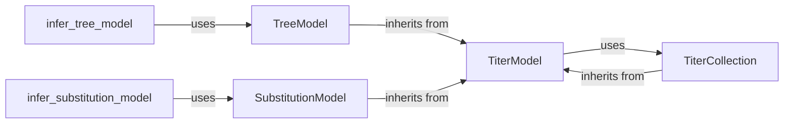

## Details

The `Titer Modeling` subsystem in `augur` provides a robust framework for inferring and analyzing models from serological titer data, which is critical for vaccine development and immune escape studies. This subsystem is built around a core set of components that abstract the modeling process, handle data management, and orchestrate the overall workflow.

### TiterModel
This is the abstract base class that defines the common interface and core functionalities for all titer models. It provides methods for assigning, preparing, training, validating, and compiling titer-related data. It encapsulates the general machine learning aspects of fitting models to titer data, including various regularization techniques. It serves as the blueprint for specific titer modeling approaches.

**Related Classes/Methods**:

- <a href="https://github.com/nextstrain/augur/augur/titer_model.py#L345-L708" target="_blank" rel="noopener noreferrer">`augur.titer_model.TiterModel` (345:708)</a>

### TreeModel
A concrete implementation of `TiterModel` that specializes in modeling titers based on phylogenetic tree structures. It prepares tree-specific features, trains the model using these features, and predicts titers by considering evolutionary relationships.

**Related Classes/Methods**:

- <a href="https://github.com/nextstrain/augur/augur/titer_model.py#L719-L924" target="_blank" rel="noopener noreferrer">`augur.titer_model.TreeModel` (719:924)</a>

### SubstitutionModel
Another concrete implementation of `TiterModel` that models titers based on amino acid or nucleotide substitutions. It identifies relevant mutations, constructs sequence graphs, and trains models to predict titers from these substitutions, focusing on the direct impact of genetic changes.

**Related Classes/Methods**:

- <a href="https://github.com/nextstrain/augur/augur/titer_model.py#L931-L1156" target="_blank" rel="noopener noreferrer">`augur.titer_model.SubstitutionModel` (931:1156)</a>

### TiterCollection
This class is primarily responsible for loading, managing, and normalizing raw serological titer data. It acts as a data container and provides essential methods for filtering strains, determining autologous titers, and performing census operations on the titer data before it is used by `TiterModel` instances. Notably, it inherits from `TiterModel`, suggesting it might also expose some model-like interfaces or be designed to integrate seamlessly within the `TiterModel` ecosystem.

**Related Classes/Methods**:

- <a href="https://github.com/nextstrain/augur/augur/titer_model.py#L13-L342" target="_blank" rel="noopener noreferrer">`augur.titer_model.TiterCollection` (13:342)</a>

### infer_substitution_model
This function orchestrates the entire workflow for inferring a substitution model. It handles the high-level steps, including loading alignments, initializing and preparing a `SubstitutionModel` instance, training it, and then compiling and writing the results to output files.

**Related Classes/Methods**:

- <a href="https://github.com/nextstrain/augur/augur/titers.py#L1-L1" target="_blank" rel="noopener noreferrer">`augur.titers.infer_substitution_model.run` (1:1)</a>

### infer_tree_model
Similar to `infer_substitution_model`, this function orchestrates the inference of a tree model. It manages the initialization and preparation of a `TreeModel` instance, its training, and the subsequent compilation and writing of the results.

**Related Classes/Methods**:

- <a href="https://github.com/nextstrain/augur/augur/titers.py#L1-L1" target="_blank" rel="noopener noreferrer">`augur.titers.infer_tree_model.run` (1:1)</a>

### [FAQ](https://github.com/CodeBoarding/GeneratedOnBoardings/tree/main?tab=readme-ov-file#faq)