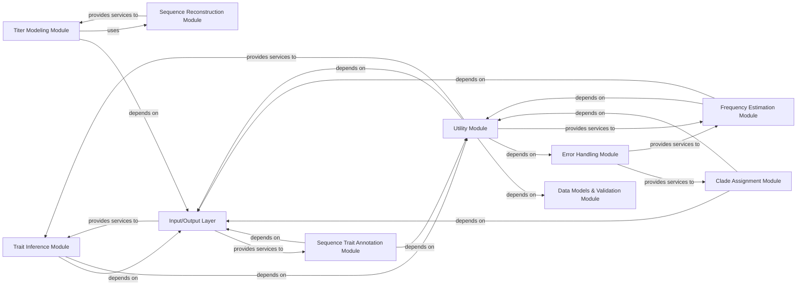

## Details

Abstract Components Overview

### Trait Inference Module
This module is responsible for inferring ancestral states of discrete or continuous traits onto phylogenetic tree nodes and labeling branches based on these inferences. It is a core component for understanding the evolutionary history of specific characteristics, such as geographic location or host.

**Related Classes/Methods**:

- <a href="https://github.com/nextstrain/augur/blob/master/augur/traits.py" target="_blank" rel="noopener noreferrer">`augur.traits`</a>

### Sequence Trait Annotation Module
This module focuses on annotating sequences with specific traits, often derived from external data sources like VCF files or other feature definitions. It enriches raw sequence data with relevant biological or epidemiological information, preparing it for downstream analyses.

**Related Classes/Methods**:

- <a href="https://github.com/nextstrain/augur/blob/master/augur/sequence_traits.py" target="_blank" rel="noopener noreferrer">`augur.sequence_traits`</a>

### Clade Assignment Module
This module identifies and assigns clades (monophyletic groups) within a phylogenetic tree based on predefined rules or ancestral state inferences. It parses clade definitions and annotates tree nodes with their respective clade assignments, which is crucial for epidemiological tracking and analysis of specific lineages.

**Related Classes/Methods**:

- <a href="https://github.com/nextstrain/augur/blob/master/augur/clades.py" target="_blank" rel="noopener noreferrer">`augur.clades`</a>

### Frequency Estimation Module
This module estimates the frequencies of various biological entities (e.g., clades, genotypes, mutations) over time. It provides different estimation models, including kernel density estimation (KDE) and models based on tree or alignment data, enabling the tracking of population dynamics and the prevalence of specific traits or lineages.

**Related Classes/Methods**:

- <a href="https://github.com/nextstrain/augur/blob/master/augur/frequencies.py" target="_blank" rel="noopener noreferrer">`augur.frequencies`</a>
- <a href="https://github.com/nextstrain/augur/blob/master/augur/frequency_estimators.py" target="_blank" rel="noopener noreferrer">`augur.frequency_estimators`</a>

### Titer Modeling Module
This component focuses on modeling and predicting antibody titers, which are crucial in immunology and vaccine development. It includes classes for managing titer data and different models (tree-based, substitution-based) for prediction, allowing for the analysis of immune response and vaccine effectiveness.

**Related Classes/Methods**:

- <a href="https://github.com/nextstrain/augur/blob/master/augur/titer_model.py" target="_blank" rel="noopener noreferrer">`augur.titer_model`</a>
- <a href="https://github.com/nextstrain/augur/blob/master/augur/titers.py" target="_blank" rel="noopener noreferrer">`augur.titers`</a>

### Input/Output Layer
This foundational component handles all data reading from and writing to various file formats, ensuring seamless data flow throughout the pipeline. It abstracts away file system interactions.

**Related Classes/Methods**:

- `augur.io`

### Utility Module
Provides a collection of common helper functions, data manipulation utilities, and date-related operations used across various core components. This promotes code reusability and consistency.

**Related Classes/Methods**:

- `augur.util_support`
- `augur.dates`

### Error Handling Module
Manages and processes errors within the system, providing a centralized mechanism for reporting and handling exceptions to ensure robust and user-friendly operation.

**Related Classes/Methods**:

- <a href="https://github.com/nextstrain/augur/blob/master/augur/errors.py" target="_blank" rel="noopener noreferrer">`augur.errors`</a>

### Data Models & Validation Module
Defines data structures, enumerations, and schemas for input and output validation, ensuring data consistency and integrity across different stages of the analysis pipeline.

**Related Classes/Methods**:

- <a href="https://github.com/nextstrain/augur/blob/master/augur/types.py" target="_blank" rel="noopener noreferrer">`augur.types`</a>
- `augur.data`

### Sequence Reconstruction Module
Provides functionality for ancestral sequence reconstruction, a process of inferring the genetic sequences of ancestral organisms based on their descendants. This is often a prerequisite for downstream evolutionary analyses.

**Related Classes/Methods**:

- <a href="https://github.com/nextstrain/augur/blob/master/augur/reconstruct_sequences.py" target="_blank" rel="noopener noreferrer">`augur.reconstruct_sequences`</a>

### [FAQ](https://github.com/CodeBoarding/GeneratedOnBoardings/tree/main?tab=readme-ov-file#faq)