```mermaid
graph LR
    CLI_Core_Orchestration["CLI & Core Orchestration"]
    Data_Management_I_O["Data Management & I/O"]
    Data_Preprocessing["Data Preprocessing"]
    Sequence_Processing["Sequence Processing"]
    Phylogenetic_Tree_Operations["Phylogenetic Tree Operations"]
    Metadata_Trait_Annotation["Metadata & Trait Annotation"]
    Epidemiological_Analysis["Epidemiological Analysis"]
    Titer_Modeling["Titer Modeling"]
    Data_Export_Visualization_Preparation["Data Export & Visualization Preparation"]
    CLI_Core_Orchestration -- "Orchestrates" --> Data_Management_I_O
    CLI_Core_Orchestration -- "Orchestrates" --> Data_Preprocessing
    CLI_Core_Orchestration -- "Orchestrates" --> Sequence_Processing
    CLI_Core_Orchestration -- "Orchestrates" --> Phylogenetic_Tree_Operations
    CLI_Core_Orchestration -- "Orchestrates" --> Metadata_Trait_Annotation
    CLI_Core_Orchestration -- "Orchestrates" --> Epidemiological_Analysis
    CLI_Core_Orchestration -- "Orchestrates" --> Titer_Modeling
    CLI_Core_Orchestration -- "Orchestrates" --> Data_Export_Visualization_Preparation
    CLI_Core_Orchestration -- "Invokes" --> Data_Management_I_O
    Data_Management_I_O -- "Provides I/O support to" --> CLI_Core_Orchestration
    Data_Management_I_O -- "Provides I/O support to" --> Data_Preprocessing
    Data_Management_I_O -- "Provides I/O support to" --> Sequence_Processing
    Data_Management_I_O -- "Provides I/O support to" --> Phylogenetic_Tree_Operations
    Data_Management_I_O -- "Provides I/O support to" --> Metadata_Trait_Annotation
    Data_Management_I_O -- "Provides I/O support to" --> Epidemiological_Analysis
    Data_Management_I_O -- "Provides I/O support to" --> Titer_Modeling
    Data_Management_I_O -- "Provides I/O support to" --> Data_Export_Visualization_Preparation
    Data_Preprocessing -- "Receives raw data from" --> Data_Management_I_O
    Data_Preprocessing -- "Provides prepared data to" --> Sequence_Processing
    Data_Preprocessing -- "Provides prepared data to" --> Phylogenetic_Tree_Operations
    Data_Preprocessing -- "Provides prepared data to" --> Metadata_Trait_Annotation
    Sequence_Processing -- "Receives sequences from" --> Data_Preprocessing
    Sequence_Processing -- "Receives sequences from" --> Data_Management_I_O
    Sequence_Processing -- "Generates aligned sequences for" --> Phylogenetic_Tree_Operations
    Phylogenetic_Tree_Operations -- "Receives aligned sequences from" --> Sequence_Processing
    Phylogenetic_Tree_Operations -- "Produces trees and ancestral data for" --> Metadata_Trait_Annotation
    Phylogenetic_Tree_Operations -- "Produces trees and ancestral data for" --> Epidemiological_Analysis
    Phylogenetic_Tree_Operations -- "Produces trees and ancestral data for" --> Titer_Modeling
    Phylogenetic_Tree_Operations -- "Produces trees and ancestral data for" --> Data_Export_Visualization_Preparation
    Metadata_Trait_Annotation -- "Receives trees and ancestral data from" --> Phylogenetic_Tree_Operations
    Metadata_Trait_Annotation -- "Receives metadata from" --> Data_Preprocessing
    Metadata_Trait_Annotation -- "Contributes annotated data to" --> Data_Export_Visualization_Preparation
    Epidemiological_Analysis -- "Receives trees and associated data from" --> Phylogenetic_Tree_Operations
    Epidemiological_Analysis -- "Contributes analytical results to" --> Data_Export_Visualization_Preparation
    Titer_Modeling -- "Receives tree data from" --> Phylogenetic_Tree_Operations
    Titer_Modeling -- "Receives titer data from" --> Data_Management_I_O
    Titer_Modeling -- "Contributes model results to" --> Data_Export_Visualization_Preparation
    Data_Export_Visualization_Preparation -- "Gathers data from" --> Phylogenetic_Tree_Operations
    Data_Export_Visualization_Preparation -- "Gathers data from" --> Metadata_Trait_Annotation
    Data_Export_Visualization_Preparation -- "Gathers data from" --> Epidemiological_Analysis
    Data_Export_Visualization_Preparation -- "Gathers data from" --> Titer_Modeling
    Data_Export_Visualization_Preparation -- "Outputs final JSON via" --> Data_Management_I_O
    Data_Export_Visualization_Preparation -- "Validated by" --> Data_Management_I_O
    click CLI_Core_Orchestration href "https://github.com/CodeBoarding/GeneratedOnBoardings/blob/main/augur/CLI_Core_Orchestration.md" "Details"
    click Data_Management_I_O href "https://github.com/CodeBoarding/GeneratedOnBoardings/blob/main/augur/Data_Management_I_O.md" "Details"
    click Data_Preprocessing href "https://github.com/CodeBoarding/GeneratedOnBoardings/blob/main/augur/Data_Preprocessing.md" "Details"
    click Sequence_Processing href "https://github.com/CodeBoarding/GeneratedOnBoardings/blob/main/augur/Sequence_Processing.md" "Details"
    click Phylogenetic_Tree_Operations href "https://github.com/CodeBoarding/GeneratedOnBoardings/blob/main/augur/Phylogenetic_Tree_Operations.md" "Details"
    click Metadata_Trait_Annotation href "https://github.com/CodeBoarding/GeneratedOnBoardings/blob/main/augur/Metadata_Trait_Annotation.md" "Details"
    click Epidemiological_Analysis href "https://github.com/CodeBoarding/GeneratedOnBoardings/blob/main/augur/Epidemiological_Analysis.md" "Details"
    click Titer_Modeling href "https://github.com/CodeBoarding/GeneratedOnBoardings/blob/main/augur/Titer_Modeling.md" "Details"
    click Data_Export_Visualization_Preparation href "https://github.com/CodeBoarding/GeneratedOnBoardings/blob/main/augur/Data_Export_Visualization_Preparation.md" "Details"
```

## Details

High-level data flow overview for `augur`, consolidating insights from the CFG and source code analysis into 9 core components.

### CLI & Core Orchestration [[Expand]](./CLI_Core_Orchestration.md)
Serves as the central command-line interface, parsing user arguments, validating inputs, and orchestrating the execution flow by dispatching commands to the appropriate functional modules. It also manages global error reporting and configuration.

**Related Classes/Methods**:

- <a href="https://github.com/nextstrain/augur/augur/__main__.py#L1-L1" target="_blank" rel="noopener noreferrer">`augur.__main__` (1:1)</a>
- `augur.run` (1:1)
- <a href="https://github.com/nextstrain/augur/augur/argparse_.py#L1-L1" target="_blank" rel="noopener noreferrer">`augur.argparse_` (1:1)</a>
- <a href="https://github.com/nextstrain/augur/augur/errors.py#L1-L1" target="_blank" rel="noopener noreferrer">`augur.errors` (1:1)</a>
- <a href="https://github.com/nextstrain/augur/augur/types.py#L1-L1" target="_blank" rel="noopener noreferrer">`augur.types` (1:1)</a>

### Data Management & I/O [[Expand]](./Data_Management_I_O.md)
Provides foundational services for all data-related operations, including reading and writing various file formats (sequences, metadata, JSON, VCF), executing external shell commands, handling date parsing and validation, and importing data from external tools (e.g., BEAST). It also manages specialized measurement data and ensures data integrity through validation.

**Related Classes/Methods**:

- `augur.io` (1:1)
- <a href="https://github.com/nextstrain/augur/augur/utils.py#L1-L1" target="_blank" rel="noopener noreferrer">`augur.utils` (1:1)</a>
- `augur.data` (1:1)
- `augur.dates` (1:1)
- <a href="https://github.com/nextstrain/augur/augur/validate.py#L1-L1" target="_blank" rel="noopener noreferrer">`augur.validate` (1:1)</a>
- `augur.import_` (1:1)
- `augur.measurements` (1:1)

### Data Preprocessing [[Expand]](./Data_Preprocessing.md)
Focuses on preparing raw input data for downstream analysis. This includes filtering sequences based on various criteria, subsampling datasets, and curating/standardizing metadata fields (e.g., geolocation, dates, column renaming).

**Related Classes/Methods**:

- `augur.filter` (1:1)
- `augur.curate` (1:1)

### Sequence Processing [[Expand]](./Sequence_Processing.md)
Performs core bioinformatics operations on genetic sequences, such as multiple sequence alignment, masking specific regions, general parsing and cleaning of sequence data, translation between nucleotide and amino acid sequences, and indexing sequence files for efficient access.

**Related Classes/Methods**:

- <a href="https://github.com/nextstrain/augur/augur/align.py#L1-L1" target="_blank" rel="noopener noreferrer">`augur.align` (1:1)</a>
- <a href="https://github.com/nextstrain/augur/augur/mask.py#L1-L1" target="_blank" rel="noopener noreferrer">`augur.mask` (1:1)</a>
- <a href="https://github.com/nextstrain/augur/augur/parse.py#L1-L1" target="_blank" rel="noopener noreferrer">`augur.parse` (1:1)</a>
- <a href="https://github.com/nextstrain/augur/augur/translate.py#L1-L1" target="_blank" rel="noopener noreferrer">`augur.translate` (1:1)</a>
- <a href="https://github.com/nextstrain/augur/augur/index.py#L1-L1" target="_blank" rel="noopener noreferrer">`augur.index` (1:1)</a>

### Phylogenetic Tree Operations [[Expand]](./Phylogenetic_Tree_Operations.md)
Responsible for constructing, refining, and analyzing phylogenetic trees. This includes building trees from sequence alignments, refining trees (e.g., for time-resolved phylogenies), and reconstructing ancestral sequences or inferring sequences for internal tree nodes.

**Related Classes/Methods**:

- <a href="https://github.com/nextstrain/augur/augur/tree.py#L1-L1" target="_blank" rel="noopener noreferrer">`augur.tree` (1:1)</a>
- <a href="https://github.com/nextstrain/augur/augur/refine.py#L1-L1" target="_blank" rel="noopener noreferrer">`augur.refine` (1:1)</a>
- <a href="https://github.com/nextstrain/augur/augur/reconstruct_sequences.py#L1-L1" target="_blank" rel="noopener noreferrer">`augur.reconstruct_sequences` (1:1)</a>
- <a href="https://github.com/nextstrain/augur/augur/ancestral.py#L1-L1" target="_blank" rel="noopener noreferrer">`augur.ancestral` (1:1)</a>

### Metadata & Trait Annotation [[Expand]](./Metadata_Trait_Annotation.md)
Processes and enriches phylogenetic data with associated metadata. This involves assigning clades based on genetic markers and inferring evolutionary traits (e.g., geographic origin, host) across the phylogenetic tree.

**Related Classes/Methods**:

- <a href="https://github.com/nextstrain/augur/augur/clades.py#L1-L1" target="_blank" rel="noopener noreferrer">`augur.clades` (1:1)</a>
- <a href="https://github.com/nextstrain/augur/augur/sequence_traits.py#L1-L1" target="_blank" rel="noopener noreferrer">`augur.sequence_traits` (1:1)</a>
- <a href="https://github.com/nextstrain/augur/augur/traits.py#L1-L1" target="_blank" rel="noopener noreferrer">`augur.traits` (1:1)</a>
- <a href="https://github.com/nextstrain/augur/augur/merge.py#L1-L1" target="_blank" rel="noopener noreferrer">`augur.merge` (1:1)</a>
- `augur.io` (1:1)

### Epidemiological Analysis [[Expand]](./Epidemiological_Analysis.md)
Performs quantitative epidemiological analyses, including calculating and modeling the frequencies of clades or genotypes over time, and computing genetic distances between samples.

**Related Classes/Methods**:

- <a href="https://github.com/nextstrain/augur/augur/frequencies.py#L1-L1" target="_blank" rel="noopener noreferrer">`augur.frequencies` (1:1)</a>
- <a href="https://github.com/nextstrain/augur/augur/frequency_estimators.py#L1-L1" target="_blank" rel="noopener noreferrer">`augur.frequency_estimators` (1:1)</a>
- <a href="https://github.com/nextstrain/augur/augur/distance.py#L1-L1" target="_blank" rel="noopener noreferrer">`augur.distance` (1:1)</a>

### Titer Modeling [[Expand]](./Titer_Modeling.md)
Provides specialized tools for inferring and analyzing models related to serological titer data, often used in vaccine development and immune escape studies.

**Related Classes/Methods**:

- <a href="https://github.com/nextstrain/augur/augur/titers.py#L1-L1" target="_blank" rel="noopener noreferrer">`augur.titers` (1:1)</a>
- <a href="https://github.com/nextstrain/augur/augur/titer_model.py#L1-L1" target="_blank" rel="noopener noreferrer">`augur.titer_model` (1:1)</a>

### Data Export & Visualization Preparation [[Expand]](./Data_Export_Visualization_Preparation.md)
Transforms and consolidates all generated phylogenetic, metadata, and analytical data into a structured JSON format specifically designed for visualization platforms like Auspice, supporting different schema versions.

**Related Classes/Methods**:

- <a href="https://github.com/nextstrain/augur/augur/export_v1.py#L1-L1" target="_blank" rel="noopener noreferrer">`augur.export_v1` (1:1)</a>
- <a href="https://github.com/nextstrain/augur/augur/export_v2.py#L1-L1" target="_blank" rel="noopener noreferrer">`augur.export_v2` (1:1)</a>
- `augur.util_support` (1:1)

### [FAQ](https://github.com/CodeBoarding/GeneratedOnBoardings/tree/main?tab=readme-ov-file#faq)