```mermaid
graph LR
    CLI_Workflow_Orchestration["CLI & Workflow Orchestration"]
    Data_I_O_Preprocessing["Data I/O & Preprocessing"]
    Core_Phylogenetic_Analysis["Core Phylogenetic Analysis"]
    Trait_Epidemiological_Analysis["Trait & Epidemiological Analysis"]
    Data_Export_Visualization_Preparation["Data Export & Visualization Preparation"]
    Core_Utilities_Shared_Services["Core Utilities & Shared Services"]
    CLI_Workflow_Orchestration -- "Orchestrates" --> Data_I_O_Preprocessing
    CLI_Workflow_Orchestration -- "Orchestrates" --> Core_Phylogenetic_Analysis
    CLI_Workflow_Orchestration -- "Orchestrates" --> Trait_Epidemiological_Analysis
    CLI_Workflow_Orchestration -- "Orchestrates" --> Data_Export_Visualization_Preparation
    CLI_Workflow_Orchestration -- "Utilizes" --> Core_Utilities_Shared_Services
    Data_I_O_Preprocessing -- "Provides Input to" --> Core_Phylogenetic_Analysis
    Data_I_O_Preprocessing -- "Provides Input to" --> Trait_Epidemiological_Analysis
    Data_I_O_Preprocessing -- "Utilizes" --> Core_Utilities_Shared_Services
    Core_Phylogenetic_Analysis -- "Produces Results for" --> Trait_Epidemiological_Analysis
    Core_Phylogenetic_Analysis -- "Produces Results for" --> Data_Export_Visualization_Preparation
    Core_Phylogenetic_Analysis -- "Utilizes" --> Core_Utilities_Shared_Services
    Trait_Epidemiological_Analysis -- "Produces Results for" --> Data_Export_Visualization_Preparation
    Trait_Epidemiological_Analysis -- "Utilizes" --> Core_Utilities_Shared_Services
    Data_Export_Visualization_Preparation -- "Utilizes" --> Core_Utilities_Shared_Services
    Core_Utilities_Shared_Services -- "Provides Services to" --> CLI_Workflow_Orchestration
    Core_Utilities_Shared_Services -- "Provides Services to" --> Data_I_O_Preprocessing
    Core_Utilities_Shared_Services -- "Provides Services to" --> Core_Phylogenetic_Analysis
    Core_Utilities_Shared_Services -- "Provides Services to" --> Trait_Epidemiological_Analysis
    Core_Utilities_Shared_Services -- "Provides Services to" --> Data_Export_Visualization_Preparation
    click CLI_Workflow_Orchestration href "https://github.com/CodeBoarding/GeneratedOnBoardings/blob/main/augur/CLI_Workflow_Orchestration.md" "Details"
    click Data_I_O_Preprocessing href "https://github.com/CodeBoarding/GeneratedOnBoardings/blob/main/augur/Data_I_O_Preprocessing.md" "Details"
    click Core_Phylogenetic_Analysis href "https://github.com/CodeBoarding/GeneratedOnBoardings/blob/main/augur/Core_Phylogenetic_Analysis.md" "Details"
    click Trait_Epidemiological_Analysis href "https://github.com/CodeBoarding/GeneratedOnBoardings/blob/main/augur/Trait_Epidemiological_Analysis.md" "Details"
    click Data_Export_Visualization_Preparation href "https://github.com/CodeBoarding/GeneratedOnBoardings/blob/main/augur/Data_Export_Visualization_Preparation.md" "Details"
    click Core_Utilities_Shared_Services href "https://github.com/CodeBoarding/GeneratedOnBoardings/blob/main/augur/Core_Utilities_Shared_Services.md" "Details"
```

## Details

The `augur` project, a bioinformatics pipeline toolkit, exhibits a well-structured modular architecture, aligning with typical bioinformatics workflow patterns. The analysis of its Control Flow Graph (CFG) and source code reveals a clear separation of concerns, facilitating modularity, reusability, and testability. The architecture is organized around six core components, each with distinct responsibilities and defined interaction pathways, ensuring efficient data flow and processing within the pipeline.

### CLI & Workflow Orchestration [[Expand]](./CLI_Workflow_Orchestration.md)
This is the central command-line interface and application core. It is responsible for parsing user commands and arguments, validating initial inputs, and orchestrating the execution flow of the entire bioinformatics pipeline. It acts as the primary entry point, coordinating calls to various analytical and data management modules.

**Related Classes/Methods**:

- <a href="https://github.com/nextstrain/augur/blob/master/augur/__main__.py#L1-L1" target="_blank" rel="noopener noreferrer">`augur.__main__` (1:1)</a>
- <a href="https://github.com/nextstrain/augur/blob/master/augur/__init__.py#L1-L1" target="_blank" rel="noopener noreferrer">`augur.__init__` (1:1)</a>
- <a href="https://github.com/nextstrain/augur/blob/master/augur/argparse_.py#L1-L1" target="_blank" rel="noopener noreferrer">`augur.argparse_` (1:1)</a>

### Data I/O & Preprocessing [[Expand]](./Data_I_O_Preprocessing.md)
This comprehensive component handles all aspects of data ingestion, output, cleaning, validation, and initial transformation. It manages reading from and writing to diverse bioinformatics file formats (e.g., FASTA, VCF, JSON, Newick trees), curating and merging metadata, validating data against predefined schemas, filtering and subsampling datasets, creating sequence indices for efficient access, masking problematic regions, and importing data from external software formats (e.g., BEAST).

**Related Classes/Methods**:

- `augur.io` (1:1)
- `augur.curate` (1:1)
- <a href="https://github.com/nextstrain/augur/blob/master/augur/merge.py#L1-L1" target="_blank" rel="noopener noreferrer">`augur.merge` (1:1)</a>
- <a href="https://github.com/nextstrain/augur/blob/master/augur/parse.py#L1-L1" target="_blank" rel="noopener noreferrer">`augur.parse` (1:1)</a>
- <a href="https://github.com/nextstrain/augur/blob/master/augur/validate.py#L1-L1" target="_blank" rel="noopener noreferrer">`augur.validate` (1:1)</a>
- `augur.filter` (1:1)
- <a href="https://github.com/nextstrain/augur/blob/master/augur/index.py#L1-L1" target="_blank" rel="noopener noreferrer">`augur.index` (1:1)</a>
- <a href="https://github.com/nextstrain/augur/blob/master/augur/mask.py#L1-L1" target="_blank" rel="noopener noreferrer">`augur.mask` (1:1)</a>
- `augur.import_` (1:1)
- `augur.measurements` (1:1)

### Core Phylogenetic Analysis [[Expand]](./Core_Phylogenetic_Analysis.md)
This component encapsulates the fundamental computational steps for phylogenetic inference. It performs multiple sequence alignment, constructs phylogenetic trees using various algorithms (e.g., RAxML, FastTree, IQ-TREE), infers ancestral nucleotide or amino acid sequences, calculates genetic distances between sequences or nodes, and computes the Local Branching Index (LBI) to identify rapidly diversifying lineages.

**Related Classes/Methods**:

- <a href="https://github.com/nextstrain/augur/blob/master/augur/align.py#L1-L1" target="_blank" rel="noopener noreferrer">`augur.align` (1:1)</a>
- <a href="https://github.com/nextstrain/augur/blob/master/augur/tree.py#L1-L1" target="_blank" rel="noopener noreferrer">`augur.tree` (1:1)</a>
- <a href="https://github.com/nextstrain/augur/blob/master/augur/ancestral.py#L1-L1" target="_blank" rel="noopener noreferrer">`augur.ancestral` (1:1)</a>
- <a href="https://github.com/nextstrain/augur/blob/master/augur/distance.py#L1-L1" target="_blank" rel="noopener noreferrer">`augur.distance` (1:1)</a>
- <a href="https://github.com/nextstrain/augur/blob/master/augur/lbi.py#L1-L1" target="_blank" rel="noopener noreferrer">`augur.lbi` (1:1)</a>

### Trait & Epidemiological Analysis [[Expand]](./Trait_Epidemiological_Analysis.md)
This component focuses on inferring and analyzing epidemiological traits and population dynamics within the context of phylogenetic trees. It includes functionalities for inferring discrete or continuous traits onto tree nodes, assigning sequences or nodes to specific clades, estimating the frequencies of traits or clades over time, and modeling antibody titers for immune response studies.

**Related Classes/Methods**:

- <a href="https://github.com/nextstrain/augur/blob/master/augur/traits.py#L1-L1" target="_blank" rel="noopener noreferrer">`augur.traits` (1:1)</a>
- <a href="https://github.com/nextstrain/augur/blob/master/augur/sequence_traits.py#L1-L1" target="_blank" rel="noopener noreferrer">`augur.sequence_traits` (1:1)</a>
- <a href="https://github.com/nextstrain/augur/blob/master/augur/clades.py#L1-L1" target="_blank" rel="noopener noreferrer">`augur.clades` (1:1)</a>
- <a href="https://github.com/nextstrain/augur/blob/master/augur/frequencies.py#L1-L1" target="_blank" rel="noopener noreferrer">`augur.frequencies` (1:1)</a>
- <a href="https://github.com/nextstrain/augur/blob/master/augur/frequency_estimators.py#L1-L1" target="_blank" rel="noopener noreferrer">`augur.frequency_estimators` (1:1)</a>
- <a href="https://github.com/nextstrain/augur/blob/master/augur/titer_model.py#L1-L1" target="_blank" rel="noopener noreferrer">`augur.titer_model` (1:1)</a>
- <a href="https://github.com/nextstrain/augur/blob/master/augur/titers.py#L1-L1" target="_blank" rel="noopener noreferrer">`augur.titers` (1:1)</a>

### Data Export & Visualization Preparation [[Expand]](./Data_Export_Visualization_Preparation.md)
This component is dedicated to formatting and serializing all processed bioinformatics data, particularly phylogenetic trees and their associated node data and metadata, into standardized JSON formats. These outputs are specifically designed for seamless integration with external visualization platforms, such as Auspice, enabling interactive exploration of the analysis results.

**Related Classes/Methods**:

- <a href="https://github.com/nextstrain/augur/blob/master/augur/export.py#L1-L1" target="_blank" rel="noopener noreferrer">`augur.export` (1:1)</a>
- <a href="https://github.com/nextstrain/augur/blob/master/augur/export_v1.py#L1-L1" target="_blank" rel="noopener noreferrer">`augur.export_v1` (1:1)</a>
- <a href="https://github.com/nextstrain/augur/blob/master/augur/export_v2.py#L1-L1" target="_blank" rel="noopener noreferrer">`augur.export_v2` (1:1)</a>

### Core Utilities & Shared Services [[Expand]](./Core_Utilities_Shared_Services.md)
This foundational component provides a collection of common helper functions, reusable data structures, and robust error handling mechanisms that are utilized across all other `augur` components. It includes utilities for generic file reading/writing, date parsing and handling, and fundamental data manipulation, ensuring consistency and reducing code duplication throughout the project.

**Related Classes/Methods**:

- <a href="https://github.com/nextstrain/augur/blob/master/augur/utils.py#L1-L1" target="_blank" rel="noopener noreferrer">`augur.utils` (1:1)</a>
- <a href="https://github.com/nextstrain/augur/blob/master/augur/types.py#L1-L1" target="_blank" rel="noopener noreferrer">`augur.types` (1:1)</a>
- <a href="https://github.com/nextstrain/augur/blob/master/augur/errors.py#L1-L1" target="_blank" rel="noopener noreferrer">`augur.errors` (1:1)</a>
- <a href="https://github.com/nextstrain/augur/blob/master/augur/dates/ambiguous_date.py#L1-L1" target="_blank" rel="noopener noreferrer">`augur.dates.ambiguous_date` (1:1)</a>
- `augur.util_support` (1:1)

### [FAQ](https://github.com/CodeBoarding/GeneratedOnBoardings/tree/main?tab=readme-ov-file#faq)