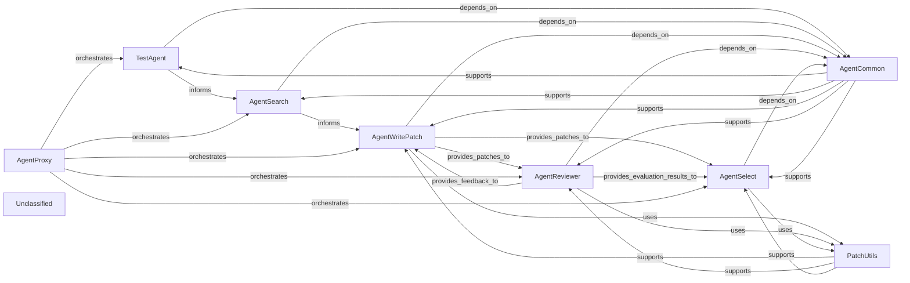

## Details

This graph illustrates the architecture of an agent-based system designed for automated bug reproduction and patching. The main flow involves a TestAgent generating and refining reproduction tests, an AgentSearch providing code context, an AgentWritePatch proposing fixes, an AgentReviewer evaluating patches, and an AgentSelect choosing the best solution. AgentCommon and PatchUtils provide shared utilities, while AgentProxy orchestrates the overall process. The system's purpose is to autonomously identify, reproduce, and fix software bugs.

### TestAgent
Manages the entire process of generating, executing, and validating reproduction tests for a given bug. It iteratively refines test scripts based on execution feedback to ensure the bug is reliably reproducible. This is fundamental for confirming the bug and validating fixes.

**Related Classes/Methods**:

- <a href="https://github.com/AutoCodeRoverSG/auto-code-rover/blob/mainapp/agents/agent_reproducer.py" target="_blank" rel="noopener noreferrer">`app.agents.agent_reproducer.TestAgent`</a>

### AgentSearch
Responsible for intelligently searching the codebase to retrieve relevant code context, file paths, and function definitions. This component is crucial for providing other agents with the necessary information to understand the bug and formulate fixes, acting as the knowledge provider.

**Related Classes/Methods**:

- <a href="https://github.com/AutoCodeRoverSG/auto-code-rover/blob/mainapp/agents/agent_search.py" target="_blank" rel="noopener noreferrer">`AgentSearch`</a>

### AgentWritePatch
Generates candidate code patches to address the identified bug. This involves synthesizing information from the bug reproduction phase and code search results to propose a fix. This is the core "repair" component.

**Related Classes/Methods**:

- <a href="https://github.com/AutoCodeRoverSG/auto-code-rover/blob/mainapp/agents/agent_write_patch.py" target="_blank" rel="noopener noreferrer">`AgentWritePatch`</a>

### AgentReviewer
Evaluates the quality, correctness, and adherence to coding standards of the patches generated by AgentWritePatch. It provides critical feedback to refine or reject proposed fixes, ensuring patch quality.

**Related Classes/Methods**:

- <a href="https://github.com/AutoCodeRoverSG/auto-code-rover/blob/mainapp/agents/agent_reviewer.py" target="_blank" rel="noopener noreferrer">`AgentReviewer`</a>

### AgentSelect
Selects the most appropriate and effective patch from a set of generated and reviewed candidates. This selection might be based on successful test runs, review scores, or other defined metrics. This component makes the final decision on which fix to apply.

**Related Classes/Methods**:

- <a href="https://github.com/AutoCodeRoverSG/auto-code-rover/blob/mainapp/agents/agent_select.py" target="_blank" rel="noopener noreferrer">`AgentSelect`</a>

### AgentCommon
Provides a set of shared utilities and foundational elements used across all specialized agents. This includes common exception handling (`InvalidLLMResponse`) and mechanisms for managing LLM interaction patterns (e.g., `replace_system_prompt`). It's essential for consistency and reusability across agents.

**Related Classes/Methods**:

- <a href="https://github.com/AutoCodeRoverSG/auto-code-rover/blob/mainapp/agents/agent_common.py" target="_blank" rel="noopener noreferrer">`AgentCommon`</a>

### PatchUtils
Contains helper functions for manipulating, analyzing, or applying code patches. This utility component supports the patch generation, review, and selection processes.

**Related Classes/Methods**:

- <a href="https://github.com/AutoCodeRoverSG/auto-code-rover/blob/mainapp/agents/patch_utils.py" target="_blank" rel="noopener noreferrer">`PatchUtils`</a>

### AgentProxy
Serves as an abstraction layer or a generic interface for interacting with different agents, or it could facilitate inter-agent communication. This component is critical for orchestrating the flow and communication between the various specialized agents.

**Related Classes/Methods**:

- <a href="https://github.com/AutoCodeRoverSG/auto-code-rover/blob/mainapp/agents/agent_proxy.py" target="_blank" rel="noopener noreferrer">`AgentProxy`</a>

### Unclassified
Component for all unclassified files and utility functions (Utility functions/External Libraries/Dependencies)

**Related Classes/Methods**: _None_

### [FAQ](https://github.com/CodeBoarding/GeneratedOnBoardings/tree/main?tab=readme-ov-file#faq)