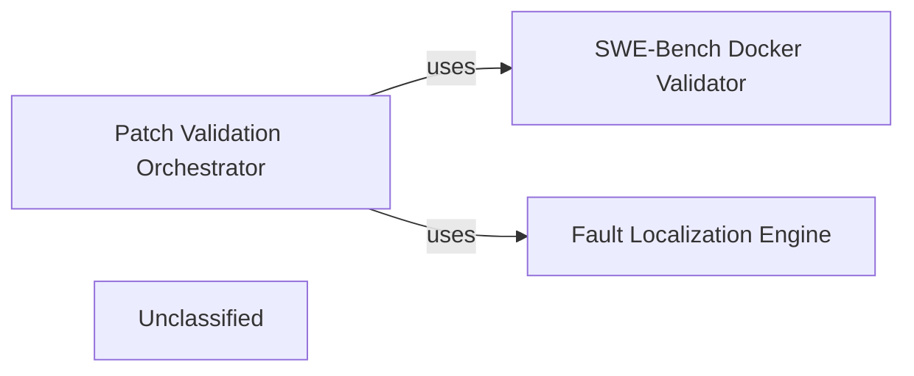

## Details

The system's core functionality revolves around automated program repair, with a clear separation of concerns for fault localization and patch validation. The Fault Localization Engine identifies potential bug locations using SBFL techniques, providing crucial insights for patch generation. The Patch Validation Orchestrator then takes charge of evaluating the generated patches, leveraging the SWE-Bench Docker Validator for robust and reproducible testing within a standardized environment. This architecture ensures a systematic approach to identifying, repairing, and validating code changes.

### Fault Localization Engine
This component is responsible for analyzing the codebase and test results to pinpoint suspicious code regions where a bug is likely located. In an APR system, this often involves techniques like Spectrum-Based Fault Localization (SBFL).

**Related Classes/Methods**:

- <a href="https://github.com/AutoCodeRoverSG/auto-code-rover/blob/mainapp/analysis/sbfl.py" target="_blank" rel="noopener noreferrer">`app.analysis.sbfl.PythonSbfl`</a>
- <a href="https://github.com/AutoCodeRoverSG/auto-code-rover/blob/mainapp/analysis/sbfl.py" target="_blank" rel="noopener noreferrer">`app.analysis.sbfl.run`</a>

### Patch Validation Orchestrator
This component manages the overall process of validating a generated patch. It coordinates test execution, evaluates the impact of the patch, and determines its correctness and effectiveness. It acts as the central control for the validation workflow.

**Related Classes/Methods**:

- <a href="https://github.com/AutoCodeRoverSG/auto-code-rover/blob/mainapp/api/validation.py" target="_blank" rel="noopener noreferrer">`app.api.validation.evaluate_patch`</a>

### SWE-Bench Docker Validator
This is a specialized validation component designed for integrating with the SWE-bench benchmark. It handles the setup of a Dockerized environment, execution of tests within that environment, and reporting of results, which is crucial for robust and reproducible patch validation in an APR context.

**Related Classes/Methods**:

- <a href="https://github.com/AutoCodeRoverSG/auto-code-rover/blob/mainapp/api/swe_bench_docker_validation.py" target="_blank" rel="noopener noreferrer">`app.api.swe_bench_docker_validation.run_pre_existing_tests`</a>

### Unclassified
Component for all unclassified files and utility functions (Utility functions/External Libraries/Dependencies)

**Related Classes/Methods**: _None_

### [FAQ](https://github.com/CodeBoarding/GeneratedOnBoardings/tree/main?tab=readme-ov-file#faq)