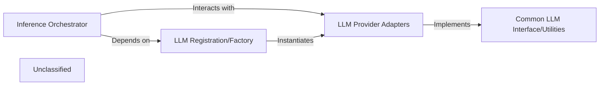

## Details

The LLM subsystem is designed for flexible and extensible integration with various Large Language Models. The `Inference Orchestrator` serves as the central control, managing the overall flow of LLM interactions. It relies on the `LLM Registration/Factory` to dynamically select and provide instances of `LLM Provider Adapters`. These adapters, each tailored to a specific LLM service, conform to a `Common LLM Interface/Utilities`, ensuring a standardized interaction mechanism across diverse models. This architecture decouples the core inference logic from the specifics of individual LLM providers, promoting maintainability and ease of adding new models.

### Inference Orchestrator
Acts as the primary entry point for the application to interact with LLMs. It selects the appropriate LLM based on configuration, formats prompts, sends requests to the chosen LLM, and processes the generated responses. This component orchestrates the overall LLM interaction flow, making it central to the system's AI capabilities.

**Related Classes/Methods**:

- <a href="https://github.com/AutoCodeRoverSG/auto-code-rover/blob/mainapp/inference.py" target="_blank" rel="noopener noreferrer">`app.inference.run_one_task`</a>

### LLM Registration/Factory
Manages the registration of available LLM providers and acts as a factory for instantiating specific LLM models based on runtime requirements or configuration. This component decouples the `Inference Orchestrator` from concrete LLM adapter implementations, promoting flexibility and extensibility.

**Related Classes/Methods**:

- <a href="https://github.com/AutoCodeRoverSG/auto-code-rover/blob/mainapp/model/common.py" target="_blank" rel="noopener noreferrer">`app.model.common.register_model`</a>
- <a href="https://github.com/AutoCodeRoverSG/auto-code-rover/blob/mainapp/model/common.py" target="_blank" rel="noopener noreferrer">`app.model.common.set_model`</a>

### Common LLM Interface/Utilities
Defines a standardized interface (e.g., abstract base class or protocol) that all concrete `LLM Provider Adapters` must implement. It also contains common utility functions for prompt engineering, response parsing, or other cross-cutting concerns related to LLM interaction, ensuring consistency and reducing code duplication across different providers. This is fundamental for achieving polymorphism and maintainability.

**Related Classes/Methods**:

- <a href="https://github.com/AutoCodeRoverSG/auto-code-rover/blob/mainapp/model/common.py" target="_blank" rel="noopener noreferrer">`app.model.common.Model`</a>

### LLM Provider Adapters
This represents a collection of concrete implementations, each encapsulating the specific API calls, authentication mechanisms, and data formatting required to interact with a particular Large Language Model (e.g., OpenAI's GPT, Anthropic's Claude, Google's Gemini, Groq, Azure, Bedrock, Ollama). Each adapter adheres to the `Common LLM Interface`, translating generic requests into provider-specific API calls and vice-versa. These components are crucial for integrating diverse external LLM services.

**Related Classes/Methods**:

- <a href="https://github.com/AutoCodeRoverSG/auto-code-rover/blob/mainapp/model/gpt.py" target="_blank" rel="noopener noreferrer">`app.model.gpt.OpenaiModel`</a>
- <a href="https://github.com/AutoCodeRoverSG/auto-code-rover/blob/mainapp/model/claude.py" target="_blank" rel="noopener noreferrer">`app.model.claude.AnthropicModel`</a>
- <a href="https://github.com/AutoCodeRoverSG/auto-code-rover/blob/mainapp/model/gemini.py" target="_blank" rel="noopener noreferrer">`app.model.gemini.GeminiModel`</a>
- <a href="https://github.com/AutoCodeRoverSG/auto-code-rover/blob/mainapp/model/groq.py" target="_blank" rel="noopener noreferrer">`app.model.groq.GroqModel`</a>
- <a href="https://github.com/AutoCodeRoverSG/auto-code-rover/blob/mainapp/model/azure.py" target="_blank" rel="noopener noreferrer">`app.model.azure.AzureOpenaiModel`</a>
- <a href="https://github.com/AutoCodeRoverSG/auto-code-rover/blob/mainapp/model/bedrock.py" target="_blank" rel="noopener noreferrer">`app.model.bedrock.BedrockModel`</a>
- <a href="https://github.com/AutoCodeRoverSG/auto-code-rover/blob/mainapp/model/ollama.py" target="_blank" rel="noopener noreferrer">`app.model.ollama.OllamaModel`</a>

### Unclassified
Component for all unclassified files and utility functions (Utility functions/External Libraries/Dependencies)

**Related Classes/Methods**: _None_

### [FAQ](https://github.com/CodeBoarding/GeneratedOnBoardings/tree/main?tab=readme-ov-file#faq)