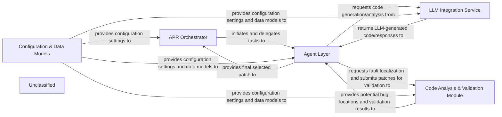

## Details

The Auto-Code-Rover (ACR) project is structured around a core APR Orchestrator that drives the automated program repair process. This orchestrator, primarily managed by the app.main.main function, initiates and coordinates tasks across specialized Agent Layer components. The Agent Layer comprises various agents (e.g., agent_reproducer, agent_search, agent_write_patch, agent_reviewer, agent_select) that handle distinct phases of bug reproduction, code analysis, patch generation, and selection. These agents heavily rely on the LLM Integration Service (modules like app.model.common, app.model.gpt, app.inference) to interact with different Large Language Models for code generation and analysis tasks. For fault localization and patch validation, the Agent Layer interacts with the Code Analysis & Validation Module, which includes functionalities for SBFL (app.analysis.sbfl) and various validation mechanisms (app.api.validation, app.api.swe_bench_docker_validation). Throughout the entire workflow, a central Configuration & Data Models component (app.config, app.data_structures) provides essential settings, LLM configurations, and defines the data structures used for consistent information exchange across all modules. This modular design ensures clear separation of concerns, facilitating maintainability and extensibility, and enabling a streamlined data flow from task initiation to validated patch generation.

### APR Orchestrator [[Expand]](./APR_Orchestrator.md)
The central control unit managing the entire Automated Program Repair (APR) workflow. It orchestrates the sequence of operations, coordinates interactions between different agents, and drives the overall repair process from bug reproduction to patch selection.

**Related Classes/Methods**:

- <a href="https://github.com/AutoCodeRoverSG/auto-code-rover/blob/mainapp/main.py" target="_blank" rel="noopener noreferrer">`app.main.main`</a>

### Agent Layer [[Expand]](./Agent_Layer.md)
A collection of specialized agents responsible for distinct phases of the bug repair process. This layer encapsulates the intelligence and operational logic for bug reproduction, code search, patch generation, and patch review/selection. It also includes common utilities shared across agents.

**Related Classes/Methods**:

- <a href="https://github.com/AutoCodeRoverSG/auto-code-rover/blob/mainapp/agents/agent_reproducer.py" target="_blank" rel="noopener noreferrer">`app.agents.agent_reproducer`</a>
- <a href="https://github.com/AutoCodeRoverSG/auto-code-rover/blob/mainapp/agents/agent_search.py" target="_blank" rel="noopener noreferrer">`app.agents.agent_search`</a>
- <a href="https://github.com/AutoCodeRoverSG/auto-code-rover/blob/mainapp/agents/agent_write_patch.py" target="_blank" rel="noopener noreferrer">`app.agents.agent_write_patch`</a>
- <a href="https://github.com/AutoCodeRoverSG/auto-code-rover/blob/mainapp/agents/agent_reviewer.py" target="_blank" rel="noopener noreferrer">`app.agents.agent_reviewer`</a>
- <a href="https://github.com/AutoCodeRoverSG/auto-code-rover/blob/mainapp/agents/agent_select.py" target="_blank" rel="noopener noreferrer">`app.agents.agent_select`</a>
- <a href="https://github.com/AutoCodeRoverSG/auto-code-rover/blob/mainapp/agents/agent_common.py" target="_blank" rel="noopener noreferrer">`app.agents.agent_common`</a>

### LLM Integration Service [[Expand]](./LLM_Integration_Service.md)
Provides a unified, standardized abstraction layer for interacting with various Large Language Models (LLMs) such as OpenAI, Anthropic, Groq, and Llama. It manages prompt formatting, sends requests to different LLM providers, and processes their generated responses.

**Related Classes/Methods**:

- <a href="https://github.com/AutoCodeRoverSG/auto-code-rover/blob/mainapp/model/common.py" target="_blank" rel="noopener noreferrer">`app.model.common`</a>
- <a href="https://github.com/AutoCodeRoverSG/auto-code-rover/blob/mainapp/model/gpt.py" target="_blank" rel="noopener noreferrer">`app.model.gpt`</a>
- <a href="https://github.com/AutoCodeRoverSG/auto-code-rover/blob/mainapp/model/claude.py" target="_blank" rel="noopener noreferrer">`app.model.claude`</a>
- <a href="https://github.com/AutoCodeRoverSG/auto-code-rover/blob/mainapp/model/gemini.py" target="_blank" rel="noopener noreferrer">`app.model.gemini`</a>
- <a href="https://github.com/AutoCodeRoverSG/auto-code-rover/blob/mainapp/model/groq.py" target="_blank" rel="noopener noreferrer">`app.model.groq`</a>
- <a href="https://github.com/AutoCodeRoverSG/auto-code-rover/blob/mainapp/inference.py" target="_blank" rel="noopener noreferrer">`app.inference`</a>

### Code Analysis & Validation Module [[Expand]](./Code_Analysis_Validation_Module.md)
Responsible for analyzing the codebase to identify potential locations where a bug might reside (fault localization) and for rigorously testing and validating generated patches. This includes running tests, evaluating their impact, and ensuring the correctness and effectiveness of the proposed fixes.

**Related Classes/Methods**:

- <a href="https://github.com/AutoCodeRoverSG/auto-code-rover/blob/mainapp/analysis/sbfl.py" target="_blank" rel="noopener noreferrer">`app.analysis.sbfl`</a>
- <a href="https://github.com/AutoCodeRoverSG/auto-code-rover/blob/mainapp/api/validation.py" target="_blank" rel="noopener noreferrer">`app.api.validation`</a>
- <a href="https://github.com/AutoCodeRoverSG/auto-code-rover/blob/mainapp/api/swe_bench_docker_validation.py" target="_blank" rel="noopener noreferrer">`app.api.swe_bench_docker_validation`</a>

### Configuration & Data Models
A foundational component that centralizes the management of application settings, LLM configurations, environment variables, and defines the core data structures used throughout the system. This ensures consistency and easy management of system-wide parameters and information representation.

**Related Classes/Methods**:

- <a href="https://github.com/AutoCodeRoverSG/auto-code-rover/blob/mainapp/config.py" target="_blank" rel="noopener noreferrer">`app.config`</a>
- <a href="https://github.com/AutoCodeRoverSG/auto-code-rover/blob/mainapp/data_structures.py" target="_blank" rel="noopener noreferrer">`app.data_structures`</a>

### Unclassified
Component for all unclassified files and utility functions (Utility functions/External Libraries/Dependencies)

**Related Classes/Methods**: _None_

### [FAQ](https://github.com/CodeBoarding/GeneratedOnBoardings/tree/main?tab=readme-ov-file#faq)