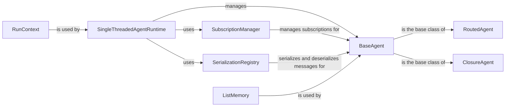

## Component Details

The Agent Core component provides the foundational building blocks for creating intelligent agents. It encompasses agent abstraction, message handling, agent runtime, and memory management. It defines the core functionalities for agent behavior, communication, and state management, enabling the creation of diverse agent types with specific roles and capabilities. The core flow involves agents sending and receiving messages, with the runtime managing the execution and message delivery. Memory components allow agents to maintain state and context.

### BaseAgent
The base class for all agents, providing fundamental functionalities such as message handling, registration, and metadata management. Agents inherit from this class to define their specific behaviors and interact with the runtime.
- **Related Classes/Methods**: `autogen.python.packages.autogen-core.src.autogen_core._base_agent.BaseAgent`

### RoutedAgent
An agent that routes messages based on type. It extends BaseAgent and adds the ability to handle different message types through dedicated handlers, enabling flexible message processing.
- **Related Classes/Methods**: `autogen.python.packages.autogen-core.src.autogen_core._routed_agent.RoutedAgent`

### ClosureAgent
An agent that uses closures to handle messages. It extends BaseAgent and allows defining message handlers as simple functions, providing a concise way to define agent behavior.
- **Related Classes/Methods**: `autogen.python.packages.autogen-core.src.autogen_core._closure_agent.ClosureAgent`

### SingleThreadedAgentRuntime
The runtime environment for agents. It manages agent creation, message delivery, and state persistence. It ensures that agents execute in a single thread, providing a controlled execution environment.
- **Related Classes/Methods**: `autogen.python.packages.autogen-core.src.autogen_core._single_threaded_agent_runtime.SingleThreadedAgentRuntime`

### SubscriptionManager
Manages subscriptions of agents to specific message types. It allows adding, removing, and retrieving subscriptions, enabling agents to selectively receive messages.
- **Related Classes/Methods**: `autogen.python.packages.autogen-core.src.autogen_core._runtime_impl_helpers.SubscriptionManager`

### SerializationRegistry
Handles serialization and deserialization of messages. It allows registering custom serializers for different message types, ensuring proper message formatting and interpretation.
- **Related Classes/Methods**: `autogen.python.packages.autogen-core.src.autogen_core._serialization.SerializationRegistry`

### ListMemory
A simple memory implementation that stores messages in a list. It allows updating the context and querying the memory, providing a basic mechanism for agents to remember past interactions.
- **Related Classes/Methods**: `autogen.python.packages.autogen-core.src.autogen_core.memory._list_memory.ListMemory`

### RunContext
Context for running an agent, allowing to define stopping conditions.
- **Related Classes/Methods**: `autogen.python.packages.autogen-core.src.autogen_core._single_threaded_agent_runtime.RunContext`
