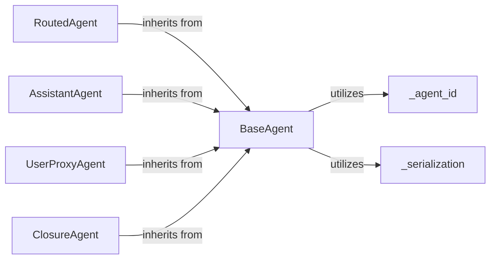

## Details

The `autogen-core` subsystem establishes a foundational framework for building intelligent agents, emphasizing modularity and clear communication pathways. At its core, the `BaseAgent` defines the essential contract for all agents, providing mechanisms for unique identification, message handling, and interaction with the runtime environment. Building upon this, `RoutedAgent` introduces sophisticated message dispatch, allowing agents to dynamically route messages to specialized handlers. Concrete agent implementations like `AssistantAgent` and `UserProxyAgent` leverage these foundational capabilities to interact with external models and human users, respectively. The `ClosureAgent` offers a flexible, function-based approach to agent definition, while `_agent_id` and `_serialization` provide crucial infrastructure for agent identity management and data exchange. This architecture promotes a decoupled design where agents can be independently developed and integrated, communicating through a well-defined message passing system.

### BaseAgent
Serves as the abstract base class for all agents, defining the common interface and fundamental capabilities. This includes unique identification, a basic message handling interface (`on_message`), and mechanisms for sending/publishing messages. It also provides foundational support for agent registration and subscription management.

**Related Classes/Methods**:

- <a href="https://github.com/microsoft/autogen/blob/main/python/packages/autogen-core/src/autogen_core/_agent_id.py#L1-L100" target="_blank" rel="noopener noreferrer">`autogen_core._agent_id`:1-100</a>
- <a href="https://github.com/microsoft/autogen/blob/main/python/packages/autogen-core/src/autogen_core/_serialization.py#L1-L150" target="_blank" rel="noopener noreferrer">`autogen_core._serialization`:1-150</a>

### RoutedAgent
Extends `BaseAgent` by introducing advanced message routing capabilities. It allows agents to define and dynamically discover specific handlers for different message types (e.g., `message_handler`, `event`, `rpc`), enabling more sophisticated internal message dispatch.

**Related Classes/Methods**:

- <a href="https://github.com/microsoft/autogen/blob/main/python/packages/autogen-core/src/autogen_core/_base_agent.py#L60-L254" target="_blank" rel="noopener noreferrer">`autogen_core._base_agent.BaseAgent`:60-254</a>

### AssistantAgent
A concrete agent implementation designed to interact with Large Language Models (LLMs) and execute tools. It processes incoming messages, updates its internal model context (memory), calls the LLM, executes tool calls based on LLM responses, and manages conversation flow, including handoffs and self-reflection on tool use.

**Related Classes/Methods**:

- <a href="https://github.com/microsoft/autogen/blob/main/python/packages/autogen-core/src/autogen_core/_base_agent.py#L60-L254" target="_blank" rel="noopener noreferrer">`autogen_core._base_agent.BaseAgent`:60-254</a>

### UserProxyAgent
A concrete agent implementation that acts as a proxy for a human user. It handles user input, populates conversation context, and manages handoffs to other agents or processes, effectively bridging human interaction with the multi-agent system.

**Related Classes/Methods**:

- <a href="https://github.com/microsoft/autogen/blob/main/python/packages/autogen-core/src/autogen_core/_base_agent.py#L60-L254" target="_blank" rel="noopener noreferrer">`autogen_core._base_agent.BaseAgent`:60-254</a>

### ClosureAgent
Provides a flexible way to define agents whose message handling logic is encapsulated within a Python closure. This allows for dynamic, context-specific, and easily definable agent behaviors without requiring a full class definition.

**Related Classes/Methods**:

- <a href="https://github.com/microsoft/autogen/blob/main/python/packages/autogen-core/src/autogen_core/_routed_agent.py#L415-L518" target="_blank" rel="noopener noreferrer">`autogen_core._routed_agent.RoutedAgent`:415-518</a>

### _agent_id
Manages the creation, validation, and comparison of unique identifiers for agents within the system, ensuring each agent instance can be distinctly identified.

**Related Classes/Methods**: _None_

### _serialization
Provides utilities for serializing and deserializing messages and other data structures exchanged between agents and the runtime. This ensures that complex Python objects can be correctly transmitted, stored, and reconstructed across different parts of the system.

**Related Classes/Methods**: _None_

### [FAQ](https://github.com/CodeBoarding/GeneratedOnBoardings/tree/main?tab=readme-ov-file#faq)