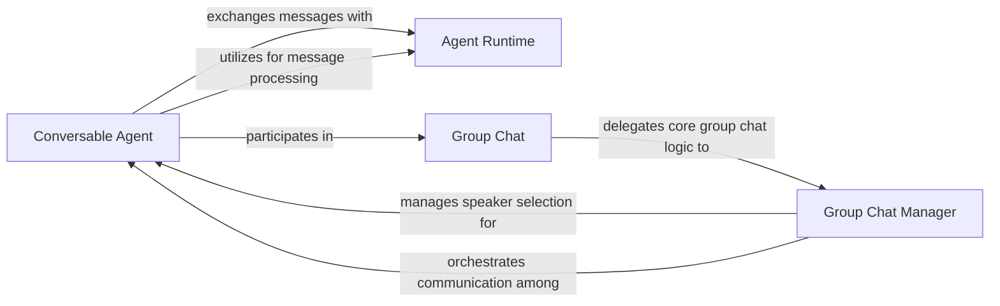

## Details

The autogen multi-agent system is built around a core Agent Runtime that facilitates all inter-agent communication. Conversable Agents represent the fundamental interacting entities, capable of exchanging messages with the Agent Runtime and processing responses. For collaborative scenarios, the Group Chat component provides a structured framework, delegating the dynamic management of conversation flow and speaker selection to the Group Chat Manager. The Group Chat Manager orchestrates communication and manages speaker turns among the participating Conversable Agents, ensuring a coherent and goal-oriented multi-agent dialogue. This architecture promotes modularity, allowing agents to operate independently or collaboratively within defined conversational contexts.

### Agent Runtime
The core orchestrator and message bus of the multi-agent system. It manages the lifecycle of agents, dispatches messages between them, and handles message responses. It serves as the central point for all inter-agent communication and execution flow.

**Related Classes/Methods**:

### Conversable Agent
Defines the fundamental interface and capabilities for all agents within the system. It provides basic functionalities for message handling (on_message, on_message_impl) and sending (send_message, publish_message). It extends these capabilities to enable agents to participate in conversational interactions, managing chat dialogues (run, run_stream). It is the abstract foundation for any interacting entity capable of engaging in turn-based conversations.

**Related Classes/Methods**:

### Group Chat
Provides the high-level framework for managing multi-agent conversations within a group setting. It defines the overall lifecycle and orchestration of a group chat, enabling multiple agents to collaborate on a shared task through structured dialogue.

**Related Classes/Methods**:

### Group Chat Manager
Manages the internal state and progression of a group chat. This includes selecting the next speaker, updating the message thread, and applying termination conditions to guide the conversation flow. Specialized implementations (e.g., _selector_group_chat) can introduce dynamic speaker selection mechanisms, often leveraging LLMs. The GroupChat class itself often embodies the manager's responsibilities.

**Related Classes/Methods**:

### [FAQ](https://github.com/CodeBoarding/GeneratedOnBoardings/tree/main?tab=readme-ov-file#faq)