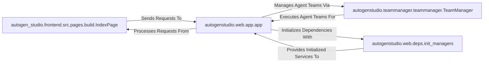

## Details

The AutoGen Studio application follows a client-server architecture, with the autogen_studio.frontend.src.pages.build.IndexPage serving as the primary user interface. This frontend component communicates with the autogenstudio.web.app.app, which acts as the central backend API gateway. The backend application is responsible for processing user requests, orchestrating interactions with core services, and managing the overall application flow. A key backend service is the autogenstudio.teammanager.teammanager.TeamManager, which handles the lifecycle and execution of AutoGen agent teams. Upon startup, the autogenstudio.web.app.app leverages autogenstudio.web.deps.init_managers to initialize essential dependencies and managers, ensuring the system is ready to handle operations. This clear separation of concerns between the frontend, the API gateway, and the core business logic facilitates modularity and scalability.

### autogen_studio.frontend.src.pages.build.IndexPage
The primary user interface of AutoGen Studio, enabling users to define, configure, and manage AutoGen agent teams and sessions. It serves as the main entry point for user interaction.

**Related Classes/Methods**:

- <a href="https://github.com/microsoft/autogen/blob/main/" target="_blank" rel="noopener noreferrer">`autogen_studio.frontend.src.pages.build.IndexPage`</a>

### autogenstudio.web.app.app
The central backend application instance, acting as the API gateway for AutoGen Studio. It manages overall application lifecycle, routes requests from the frontend, and orchestrates interactions with various backend services.

**Related Classes/Methods**:

- <a href="https://github.com/microsoft/autogen/blob/main/python/packages/autogen-studio/autogenstudio/web/app.py" target="_blank" rel="noopener noreferrer">`autogenstudio.web.app.app`</a>

### autogenstudio.teammanager.teammanager.TeamManager
A core backend service responsible for the lifecycle management and execution of AutoGen agent teams. It handles loading team configurations, initiating execution runs, and processing results.

**Related Classes/Methods**:

- <a href="https://github.com/microsoft/autogen/blob/main/python/packages/autogen-studio/autogenstudio/teammanager/teammanager.py#L40-L176" target="_blank" rel="noopener noreferrer">`autogenstudio.teammanager.teammanager.TeamManager`:40-176</a>

### autogenstudio.web.deps.init_managers
A utility component responsible for initializing critical backend dependencies and managers, such as database connections and WebSocket managers, ensuring the application's operational readiness.

**Related Classes/Methods**:

- <a href="https://github.com/microsoft/autogen/blob/main/python/packages/autogen-studio/autogenstudio/web/deps.py#L134-L173" target="_blank" rel="noopener noreferrer">`autogenstudio.web.deps.init_managers`:134-173</a>

### [FAQ](https://github.com/CodeBoarding/GeneratedOnBoardings/tree/main?tab=readme-ov-file#faq)