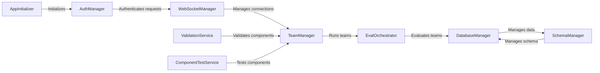

## Component Details

The Autogen Studio UI provides a web interface for creating, managing, and evaluating multi-agent workflows. It simplifies the development and deployment of multi-agent systems, making them accessible to a wider audience. The UI allows users to design agent interactions, monitor workflow execution in real-time via WebSockets, and analyze results. It integrates with backend services for team management, evaluation orchestration, database operations, and authentication, providing a comprehensive platform for multi-agent system development.

### AppInitializer
The AppInitializer component is responsible for setting up the application environment, including initializing paths and configurations required for the Autogen Studio UI to function correctly. It ensures that the necessary directories and settings are in place before the application starts.
- **Related Classes/Methods**: `autogen.python.packages.autogen-studio.autogenstudio.web.initialization.AppInitializer`

### AuthManager
The AuthManager component handles user authentication and authorization within the Autogen Studio UI. It supports multiple authentication providers, such as Github, MSAL, and Firebase, and manages user roles and permissions. It authenticates incoming requests and ensures that only authorized users can access specific features and resources.
- **Related Classes/Methods**: `autogen.python.packages.autogen-studio.autogenstudio.web.auth.manager.AuthManager`

### WebSocketManager
The WebSocketManager component manages real-time communication between the client-side UI and the backend agents. It handles WebSocket connections, allowing for bidirectional data flow and enabling features such as live monitoring of agent workflow execution. It manages connecting, disconnecting, sending messages, and managing the run lifecycle.
- **Related Classes/Methods**: `autogen.python.packages.autogen-studio.autogenstudio.web.managers.connection.WebSocketManager`

### TeamManager
The TeamManager component is responsible for managing teams of agents within the Autogen Studio UI. It allows users to create, configure, and run teams of agents, defining their roles, interactions, and objectives. It loads configurations, creates teams, and orchestrates their execution.
- **Related Classes/Methods**: `autogen.python.packages.autogen-studio.autogenstudio.teammanager.teammanager.TeamManager`

### EvalOrchestrator
The EvalOrchestrator component manages the evaluation of agent teams within the Autogen Studio UI. It allows users to define evaluation tasks and criteria, run evaluations, and analyze the results. It orchestrates the evaluation process and provides tools for tabulating and visualizing the performance of agent teams.
- **Related Classes/Methods**: `autogen.python.packages.autogen-studio.autogenstudio.eval.orchestrator.EvalOrchestrator`

### DatabaseManager
The DatabaseManager component handles database operations for the Autogen Studio UI. It provides an interface for storing and retrieving data related to agents, teams, evaluations, and other application entities. It manages database connections, executes queries, and ensures data integrity.
- **Related Classes/Methods**: `autogen.python.packages.autogen-studio.autogenstudio.database.db_manager.DatabaseManager`

### SchemaManager
The SchemaManager component manages the database schema for the Autogen Studio UI. It handles schema migrations, ensuring that the database structure is up-to-date and compatible with the application code. It initializes migrations, checks schema status, and upgrades the schema as needed.
- **Related Classes/Methods**: `autogen.python.packages.autogen-studio.autogenstudio.database.schema_manager.SchemaManager`

### ValidationService
The ValidationService component provides validation services for various components within the Autogen Studio UI. It validates configurations, inputs, and outputs to ensure data integrity and prevent errors. It validates providers, component types, and configurations.
- **Related Classes/Methods**: `autogen.python.packages.autogen-studio.autogenstudio.validation.validation_service.ValidationService`

### ComponentTestService
The ComponentTestService component offers testing services for different components such as agents, models, and tools. It allows for testing the functionality and performance of individual components in isolation.
- **Related Classes/Methods**: `autogen.python.packages.autogen-studio.autogenstudio.validation.component_test_service.ComponentTestService`
