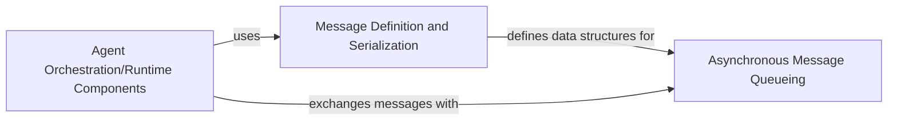

## Details

The AutoGen Communication Bus facilitates inter-agent communication through three core components: `Message Definition and Serialization`, `Asynchronous Message Queueing`, and `Agent Orchestration/Runtime Components`. The `Message Definition and Serialization` component establishes the standardized message formats, acting as the common language for all communications. `Agent Orchestration/Runtime Components`, which represent the active agents, utilize these defined message structures to formulate their communications. All message exchanges between agents are mediated by the `Asynchronous Message Queueing` component, which provides the robust, non-blocking transport layer, ensuring efficient and reliable message delivery across the system. This architecture enables agents to seamlessly send and receive information, fostering collaborative task execution within the AutoGen framework.

### Message Definition and Serialization
Defines the canonical message formats and types (e.g., `StopMessage`, `TextMessage`, `ModelClientStreamingChunkEvent`) that agents use to communicate. It provides utilities for creating, loading, and transforming these messages, ensuring a standardized communication protocol. This component acts as the "language" of the bus.

**Related Classes/Methods**:

- <a href="https://github.com/microsoft/autogen/blob/main/python/packages/autogen-agentchat/src/autogen_agentchat/messages.py" target="_blank" rel="noopener noreferrer">`autogen_agentchat.messages`</a>

### Asynchronous Message Queueing
Provides the underlying asynchronous infrastructure for message transport. It manages the flow of messages through operations like enqueuing (`put`, `put_nowait`) and dequeuing (`get`, `get_nowait`), ensuring ordered, non-blocking, and reliable message delivery between agents. This component acts as the "transport layer" of the bus.

**Related Classes/Methods**:

- <a href="https://github.com/microsoft/autogen/blob/main/python/packages/autogen-core/src/autogen_core/_queue.py" target="_blank" rel="noopener noreferrer">`autogen_core._queue`</a>

### Agent Orchestration/Runtime Components
Represents the various agents and their runtime environment within the AutoGen framework. These components act as the primary clients of the Communication Bus, responsible for initiating communication by creating and sending messages, and for processing incoming messages. They leverage the message definitions and queuing mechanisms to perform their collaborative tasks.

**Related Classes/Methods**:

- <a href="https://github.com/microsoft/autogen/blob/main/python/packages/autogen-agentchat/src/autogen_agentchat/agents/_base_chat_agent.py" target="_blank" rel="noopener noreferrer">`autogen_agentchat.agents._base_chat_agent`</a>

### [FAQ](https://github.com/CodeBoarding/GeneratedOnBoardings/tree/main?tab=readme-ov-file#faq)