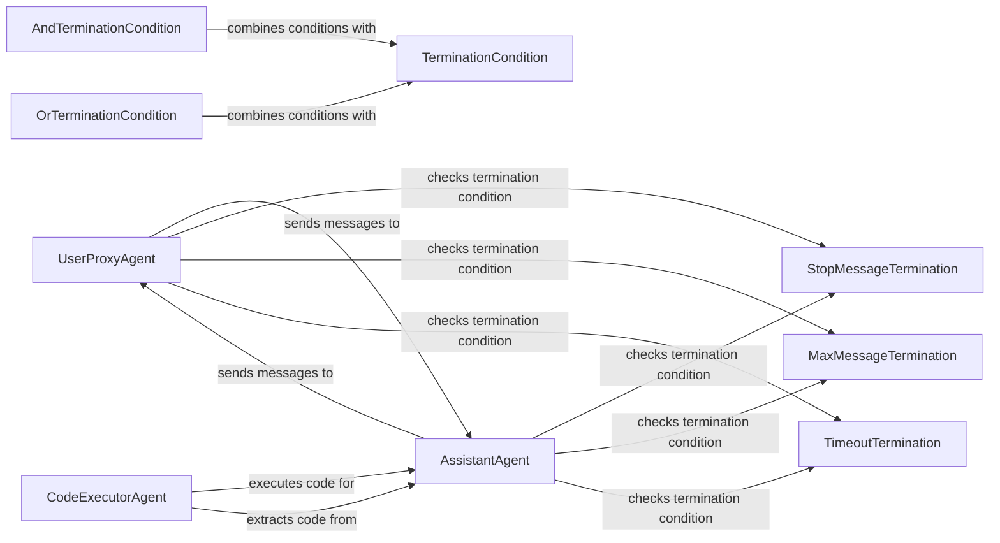

## Component Details

The Conversational Agents component provides a framework for building interactive agents that can communicate with users and each other. It includes agents like UserProxyAgent and AssistantAgent, which facilitate message exchange, code execution, and conversation management. Termination conditions are used to automatically end conversations based on predefined criteria, ensuring efficient and controlled interactions.

### UserProxyAgent
The UserProxyAgent acts as an interface between a human user or an external system and other agents. It relays messages, executes code provided by other agents, and manages the conversation from the user's perspective. It can also be configured with termination conditions to automatically end the conversation based on certain criteria.
- **Related Classes/Methods**: `autogen.python.packages.autogen-agentchat.src.autogen_agentchat.agents._user_proxy_agent.UserProxyAgent`

### AssistantAgent
The AssistantAgent is an autonomous agent that leverages LLMs to generate responses, execute tools, and manage the conversation flow from an assistant's perspective. It can reflect on tool use, summarize information, and handoff the conversation to other agents. It interacts with other agents, such as UserProxyAgent and CodeExecutorAgent, to accomplish tasks.
- **Related Classes/Methods**: `autogen.python.packages.autogen-agentchat.src.autogen_agentchat.agents._assistant_agent.AssistantAgent`

### CodeExecutorAgent
The CodeExecutorAgent is responsible for extracting and executing code blocks from messages. It provides a secure environment for running code and returns the results to the AssistantAgent. It supports multiple programming languages and can be configured with different execution environments.
- **Related Classes/Methods**: `autogen.python.packages.autogen-agentchat.src.autogen_agentchat.agents._code_executor_agent.CodeExecutorAgent`

### TerminationCondition
The TerminationCondition base class provides a way to define conditions under which a conversation should be terminated. Specific termination conditions, such as StopMessageTermination, MaxMessageTermination, and TimeoutTermination, inherit from this class and implement the logic for determining when the conversation should end. It also allows combining conditions using AND and OR operators.
- **Related Classes/Methods**: `autogen.python.packages.autogen-agentchat.src.autogen_agentchat.base._termination.TerminationCondition`

### StopMessageTermination
A termination condition that stops the conversation when a specific stop message is detected. It checks if the last message received contains the predefined stop message, and if so, terminates the conversation.
- **Related Classes/Methods**: `autogen.python.packages.autogen-agentchat.src.autogen_agentchat.conditions._terminations.StopMessageTermination`

### MaxMessageTermination
A termination condition that stops the conversation after a maximum number of messages have been exchanged. It keeps track of the number of messages sent and received, and terminates the conversation when the limit is reached.
- **Related Classes/Methods**: `autogen.python.packages.autogen-agentchat.src.autogen_agentchat.conditions._terminations.MaxMessageTermination`

### TimeoutTermination
A termination condition that stops the conversation after a specified timeout period. It starts a timer when the conversation begins, and terminates the conversation when the timer expires.
- **Related Classes/Methods**: `autogen.python.packages.autogen-agentchat.src.autogen_agentchat.conditions._terminations.TimeoutTermination`

### AndTerminationCondition
Combines multiple termination conditions using the AND operator. The conversation terminates only if all the combined conditions are met.
- **Related Classes/Methods**: `autogen.python.packages.autogen-agentchat.src.autogen_agentchat.base._termination.AndTerminationCondition`

### OrTerminationCondition
Combines multiple termination conditions using the OR operator. The conversation terminates if any of the combined conditions are met.
- **Related Classes/Methods**: `autogen.python.packages.autogen-agentchat.src.autogen_agentchat.base._termination.OrTerminationCondition`
