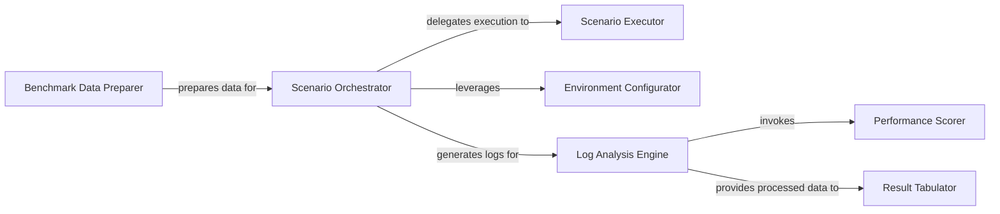

## Details

The `Evaluation & Benchmarking` subsystem is primarily encapsulated within the `agbench` package, providing a structured framework for assessing AutoGen agents.

### Scenario Orchestrator
Drives the entire benchmarking process by initiating and managing scenario executions, deciding between native or Docker environments. It acts as the central control plane for benchmark runs.

**Related Classes/Methods**:

- <a href="https://github.com/microsoft/autogen/blob/main/python/packages/agbench/src/agbench/run_cmd.py" target="_blank" rel="noopener noreferrer">`agbench.run_cmd:run_scenarios`</a>

### Scenario Executor
Executes benchmark scenarios, providing isolated and consistent environments either natively on the host system or within Docker containers. It abstracts the underlying execution environment.

**Related Classes/Methods**:

- <a href="https://github.com/microsoft/autogen/blob/main/python/packages/agbench/src/agbench/run_cmd.py" target="_blank" rel="noopener noreferrer">`agbench.run_cmd:run_scenario_in_docker`</a>
- <a href="https://github.com/microsoft/autogen/blob/main/python/packages/agbench/src/agbench/run_cmd.py" target="_blank" rel="noopener noreferrer">`agbench.run_cmd:run_scenario_natively`</a>

### Environment Configurator
Dynamically configures the execution environment for each scenario by resolving and substituting environment variables, ensuring consistent and reproducible test conditions.

**Related Classes/Methods**:

- <a href="https://github.com/microsoft/autogen/blob/main/python/packages/agbench/src/agbench/run_cmd.py" target="_blank" rel="noopener noreferrer">`agbench.run_cmd:get_scenario_env`</a>

### Benchmark Data Preparer
Sets up benchmark environments by downloading required datasets and converting them into suitable formats for scenario execution, enabling diverse benchmark support.

**Related Classes/Methods**:

- <a href="https://github.com/microsoft/autogen/blob/main/python/packages/agbench/benchmarks/GAIA/Scripts/init_tasks.py" target="_blank" rel="noopener noreferrer">`agbench.benchmarks.GAIA.Scripts.init_tasks:main`</a>
- <a href="https://github.com/microsoft/autogen/blob/main/python/packages/agbench/benchmarks/HumanEval/Scripts/init_tasks.py" target="_blank" rel="noopener noreferrer">`agbench.benchmarks.HumanEval.Scripts.init_tasks:main`</a>

### Log Analysis Engine
Analyzes and processes logs generated from benchmark runs to extract insights, assess agent performance, and detect undesirable behaviors.

**Related Classes/Methods**:

- <a href="https://github.com/microsoft/autogen/blob/main/python/packages/agbench/benchmarks/process_logs.py" target="_blank" rel="noopener noreferrer">`agbench.benchmarks.process_logs:process_logs`</a>

### Performance Scorer
Quantifies the success of an agent's performance by comparing its output against expected answers, often invoked by the Log Analysis Engine to calculate metrics.

**Related Classes/Methods**:

- <a href="https://github.com/microsoft/autogen/blob/main/python/packages/agbench/benchmarks/process_logs.py" target="_blank" rel="noopener noreferrer">`agbench.benchmarks.process_logs:scorer`</a>

### Result Tabulator
Facilitates the presentation of complex benchmark data in an easily digestible, tabular format for command-line interface users, ensuring clear communication of results.

**Related Classes/Methods**:

- <a href="https://github.com/microsoft/autogen/blob/main/python/packages/agbench/src/agbench/tabulate_cmd.py" target="_blank" rel="noopener noreferrer">`agbench.tabulate_cmd:tabulate_cli`</a>

### [FAQ](https://github.com/CodeBoarding/GeneratedOnBoardings/tree/main?tab=readme-ov-file#faq)