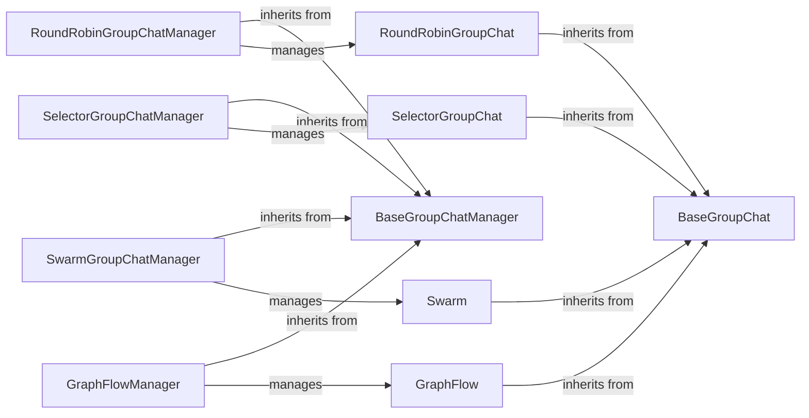

## Component Details

The Group Chat Orchestration component manages and coordinates interactions within multi-agent groups. It provides a foundation for different group chat implementations, including round-robin, selector-based, swarm-based, graph-based, and MagenticOne-based approaches. The core functionality involves managing agent turns, message flow, and overall group dynamics to achieve a common goal. The orchestration is handled by manager classes that correspond to each group chat type, ensuring efficient communication and collaborative problem-solving.

### BaseGroupChat
Abstract base class for group chats, defining common initialization and management methods. It serves as a foundation for different group chat implementations, providing a common interface for managing agents and messages within a group.
- **Related Classes/Methods**: `autogen.python.packages.autogen-agentchat.src.autogen_agentchat.teams._group_chat._base_group_chat.BaseGroupChat`

### RoundRobinGroupChat
Implements a group chat where speakers are selected in a round-robin fashion. It inherits from BaseGroupChat and manages the turn-taking process among agents, ensuring fair participation and orderly communication within the group.
- **Related Classes/Methods**: `autogen.python.packages.autogen-agentchat.src.autogen_agentchat.teams._group_chat._round_robin_group_chat.RoundRobinGroupChat`

### SelectorGroupChat
Implements a group chat where the speaker is selected based on a selection mechanism. It inherits from BaseGroupChat and uses a selection function to determine the next speaker, allowing for dynamic and context-aware speaker selection.
- **Related Classes/Methods**: `autogen.python.packages.autogen-agentchat.src.autogen_agentchat.teams._group_chat._selector_group_chat.SelectorGroupChat`

### Swarm
Implements a group chat where agents work in a swarm-like manner. It inherits from BaseGroupChat and facilitates collaborative problem-solving among agents, enabling parallel and distributed task execution.
- **Related Classes/Methods**: `autogen.python.packages.autogen-agentchat.src.autogen_agentchat.teams._group_chat._swarm_group_chat.Swarm`

### GraphFlow
Implements a group chat where the flow of communication is determined by a graph structure. It inherits from BaseGroupChat and defines the communication pathways among agents, allowing for structured and controlled information exchange.
- **Related Classes/Methods**: `autogen.python.packages.autogen-agentchat.src.autogen_agentchat.teams._group_chat._graph._digraph_group_chat.GraphFlow`

### BaseGroupChatManager
Abstract base class for group chat managers, handling agent responses, speaker transitions, and termination conditions. It provides a common interface for managing different group chat implementations, ensuring consistent behavior and control.
- **Related Classes/Methods**: `autogen.python.packages.autogen-agentchat.src.autogen_agentchat.teams._group_chat._base_group_chat_manager.BaseGroupChatManager`

### RoundRobinGroupChatManager
Manages the round-robin group chat, handling speaker selection and state saving. It inherits from BaseGroupChatManager and implements the round-robin turn-taking logic, ensuring fair and orderly speaker transitions.
- **Related Classes/Methods**: `autogen.python.packages.autogen-agentchat.src.autogen_agentchat.teams._group_chat._round_robin_group_chat.RoundRobinGroupChatManager`

### SelectorGroupChatManager
Manages the selector group chat, including speaker selection, message thread updates, and state management. It inherits from BaseGroupChatManager and uses a selection function to determine the next speaker, enabling dynamic and context-aware speaker selection.
- **Related Classes/Methods**: `autogen.python.packages.autogen-agentchat.src.autogen_agentchat.teams._group_chat._selector_group_chat.SelectorGroupChatManager`

### SwarmGroupChatManager
Manages the swarm group chat, handling state saving. It inherits from BaseGroupChatManager and facilitates collaborative problem-solving among agents, enabling parallel and distributed task execution.
- **Related Classes/Methods**: `autogen.python.packages.autogen-agentchat.src.autogen_agentchat.teams._group_chat._swarm_group_chat.SwarmGroupChatManager`

### GraphFlowManager
Manages the graph flow group chat, updating the message thread. It inherits from BaseGroupChatManager and defines the communication pathways among agents, allowing for structured and controlled information exchange.
- **Related Classes/Methods**: `autogen.python.packages.autogen-agentchat.src.autogen_agentchat.teams._group_chat._graph._digraph_group_chat.GraphFlowManager`
