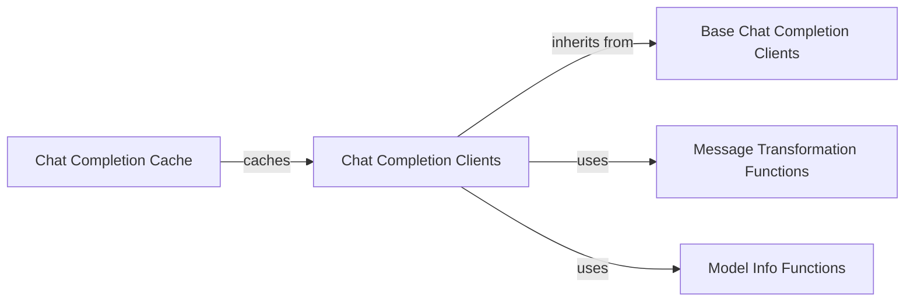

## Component Details

The LLM Integration component facilitates communication between agents and various Large Language Models (LLMs). It abstracts the complexities of interacting with different LLM providers like OpenAI, Azure OpenAI, Anthropic, and Ollama. The component handles message formatting, API calls, token counting, and caching to optimize performance and reduce costs. It provides a unified interface for agents to leverage LLMs for natural language understanding, generation, and reasoning.

### Chat Completion Clients
This component provides a unified interface for interacting with different LLM providers. It includes specific clients for OpenAI, Azure OpenAI, Anthropic, and Ollama, each handling the unique API requirements of their respective providers. These clients manage API calls, message formatting, and token counting.
- **Related Classes/Methods**: `autogen.python.packages.autogen-ext.src.autogen_ext.models.openai._openai_client.OpenAIChatCompletionClient`, `autogen.python.packages.autogen-ext.src.autogen_ext.models.openai._openai_client.AzureOpenAIChatCompletionClient`, `autogen.python.packages.autogen-ext.src.autogen_ext.models.anthropic._anthropic_client.AnthropicChatCompletionClient`, `autogen.python.packages.autogen-ext.src.autogen_ext.models.ollama._ollama_client.OllamaChatCompletionClient`

### Base Chat Completion Clients
These abstract base classes provide common functionality for handling API requests, message formatting, and token counting across different LLM providers. They serve as a foundation for the specific client implementations, promoting code reuse and consistency.
- **Related Classes/Methods**: `autogen.python.packages.autogen-ext.src.autogen_ext.models.openai._openai_client.BaseOpenAIChatCompletionClient`, `autogen.python.packages.autogen-ext.src.autogen_ext.models.anthropic._anthropic_client.BaseAnthropicChatCompletionClient`, `autogen.python.packages.autogen-ext.src.autogen_ext.models.ollama._ollama_client.BaseOllamaChatCompletionClient`

### Chat Completion Cache
This component caches chat completion responses to improve performance and reduce API costs. It stores and retrieves previous completions based on the request parameters, avoiding redundant API calls for identical requests.
- **Related Classes/Methods**: `autogen.python.packages.autogen-ext.src.autogen_ext.models.cache._chat_completion_cache.ChatCompletionCache`

### Message Transformation Functions
These functions transform messages into the format expected by different LLM providers. They handle the specific formatting requirements of each provider, ensuring that messages are properly interpreted by the LLMs.
- **Related Classes/Methods**: `autogen.python.packages.autogen-ext.src.autogen_ext.models.openai._message_transform`

### Model Info Functions
These functions retrieve model information such as token limits. They provide essential metadata about the LLMs, enabling the system to optimize requests and avoid exceeding model limitations.
- **Related Classes/Methods**: `autogen.python.packages.autogen-ext.src.autogen_ext.models.openai._model_info`, `autogen.python.packages.autogen-ext.src.autogen_ext.models.ollama._model_info`
