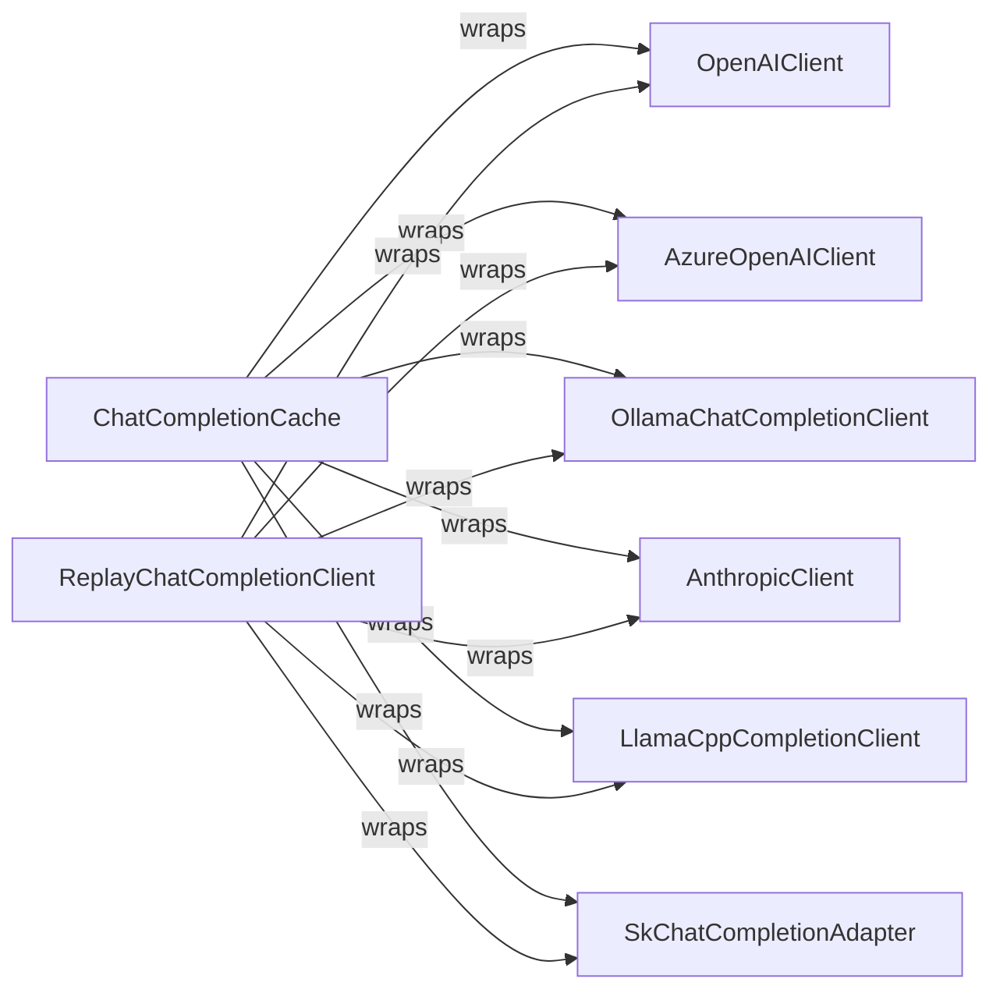

## Details

The autogen project's LLM client subsystem is designed for flexible and extensible integration with various Large Language Models. At its core, it provides a set of specialized client components, each tailored to interact with a specific LLM provider (e.g., OpenAI, Azure OpenAI, Anthropic, Ollama, LlamaCpp) or an external framework like Semantic Kernel. These clients abstract away the complexities of API interactions, request/response formatting, and model-specific configurations.

To enhance performance and reliability, the subsystem incorporates two key cross-cutting components: ChatCompletionCache and ReplayChatCompletionClient. The ChatCompletionCache intercepts and caches LLM responses, reducing redundant API calls and improving overall efficiency. The ReplayChatCompletionClient records and replays LLM interactions, which is crucial for testing, debugging, and ensuring consistent behavior in multi-agent systems. Both ChatCompletionCache and ReplayChatCompletionClient act as wrappers, transparently integrating with any of the individual LLM client components to provide their respective functionalities.

### OpenAIClient
Manages interactions with OpenAI's LLM services, handling request/response formatting, token usage, and model configurations. It serves as the primary adapter for OpenAI models.

**Related Classes/Methods**:

- <a href="https://github.com/microsoft/autogen/blob/main/python/packages/autogen-ext/src/autogen_ext/models/openai/_openai_client.py" target="_blank" rel="noopener noreferrer">`OpenAIClient`</a>

### AzureOpenAIClient
Specializes in integrating with Azure OpenAI services, including authentication and Azure-specific message formatting. It extends LLM integration to enterprise-grade Azure deployments.

**Related Classes/Methods**:

- <a href="https://github.com/microsoft/autogen/blob/main/python/packages/autogen-studio/frontend/src/components/types/datamodel.ts#L300-L306" target="_blank" rel="noopener noreferrer">`AzureOpenAIClient`:300-306</a>

### OllamaChatCompletionClient
Provides an interface for local or self-hosted Ollama models, managing Ollama-specific API interactions. This component enables integration with open-source and locally deployed LLMs.

**Related Classes/Methods**:

- <a href="https://github.com/microsoft/autogen/blob/main/python/packages/autogen-ext/src/autogen_ext/models/ollama/_ollama_client.py#L458-L890" target="_blank" rel="noopener noreferrer">`OllamaChatCompletionClient`:458-890</a>

### AnthropicClient
Facilitates communication with Anthropic LLM services, including message and tool transformations. It expands the range of supported commercial LLM providers.

**Related Classes/Methods**:

- <a href="https://github.com/microsoft/autogen/blob/main/python/packages/autogen-ext/src/autogen_ext/models/anthropic/_anthropic_client.py" target="_blank" rel="noopener noreferrer">`AnthropicClient`</a>

### LlamaCppCompletionClient
Integrates with LlamaCpp models, focusing on tool conversion and chat completion for local or self-hosted Llama models. This component supports efficient local execution of Llama-based models.

**Related Classes/Methods**:

- <a href="https://github.com/microsoft/autogen/blob/main/python/packages/autogen-ext/src/autogen_ext/models/llama_cpp/_llama_cpp_completion_client.py" target="_blank" rel="noopener noreferrer">`LlamaCppCompletionClient`</a>

### SkChatCompletionAdapter
Acts as an adapter to use Semantic Kernel as an LLM backend, translating requests and responses to align with Semantic Kernel's paradigms. This component enhances extensibility by allowing integration with other AI frameworks.

**Related Classes/Methods**:

- <a href="https://github.com/microsoft/autogen/blob/main/python/packages/autogen-ext/src/autogen_ext/models/semantic_kernel/_sk_chat_completion_adapter.py#L55-L764" target="_blank" rel="noopener noreferrer">`SkChatCompletionAdapter`:55-764</a>

### ReplayChatCompletionClient
Records and replays LLM interactions for testing, debugging, and ensuring consistent behavior across runs, crucial for multi-agent systems. It provides a critical utility for development and reliability.

**Related Classes/Methods**:

- <a href="https://github.com/microsoft/autogen/blob/main/python/packages/autogen-ext/src/autogen_ext/models/replay/_replay_chat_completion_client.py#L32-L322" target="_blank" rel="noopener noreferrer">`ReplayChatCompletionClient`:32-322</a>

### ChatCompletionCache
Provides caching mechanisms for LLM responses to improve performance, reduce API calls, and manage costs. This component is vital for optimizing resource usage and response times.

**Related Classes/Methods**:

- <a href="https://github.com/microsoft/autogen/blob/main/python/packages/autogen-ext/src/autogen_ext/models/cache/_chat_completion_cache.py#L29-L256" target="_blank" rel="noopener noreferrer">`ChatCompletionCache`:29-256</a>

### [FAQ](https://github.com/CodeBoarding/GeneratedOnBoardings/tree/main?tab=readme-ov-file#faq)