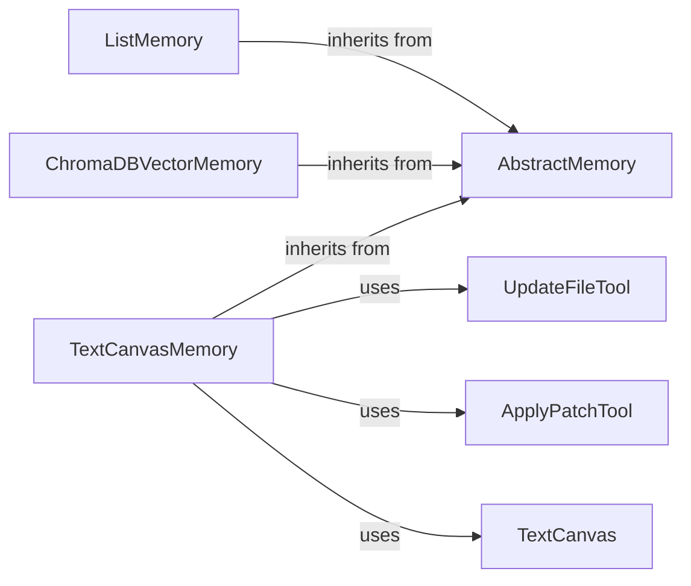

## Component Details

The Memory component in Autogen provides a flexible and extensible way for agents to store and retrieve information, enabling them to retain context, learn from past experiences, and adapt to changing environments. It offers several memory implementations, including a basic list-based memory, a vector database memory using ChromaDB, and a text canvas memory for managing text-based information. These different implementations cater to various use cases and allow agents to choose the most suitable memory solution for their specific needs. The core functionality revolves around updating the memory with new information, querying the memory to retrieve relevant data, and managing the configuration of the memory system.

### AbstractMemory
The AbstractMemory class serves as the foundation for all memory implementations in Autogen. It defines the common interface and abstract methods that all memory classes must implement, such as updating context, querying memory, and managing configuration. This abstract class promotes code reuse and ensures consistency across different memory implementations.
- **Related Classes/Methods**: `autogen.python.packages.autogen-core.src.autogen_core.memory.memory.AbstractMemory`

### ListMemory
ListMemory is a basic memory implementation that stores information in a list. It provides simple functionalities for updating the context, querying the memory, and managing the configuration. It's suitable for scenarios where a simple, in-memory storage solution is sufficient.
- **Related Classes/Methods**: `autogen.python.packages.autogen-core.src.autogen_core.memory._list_memory.ListMemory`

### ChromaDBVectorMemory
ChromaDBVectorMemory leverages ChromaDB, a vector database, to store and retrieve information. It supports initializing the ChromaDB client, updating the context, adding data to the database, querying the memory using vector similarity search, clearing the memory, resetting the memory, and managing the configuration. This implementation is ideal for scenarios where semantic similarity search is required.
- **Related Classes/Methods**: `autogen.python.packages.autogen-ext.src.autogen_ext.memory.chromadb.ChromaDBVectorMemory`

### TextCanvasMemory
TextCanvasMemory utilizes a text canvas for storing and manipulating text-based information. It supports initializing the canvas, updating the context, querying the memory, clearing the memory, and providing tools for updating files and applying patches. This implementation is well-suited for managing and manipulating code or other text-based data.
- **Related Classes/Methods**: `autogen.python.packages.autogen-ext.src.autogen_ext.memory.canvas._text_canvas_memory.TextCanvasMemory`

### TextCanvas
The TextCanvas class represents the text canvas used by TextCanvasMemory. It provides functionalities for adding or updating files, getting the diff between two versions of a file, and applying patches to a file. It acts as the underlying storage and manipulation mechanism for text-based data in TextCanvasMemory.
- **Related Classes/Methods**: `autogen.python.packages.autogen-ext.src.autogen_ext.memory.canvas._text_canvas.TextCanvas`

### UpdateFileTool
The UpdateFileTool is a tool used by TextCanvasMemory to update files. It takes a filename and content as input and updates the file with the new content. This tool allows the agent to modify files within the text canvas.
- **Related Classes/Methods**: `autogen.python.packages.autogen-ext.src.autogen_ext.memory.canvas._canvas_writer.UpdateFileTool`

### ApplyPatchTool
The ApplyPatchTool is a tool used by TextCanvasMemory to apply patches to files. It takes a filename and a patch as input and applies the patch to the file. This tool enables the agent to apply incremental changes to files within the text canvas.
- **Related Classes/Methods**: `autogen.python.packages.autogen-ext.src.autogen_ext.memory.canvas._canvas_writer.ApplyPatchTool`
