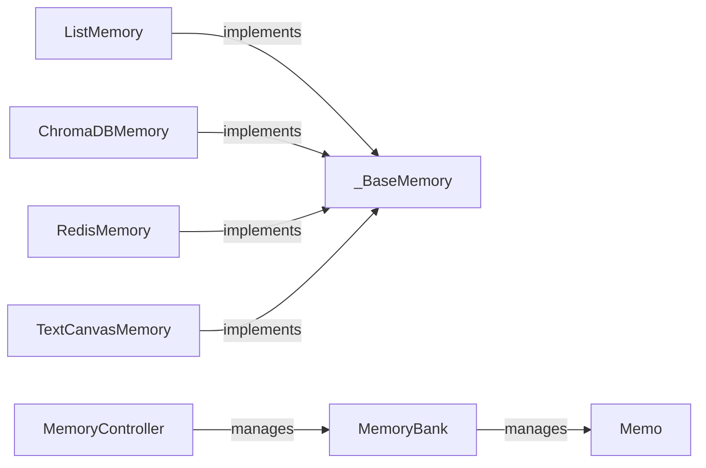

## Details

The memory subsystem in `autogen` is designed with a layered abstraction, starting from the `_BaseMemory` abstract class that defines the fundamental interface for all memory implementations. This allows for diverse memory solutions, ranging from simple in-memory storage like `ListMemory` to persistent, vector-based stores such as `ChromaDBMemory` and distributed solutions like `RedisMemory`. The `TextCanvasMemory` offers a unique approach by treating memory as a mutable text canvas. For advanced, task-centric memory management, the `MemoryBank` component stores individual `Memo` entries, with the `MemoryController` orchestrating their lifecycle, including training, testing, and retrieval. This modular design facilitates extensibility and integration of various memory backends, crucial for supporting complex multi-agent interactions and learning capabilities.

### _BaseMemory
This foundational abstract class defines the common interface and contracts for all memory implementations, embodying the "Layered Abstraction" pattern.

**Related Classes/Methods**:

- <a href="https://github.com/microsoft/autogen/blob/main/python/packages/autogen-core/src/autogen_core/memory/_base_memory.py#L60-L131" target="_blank" rel="noopener noreferrer">`autogen_core.memory._base_memory._BaseMemory`:60-131</a>

### ListMemory
The default, in-memory conversational context manager, serving as a basic yet essential component for straightforward agent interactions.

**Related Classes/Methods**:

- <a href="https://github.com/microsoft/autogen/blob/main/python/packages/autogen-core/src/autogen_core/memory/_list_memory.py#L22-L171" target="_blank" rel="noopener noreferrer">`autogen_core.memory.list_memory.ListMemory`:22-171</a>

### ChromaDBMemory
A persistent, vector-based memory store leveraging ChromaDB for semantic search and recall. This exemplifies the "Plugin/Extension Architecture" by integrating with an external vector database.

**Related Classes/Methods**:

- <a href="https://github.com/microsoft/autogen/blob/main/python/packages/autogen-ext/src/autogen_ext/memory/chromadb/_chromadb.py#L35-L300" target="_blank" rel="noopener noreferrer">`autogen_ext.memory.chromadb.ChromaDBMemory`:35-300</a>

### RedisMemory
Provides a scalable and distributed memory solution using Redis, further demonstrating the "Plugin/Extension Architecture" for diverse memory backends.

**Related Classes/Methods**:

- <a href="https://github.com/microsoft/autogen/blob/main/python/packages/autogen-ext/src/autogen_ext/memory/redis/_redis_memory.py#L42-L325" target="_blank" rel="noopener noreferrer">`autogen_ext.memory.redis._redis_memory.RedisMemory`:42-325</a>

### TextCanvasMemory
A unique memory type that treats context as a mutable text canvas, enabling agents to perform file-like operations within their memory space. This highlights the framework's flexibility.

**Related Classes/Methods**:

- <a href="https://github.com/microsoft/autogen/blob/main/python/packages/autogen-ext/src/autogen_ext/memory/canvas/_text_canvas_memory.py#L18-L229" target="_blank" rel="noopener noreferrer">`autogen_ext.memory.canvas._text_canvas_memory.TextCanvasMemory`:18-229</a>

### MemoryBank
A core component for structured, task-centric memory, designed to store and manage "memos" for learning from past experiences. This is crucial for advanced multi-agent systems.

**Related Classes/Methods**:

- <a href="https://github.com/microsoft/autogen/blob/main/python/packages/autogen-ext/src/autogen_ext/experimental/task_centric_memory/_memory_bank.py#L29-L201" target="_blank" rel="noopener noreferrer">`autogen_ext.experimental.task_centric_memory._memory_bank.MemoryBank`:29-201</a>

### MemoryController
Orchestrates the operations of MemoryBank, managing the training, testing, and retrieval of relevant memories. This acts as an "Agent Orchestrator/Manager" for the task-centric memory.

**Related Classes/Methods**:

- <a href="https://github.com/microsoft/autogen/blob/main/python/packages/autogen-ext/src/autogen_ext/experimental/task_centric_memory/memory_controller.py#L29-L478" target="_blank" rel="noopener noreferrer">`autogen_ext.experimental.task_centric_memory.memory_controller.MemoryController`:29-478</a>

### Memo
The data structure representing individual memory entries within the MemoryBank, central to the task-centric memory paradigm.

**Related Classes/Methods**:

- <a href="https://github.com/microsoft/autogen/blob/main/python/packages/autogen-ext/src/autogen_ext/experimental/task_centric_memory/_memo.py#L1-L100" target="_blank" rel="noopener noreferrer">`autogen_ext.experimental.task_centric_memory.memo.Memo`:1-100</a>

### [FAQ](https://github.com/CodeBoarding/GeneratedOnBoardings/tree/main?tab=readme-ov-file#faq)