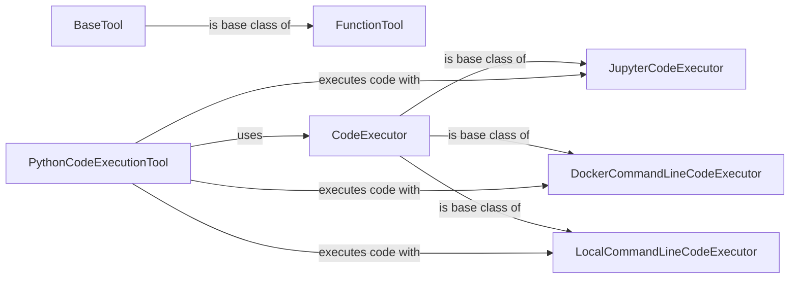

## Component Details

The Tooling component in autogen enables agents to interact with the external world by providing a framework for defining, managing, and executing tools and code. It encompasses abstract base classes for tools and code executors, concrete implementations for various execution environments (Jupyter, Docker, Azure, local command line), and utilities for managing function dependencies. The core flow involves defining a tool, selecting an appropriate code executor based on the environment, and executing the tool or code to achieve a desired outcome.

### BaseTool
The abstract base class for all tools, defining the interface for tool schema definition and execution. It ensures a consistent way to interact with different tools within the autogen framework.
- **Related Classes/Methods**: `autogen.python.packages.autogen-core.src.autogen_core.tools._base.BaseTool`

### FunctionTool
Wraps a Python function, making it accessible as a tool. It handles the conversion of the function's signature into a tool schema and manages the execution of the function, including dependency management using FunctionWithRequirements.
- **Related Classes/Methods**: `autogen.python.packages.autogen-core.src.autogen_core.tools._function_tool.FunctionTool`

### CodeExecutor
An abstract base class for code executors, defining the interface for executing code in different environments. Concrete implementations handle the specifics of setting up and running code.
- **Related Classes/Methods**: `autogen.python.packages.autogen-core.src.autogen_core.code_executor._base.CodeExecutor`

### JupyterCodeExecutor
Executes code blocks in a Jupyter kernel, supporting kernel restarts and individual code block execution. It extends CodeExecutor to provide Jupyter-specific functionality.
- **Related Classes/Methods**: `autogen.python.packages.autogen-ext.src.autogen_ext.code_executors.jupyter._jupyter_code_executor.JupyterCodeExecutor`

### DockerCommandLineCodeExecutor
Executes code blocks in a Docker container using command-line execution. It handles container setup, command execution, and function setup. It extends CodeExecutor to provide Docker-specific functionality.
- **Related Classes/Methods**: `autogen.python.packages.autogen-ext.src.autogen_ext.code_executors.docker._docker_code_executor.DockerCommandLineCodeExecutor`

### LocalCommandLineCodeExecutor
Executes code blocks locally using the command line. It handles function setup and code block execution in the local environment. It extends CodeExecutor to provide local command-line functionality.
- **Related Classes/Methods**: `autogen.python.packages.autogen-ext.src.autogen_ext.code_executors.local.__init__.LocalCommandLineCodeExecutor`

### PythonCodeExecutionTool
A tool specifically designed for executing Python code. It uses a code executor to run the code and returns the results. It extends BaseToolWithState and uses a CodeExecutor to execute the code.
- **Related Classes/Methods**: `autogen.python.packages.autogen-ext.src.autogen_ext.tools.code_execution._code_execution.PythonCodeExecutionTool`
