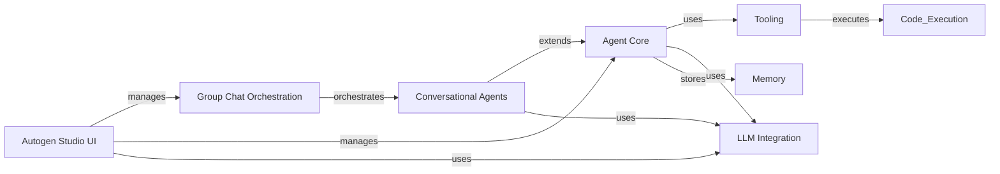

## Component Details

The Autogen framework facilitates the development of multi-agent systems by providing reusable components for agent creation, communication, tool utilization, memory management, and integration with Large Language Models (LLMs). It enables the creation of complex workflows where agents can collaborate to solve problems, execute code, and interact with external systems. The framework also includes Autogen Studio, a web interface for managing and evaluating multi-agent workflows.

### Agent Core
This component provides the foundational building blocks for creating intelligent agents. It encompasses agent abstraction, message handling, agent runtime, and memory management. It defines the core functionalities for agent behavior, communication, and state management, enabling the creation of diverse agent types with specific roles and capabilities.
- **Related Classes/Methods**: `autogen.python.packages.autogen-core.src.autogen_core._base_agent.BaseAgent`, `autogen.python.packages.autogen-core.src.autogen_core._routed_agent.RoutedAgent`, `autogen.python.packages.autogen-core.src.autogen_core._closure_agent.ClosureAgent`, `autogen.python.packages.autogen-core.src.autogen_core._base_agent.BaseAgent:send_message`, `autogen.python.packages.autogen-core.src.autogen_core._single_threaded_agent_runtime.SingleThreadedAgentRuntime:send_message`, `autogen.python.packages.autogen-core.src.autogen_core._serialization.SerializationRegistry`, `autogen.python.packages.autogen-core.src.autogen_core._runtime_impl_helpers.SubscriptionManager`, `autogen.python.packages.autogen-core.src.autogen_core._single_threaded_agent_runtime.SingleThreadedAgentRuntime`, `autogen.python.packages.autogen-core.src.autogen_core._single_threaded_agent_runtime.RunContext`, `autogen.python.packages.autogen-core.src.autogen_core.memory._list_memory.ListMemory`

### Tooling
This component focuses on enabling agents to interact with the external world through tools and code execution. It provides functionalities for tool management and code execution in various environments. This allows agents to leverage external resources, perform computations, and access data, extending their problem-solving abilities.
- **Related Classes/Methods**: `autogen.python.packages.autogen-core.src.autogen_core.tools._base.BaseTool`, `autogen.python.packages.autogen-core.src.autogen_core.tools._static_workbench.StaticWorkbench`, `autogen.python.packages.autogen-core.src.autogen_core.tools._function_tool.FunctionTool`, `autogen.python.packages.autogen-core.src.autogen_core.code_executor._base.CodeExecutor`, `autogen.python.packages.autogen-core.src.autogen_core.code_executor._func_with_reqs.FunctionWithRequirements`, `autogen.python.packages.autogen-ext.src.autogen_ext.code_executors.jupyter._jupyter_code_executor.JupyterCodeExecutor`, `autogen.python.packages.autogen-ext.src.autogen_ext.code_executors.docker._docker_code_executor.DockerCommandLineCodeExecutor`, `autogen.python.packages.autogen-ext.src.autogen_ext.code_executors.azure._azure_container_code_executor.ACADynamicSessionsCodeExecutor`, `autogen.python.packages.autogen-ext.src.autogen_ext.code_executors.local.__init__.LocalCommandLineCodeExecutor`

### LLM Integration
This component provides the interface for agents to interact with Large Language Models (LLMs). It handles message formatting, token counting, and caching, optimizing the communication between agents and LLMs. This enables agents to leverage the power of LLMs for natural language understanding, generation, and reasoning.
- **Related Classes/Methods**: `autogen.python.packages.autogen-ext.src.autogen_ext.models.openai._openai_client.OpenAIChatCompletionClient`, `autogen.python.packages.autogen-ext.src.autogen_ext.models.openai._openai_client.AzureOpenAIChatCompletionClient`, `autogen.python.packages.autogen-ext.src.autogen_ext.models.anthropic._anthropic_client.AnthropicChatCompletionClient`, `autogen.python.packages.autogen-ext.src.autogen_ext.models.ollama._ollama_client.OllamaChatCompletionClient`, `autogen.python.packages.autogen-ext.src.autogen_ext.models.cache._chat_completion_cache.ChatCompletionCache`

### Conversational Agents
This component provides pre-built agent types designed for conversational interactions. It includes user proxy agents and assistant agents, handling message filtering, termination conditions, and handoff. This enables the creation of natural and intuitive interactions between agents and users, facilitating collaborative problem-solving and task completion.
- **Related Classes/Methods**: `autogen.python.packages.autogen-agentchat.src.autogen_agentchat.agents._user_proxy_agent.UserProxyAgent`, `autogen.python.packages.autogen-agentchat.src.autogen_agentchat.agents._assistant_agent.AssistantAgent`, `autogen.python.packages.autogen-agentchat.src.autogen_agentchat.agents._code_executor_agent.CodeExecutorAgent`, `autogen.python.packages.autogen-agentchat.src.autogen_agentchat.conditions._terminations`

### Group Chat Orchestration
This component focuses on managing and coordinating interactions within multi-agent groups. It supports different group chat implementations, enabling collaborative problem-solving and allowing agents to coordinate their actions to achieve a common goal. It provides mechanisms for managing group dynamics, resolving conflicts, and ensuring efficient communication within the group.
- **Related Classes/Methods**: `autogen.python.packages.autogen-agentchat.src.autogen_agentchat.teams._group_chat._base_group_chat.BaseGroupChat`, `autogen.python.packages.autogen-agentchat.src.autogen_agentchat.teams._group_chat._round_robin_group_chat.RoundRobinGroupChat`, `autogen.python.packages.autogen-agentchat.src.autogen_agentchat.teams._group_chat._selector_group_chat.SelectorGroupChat`, `autogen.python.packages.autogen-agentchat.src.autogen_agentchat.teams._group_chat._swarm_group_chat.Swarm`, `autogen.python.packages.autogen-agentchat.src.autogen_agentchat.teams._group_chat._graph._digraph_group_chat.GraphFlow`

### Autogen Studio UI
This component provides a web interface for creating, managing, and evaluating multi-agent workflows. It simplifies the development and deployment of multi-agent systems, making them accessible to a wider audience. It offers tools for designing agent interactions, monitoring workflow execution, and analyzing results.
- **Related Classes/Methods**: `autogen.python.packages.autogen-studio.autogenstudio.web.app`, `autogen.python.packages.autogen-studio.autogenstudio.teammanager.teammanager.TeamManager`, `autogen.python.packages.autogen-studio.autogenstudio.eval.orchestrator.EvalOrchestrator`

### Memory
This component provides functionalities for managing agent memory, including storing and retrieving information. It supports different memory implementations such as list memory, ChromaDB vector memory, and text canvas memory. This allows agents to retain context, learn from past experiences, and adapt to changing environments.
- **Related Classes/Methods**: `autogen.python.packages.autogen-ext.src.autogen_ext.memory.chromadb.ChromaDBVectorMemory`, `autogen.python.packages.autogen-ext.src.autogen_ext.memory.canvas._text_canvas_memory.TextCanvasMemory`