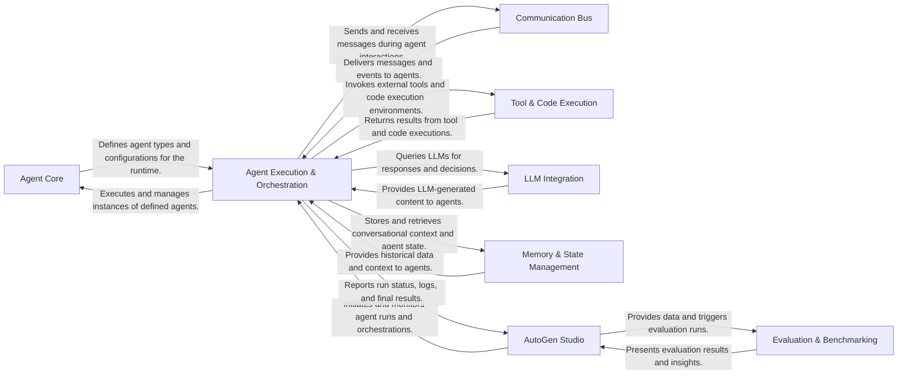

## Details

The AutoGen framework is designed around a modular, agent-centric architecture facilitating multi-agent conversations and task automation. At its core, the **Agent Core** defines the fundamental building blocks for intelligent agents. The **Agent Execution & Orchestration** component manages the dynamic interactions and workflows between these agents, leveraging a **Communication Bus** for seamless message exchange. Agents can extend their capabilities through the **Tool & Code Execution** component, enabling interaction with external systems and code environments. For intelligent decision-making, the **LLM Integration** component provides a standardized interface to various large language models. Conversational context and persistent data are managed by the **Memory & State Management** component. Finally, **AutoGen Studio** provides a comprehensive web-based platform for users to build, manage, and interact with agent teams, while **Evaluation & Benchmarking** offers tools to assess agent performance.

### Agent Core [[Expand]](./Agent_Core.md)
Defines the foundational elements for agents, including their types, basic message handling, and configuration. This component establishes the blueprint for all agents within the system.

**Related Classes/Methods**:

### Agent Execution & Orchestration [[Expand]](./Agent_Execution_Orchestration.md)
Manages the lifecycle and interactions of agents, including message processing, conversation flow, and group chat management. It orchestrates how agents communicate and collaborate to achieve tasks.

**Related Classes/Methods**:

### Communication Bus [[Expand]](./Communication_Bus.md)
Provides the underlying infrastructure for agents to send, receive, and publish messages and events, ensuring seamless inter-agent communication.

**Related Classes/Methods**:

- <a href="https://github.com/microsoft/autogen/blob/main/python/packages/autogen-agentchat/src/autogen_agentchat/messages.py#L1-L50" target="_blank" rel="noopener noreferrer">`autogen_agentchat.messages`:1-50</a>

### Tool & Code Execution [[Expand]](./Tool_Code_Execution.md)
Offers a standardized interface for agents to define, discover, and execute external functions or capabilities, including various environments for code execution.

**Related Classes/Methods**:

### LLM Integration [[Expand]](./LLM_Integration.md)
Provides adapters for seamless integration with various Large Language Model providers, abstracting away API-specific details for agents to leverage LLM capabilities.

**Related Classes/Methods**:

### Memory & State Management [[Expand]](./Memory_State_Management.md)
Manages the storage and retrieval of information for agents, maintaining conversational context and persistent data across interactions.

**Related Classes/Methods**:

### AutoGen Studio [[Expand]](./AutoGen_Studio.md)
The comprehensive web-based platform for interacting with AutoGen, encompassing both the user interface and the backend services for managing agent teams, sessions, and evaluations.

**Related Classes/Methods**:

- <a href="https://github.com/microsoft/autogen/blob/main/python/packages/autogen-studio/autogenstudio/web/app.py" target="_blank" rel="noopener noreferrer">`autogenstudio.web.app.app`</a>
- <a href="https://github.com/microsoft/autogen/blob/main/python/packages/autogen-studio/autogenstudio/teammanager/teammanager.py#L40-L176" target="_blank" rel="noopener noreferrer">`autogenstudio.teammanager.teammanager.TeamManager`:40-176</a>

### Evaluation & Benchmarking [[Expand]](./Evaluation_Benchmarking.md)
Provides tools and frameworks for systematically evaluating the performance, reliability, and behavior of AutoGen agents and multi-agent teams.

**Related Classes/Methods**:

- <a href="https://github.com/microsoft/autogen/blob/main/python/packages/agbench/benchmarks/process_logs.py#L15-L69" target="_blank" rel="noopener noreferrer">`agbench.benchmarks.process_logs.process_logs`:15-69</a>
- <a href="https://github.com/microsoft/autogen/blob/main/python/packages/agbench/src/agbench/run_cmd.py#L59-L178" target="_blank" rel="noopener noreferrer">`agbench.run_cmd.run_scenarios`:59-178</a>

### [FAQ](https://github.com/CodeBoarding/GeneratedOnBoardings/tree/main?tab=readme-ov-file#faq)