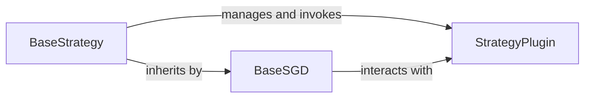

## Details

The Continual Learning Strategies subsystem encompasses the core components responsible for orchestrating the training process, managing optimizers, and integrating various continual learning algorithms. Its primary focus is on defining and executing the main training loop for continual learning scenarios.

### BaseStrategy
The abstract base class for all continual learning strategies. It defines the fundamental training pipeline, including hooks for various stages of the learning process (e.g., `before_training`, `after_training_epoch`, `before_backward`). It acts as the central orchestrator, managing the flow of data and interactions with models and plugins.

**Related Classes/Methods**:

- <a href="https://github.com/ContinualAI/avalanche/blob/master/avalanche/training/templates/base.py" target="_blank" rel="noopener noreferrer">`avalanche.training.templates.base.BaseStrategy`</a>
- <a href="https://github.com/ContinualAI/avalanche/blob/master/avalanche/training/templates/base.py" target="_blank" rel="noopener noreferrer">`avalanche.training.templates.base.BaseStrategy:before_training`</a>
- <a href="https://github.com/ContinualAI/avalanche/blob/master/avalanche/training/templates/base.py" target="_blank" rel="noopener noreferrer">`avalanche.training.templates.base.BaseStrategy:after_training_epoch`</a>
- <a href="https://github.com/ContinualAI/avalanche/blob/master/avalanche/training/templates/base.py" target="_blank" rel="noopener noreferrer">`avalanche.training.templates.base.BaseStrategy:before_backward`</a>

### BaseSGD
A concrete implementation of a continual learning strategy based on Stochastic Gradient Descent (SGD). It extends `BaseStrategy` to provide a standard training loop with SGD optimization, handling data iteration, forward passes, loss calculation, backward passes, and optimizer steps. It serves as a foundational example and a commonly used strategy.

**Related Classes/Methods**:

- <a href="https://github.com/ContinualAI/avalanche/blob/master/avalanche/training/templates/base_sgd.py#L39-L577" target="_blank" rel="noopener noreferrer">`avalanche.training.templates.base_sgd.BaseSGD`:39-577</a>
- <a href="https://github.com/ContinualAI/avalanche/blob/master/avalanche/training/templates/base.py" target="_blank" rel="noopener noreferrer">`avalanche.training.templates.base.BaseStrategy`</a>

### StrategyPlugin
An abstract base class for plugins that can extend or modify the behavior of a `BaseStrategy` instance. Plugins provide a flexible mechanism to inject custom logic (e.g., regularization, replay, knowledge distillation) at various points within the training pipeline defined by `BaseStrategy`. They enable the integration of diverse continual learning algorithms without altering the core strategy logic.

**Related Classes/Methods**:

- <a href="https://github.com/ContinualAI/avalanche/blob/master/avalanche/training/plugins/strategy_plugin.py" target="_blank" rel="noopener noreferrer">`avalanche.training.plugins.strategy_plugin.StrategyPlugin`</a>
- <a href="https://github.com/ContinualAI/avalanche/blob/master/avalanche/training/plugins/strategy_plugin.py" target="_blank" rel="noopener noreferrer">`avalanche.training.plugins.strategy_plugin.StrategyPlugin:before_training`</a>
- <a href="https://github.com/ContinualAI/avalanche/blob/master/avalanche/training/plugins/strategy_plugin.py" target="_blank" rel="noopener noreferrer">`avalanche.training.plugins.strategy_plugin.StrategyPlugin:after_training_epoch`</a>

### [FAQ](https://github.com/CodeBoarding/GeneratedOnBoardings/tree/main?tab=readme-ov-file#faq)