```mermaid
graph LR
    avalanche_benchmarks_datasets["avalanche.benchmarks.datasets"]
    avalanche_benchmarks_utils_data_AvalancheDataset["avalanche.benchmarks.utils.data.AvalancheDataset"]
    avalanche_benchmarks_utils_transforms_TransformGroups["avalanche.benchmarks.utils.transforms.TransformGroups"]
    avalanche_benchmarks_scenarios_generic_scenario_CLScenario["avalanche.benchmarks.scenarios.generic_scenario.CLScenario"]
    avalanche_benchmarks_scenarios_generic_scenario_CLStream["avalanche.benchmarks.scenarios.generic_scenario.CLStream"]
    avalanche_benchmarks_scenarios_supervised_class_incremental_benchmark["avalanche.benchmarks.scenarios.supervised.class_incremental_benchmark"]
    avalanche_benchmarks_utils_data_loader_AvalancheDataLoader["avalanche.benchmarks.utils.data_loader.AvalancheDataLoader"]
    avalanche_benchmarks_utils_ffcv_support["avalanche.benchmarks.utils.ffcv_support"]
    avalanche_benchmarks_datasets -- "provides raw data to" --> avalanche_benchmarks_utils_data_AvalancheDataset
    avalanche_benchmarks_utils_data_AvalancheDataset -- "wraps and extends data from" --> avalanche_benchmarks_datasets
    avalanche_benchmarks_utils_data_AvalancheDataset -- "applies transformations defined by" --> avalanche_benchmarks_utils_transforms_TransformGroups
    avalanche_benchmarks_utils_transforms_TransformGroups -- "defines and manages transformations applied by" --> avalanche_benchmarks_utils_data_AvalancheDataset
    avalanche_benchmarks_scenarios_generic_scenario_CLScenario -- "contains and constructs instances of" --> avalanche_benchmarks_scenarios_generic_scenario_CLStream
    avalanche_benchmarks_scenarios_generic_scenario_CLScenario -- "serves as base for" --> avalanche_benchmarks_scenarios_supervised_class_incremental_benchmark
    avalanche_benchmarks_scenarios_generic_scenario_CLStream -- "provides access to data from" --> avalanche_benchmarks_utils_data_AvalancheDataset
    avalanche_benchmarks_scenarios_supervised_class_incremental_benchmark -- "inherits from" --> avalanche_benchmarks_scenarios_generic_scenario_CLScenario
    avalanche_benchmarks_scenarios_supervised_class_incremental_benchmark -- "utilizes" --> avalanche_benchmarks_utils_data_AvalancheDataset
    avalanche_benchmarks_utils_data_loader_AvalancheDataLoader -- "consumes instances of" --> avalanche_benchmarks_utils_data_AvalancheDataset
    avalanche_benchmarks_utils_data_loader_AvalancheDataLoader -- "leverages" --> avalanche_benchmarks_utils_ffcv_support
    avalanche_benchmarks_utils_ffcv_support -- "provides optimized data loading capabilities to" --> avalanche_benchmarks_utils_data_loader_AvalancheDataLoader
```

## Details

The `Data & Scenario Management` subsystem in Avalanche is crucial for defining and preparing data for continual learning experiments. It encompasses the entire pipeline from raw dataset acquisition to the creation of structured continual learning scenarios and efficient data batching.

### avalanche.benchmarks.datasets
Acts as the primary source of raw data, providing implementations for various datasets (e.g., CORe50, ImageNet). It handles data downloading, loading, and initial preparation.

**Related Classes/Methods**:

- <a href="https://github.com/ContinualAI/avalanche/blob/master/avalanche/benchmarks/datasets/__init__.py" target="_blank" rel="noopener noreferrer">`avalanche.benchmarks.datasets`</a>

### avalanche.benchmarks.utils.data.AvalancheDataset
A foundational wrapper around standard PyTorch datasets, extending them with Avalanche-specific features like task labels and experience IDs. It provides a unified interface for data access and transformation management.

**Related Classes/Methods**:

- <a href="https://github.com/ContinualAI/avalanche/blob/master/avalanche/benchmarks/utils/data.py#L50-L451" target="_blank" rel="noopener noreferrer">`avalanche.benchmarks.utils.data.AvalancheDataset`:50-451</a>

### avalanche.benchmarks.utils.transforms.TransformGroups
Manages and applies data augmentation and preprocessing transformations. It allows for the definition and conditional application of sets of transformations (e.g., different transformations for training vs. evaluation).

**Related Classes/Methods**:

- <a href="https://github.com/ContinualAI/avalanche/blob/master/avalanche/benchmarks/utils/transform_groups.py" target="_blank" rel="noopener noreferrer">`avalanche.benchmarks.utils.transforms.TransformGroups`</a>

### avalanche.benchmarks.scenarios.generic_scenario.CLScenario
The abstract base class for all continual learning benchmarks. It defines the core concepts of data streams and experiences, providing a common, extensible interface for scenario generation. This is key for experiment definition.

**Related Classes/Methods**:

- <a href="https://github.com/ContinualAI/avalanche/blob/master/avalanche/benchmarks/scenarios/generic_scenario.py#L578-L607" target="_blank" rel="noopener noreferrer">`avalanche.benchmarks.scenarios.generic_scenario.CLScenario`:578-607</a>

### avalanche.benchmarks.scenarios.generic_scenario.CLStream
Represents a sequence of experiences (tasks) within a continual learning scenario. It provides the abstract interface for data streams, which are fundamental to continual learning.

**Related Classes/Methods**:

- <a href="https://github.com/ContinualAI/avalanche/blob/master/avalanche/benchmarks/scenarios/generic_scenario.py#L301-L359" target="_blank" rel="noopener noreferrer">`avalanche.benchmarks.scenarios.generic_scenario.CLStream`:301-359</a>

### avalanche.benchmarks.scenarios.supervised.class_incremental_benchmark
A concrete scenario generator that structures a dataset into a class-incremental learning benchmark. It defines how new classes are introduced sequentially over experiences, a common setup in continual learning research.

**Related Classes/Methods**:

- <a href="https://github.com/ContinualAI/avalanche/blob/master/avalanche/benchmarks/scenarios/supervised.py#L36-L136" target="_blank" rel="noopener noreferrer">`avalanche.benchmarks.scenarios.supervised.class_incremental_benchmark`:36-136</a>

### avalanche.benchmarks.utils.data_loader.AvalancheDataLoader
Creates iterable data loaders from `AvalancheDataset` instances, yielding mini-batches for training or evaluation. It supports both standard PyTorch and FFCV data loading for efficient batching.

**Related Classes/Methods**:

- <a href="https://github.com/ContinualAI/avalanche/blob/master/avalanche/benchmarks/utils/data_loader.py" target="_blank" rel="noopener noreferrer">`avalanche.benchmarks.utils.data_loader.AvalancheDataLoader`</a>

### avalanche.benchmarks.utils.ffcv_support
Provides integration and utilities for FFCV (Fast Forward Computer Vision), enabling highly optimized and faster data loading. This is critical for performance in large-scale ML experiments.

**Related Classes/Methods**:

- <a href="https://github.com/ContinualAI/avalanche/blob/master/avalanche/benchmarks/utils/ffcv_support" target="_blank" rel="noopener noreferrer">`avalanche.benchmarks.utils.ffcv_support`</a>

### [FAQ](https://github.com/CodeBoarding/GeneratedOnBoardings/tree/main?tab=readme-ov-file#faq)