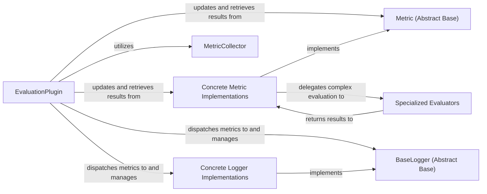

## Details

The Evaluation & Logging subsystem in Avalanche is responsible for computing, aggregating, and dispatching performance metrics during and after continual learning training. It adheres to the "Evaluation Metrics & Loggers" expected component pattern for Machine Learning Libraries, emphasizing extensibility and reproducibility.

### EvaluationPlugin
Orchestrates the entire evaluation and logging process within the continual learning loop. It registers metrics and loggers, and ensures that metric updates, computations, and logging occur at the correct points (e.g., after each mini-batch, epoch, or experience). It acts as the primary interface between the training strategy and the evaluation/logging infrastructure.

**Related Classes/Methods**:

- <a href="https://github.com/ContinualAI/avalanche/blob/master/avalanche/training/plugins/evaluation.py#L33-L239" target="_blank" rel="noopener noreferrer">`avalanche.training.plugins.evaluation.EvaluationPlugin`:33-239</a>

### Metric (Abstract Base)
Serves as the abstract base class for all evaluation metrics. It defines a standardized interface (`update`, `result`, `reset`) that concrete metrics must implement, ensuring consistency across different metric types. This promotes extensibility, allowing researchers to easily add new metrics.

**Related Classes/Methods**:

- <a href="https://github.com/ContinualAI/avalanche/blob/master/avalanche/evaluation/metric_definitions.py" target="_blank" rel="noopener noreferrer">`avalanche.evaluation.metric_definitions.Metric`</a>

### Concrete Metric Implementations
Implement the specific logic for calculating a particular performance metric (e.g., accuracy, forgetting, detection metrics). They maintain internal state and update it with data from each mini-batch or experience, then compute the final result when requested.

**Related Classes/Methods**:

- <a href="https://github.com/ContinualAI/avalanche/blob/master/avalanche/evaluation/metrics/accuracy.py" target="_blank" rel="noopener noreferrer">`avalanche.evaluation.metrics.accuracy`</a>
- <a href="https://github.com/ContinualAI/avalanche/blob/master/avalanche/evaluation/metrics/forgetting_bwt.py" target="_blank" rel="noopener noreferrer">`avalanche.evaluation.metrics.forgetting_bwt`</a>
- <a href="https://github.com/ContinualAI/avalanche/blob/master/avalanche/evaluation/metrics/detection.py" target="_blank" rel="noopener noreferrer">`avalanche.evaluation.metrics.detection`</a>

### MetricCollector
Acts as a container and aggregator for metric values. It is particularly useful when metrics need to be collected and combined across different streams or phases of the continual learning process, providing a centralized point for accessing current metric states.

**Related Classes/Methods**:

- <a href="https://github.com/ContinualAI/avalanche/blob/master/avalanche/evaluation/collector.py#L12-L187" target="_blank" rel="noopener noreferrer">`avalanche.evaluation.collector.MetricCollector`:12-187</a>

### BaseLogger (Abstract Base)
Provides a unified abstract interface for logging metric results to various output destinations. Each subclass specializes in a particular logging backend, ensuring a consistent API for different logging services.

**Related Classes/Methods**:

- <a href="https://github.com/ContinualAI/avalanche/blob/master/avalanche/logging/base_logger.py#L12-L92" target="_blank" rel="noopener noreferrer">`avalanche.logging.base_logger.BaseLogger`:12-92</a>

### Concrete Logger Implementations
Handle the specific formatting and dispatching of metrics to their respective logging backends (e.g., TensorBoard, CSV file, console). They translate the generic metric results into a format suitable for the target logging system.

**Related Classes/Methods**:

- <a href="https://github.com/ContinualAI/avalanche/blob/master/avalanche/logging/tensorboard_logger.py" target="_blank" rel="noopener noreferrer">`avalanche.logging.tensorboard_logger`</a>
- <a href="https://github.com/ContinualAI/avalanche/blob/master/avalanche/logging/csv_logger.py" target="_blank" rel="noopener noreferrer">`avalanche.logging.csv_logger`</a>

### Specialized Evaluators
Perform complex, domain-specific evaluation for certain metrics, such as object detection metrics (e.g., COCO mAP). These evaluators often encapsulate external libraries or more intricate computation logic that is too complex for a simple `Metric` implementation.

**Related Classes/Methods**:

- <a href="https://github.com/ContinualAI/avalanche/blob/master/avalanche/evaluation/metrics/detection_evaluators/coco_evaluator.py" target="_blank" rel="noopener noreferrer">`avalanche.evaluation.metrics.detection_evaluators.coco_evaluator`</a>

### [FAQ](https://github.com/CodeBoarding/GeneratedOnBoardings/tree/main?tab=readme-ov-file#faq)