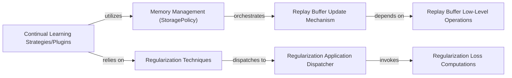

## Details

The "Memory & Regularization" subsystem in Avalanche is designed to combat catastrophic forgetting in continual learning. It primarily consists of two intertwined functional areas: Memory Management and Regularization Techniques. Memory Management, centered around the StoragePolicy, provides the foundational mechanisms for storing and retrieving past data samples, crucial for replay-based strategies. The Replay Buffer Update Mechanism and Replay Buffer Low-Level Operations handle the dynamic aspects of this memory. Complementing this, Regularization Techniques, spearheaded by the Regularization component, apply various penalties to the loss function to preserve learned knowledge. The Regularization Application Dispatcher and Regularization Loss Computations manage the specific algorithms for these penalties. These core components are then leveraged by higher-level Continual Learning Strategies/Plugins like ReplayPlugin, which orchestrate the overall continual learning process by utilizing the memory and regularization capabilities.

### Memory Management (StoragePolicy)
This is the foundational component for memory management, specifically for implementing replay buffers. It provides mechanisms for storing, organizing, and retrieving past data samples, which are crucial for replay-based continual learning strategies. It acts as the primary interface for memory operations.

**Related Classes/Methods**:

- <a href="https://github.com/ContinualAI/avalanche/blob/master/avalanche/training/storage_policy.py" target="_blank" rel="noopener noreferrer">`avalanche.training.storage_policy.StoragePolicy`</a>

### Regularization Techniques
This component is responsible for applying various regularization techniques during the training process. Its primary goal is to mitigate catastrophic forgetting by introducing penalties to the model's loss function, thereby preserving knowledge acquired from previous tasks. It serves as the main entry point for regularization.

**Related Classes/Methods**:

- <a href="https://github.com/ContinualAI/avalanche/blob/master/avalanche/training/regularization.py#L36-L54" target="_blank" rel="noopener noreferrer">`avalanche.training.regularization.Regularization`:36-54</a>

### Replay Buffer Update Mechanism
Handles the high-level logic for updating the replay buffer within the Memory Management component. This includes deciding when and how to add new samples, and potentially adapting the buffer size or content based on training progress.

**Related Classes/Methods**:

- <a href="https://github.com/ContinualAI/avalanche/blob/master/avalanche/training/storage_policy.py" target="_blank" rel="noopener noreferrer">`avalanche.training.storage_policy.StoragePolicy.update`</a>
- <a href="https://github.com/ContinualAI/avalanche/blob/master/avalanche/training/storage_policy.py" target="_blank" rel="noopener noreferrer">`avalanche.training.storage_policy.StoragePolicy.post_adapt`</a>
- <a href="https://github.com/ContinualAI/avalanche/blob/master/avalanche/training/storage_policy.py" target="_blank" rel="noopener noreferrer">`avalanche.training.storage_policy.StoragePolicy.update_from_dataset`</a>

### Replay Buffer Low-Level Operations
Manages the actual data storage, resizing, and internal organization of samples within the replay buffer. These are the granular operations that support the Replay Buffer Update Mechanism.

**Related Classes/Methods**:

- <a href="https://github.com/ContinualAI/avalanche/blob/master/avalanche/training/storage_policy.py" target="_blank" rel="noopener noreferrer">`avalanche.training.storage_policy.StoragePolicy.resize`</a>
- <a href="https://github.com/ContinualAI/avalanche/blob/master/avalanche/training/storage_policy.py" target="_blank" rel="noopener noreferrer">`avalanche.training.storage_policy.StoragePolicy.get_group_lengths`</a>
- <a href="https://github.com/ContinualAI/avalanche/blob/master/avalanche/training/storage_policy.py" target="_blank" rel="noopener noreferrer">`avalanche.training.storage_policy.StoragePolicy._make_groups`</a>

### Regularization Application Dispatcher
Acts as a central dispatcher within the Regularization Techniques component, orchestrating the application of different regularization terms. It determines which specific regularization loss functions to invoke based on the current training context.

**Related Classes/Methods**:

- <a href="https://github.com/ContinualAI/avalanche/blob/master/avalanche/training/regularization.py" target="_blank" rel="noopener noreferrer">`avalanche.training.regularization.Regularization.__call__`</a>

### Regularization Loss Computations
Implements the specific mathematical functions for computing various regularization losses (e.g., LwF penalty, distillation loss). These are the core algorithms that calculate the regularization terms added to the model's loss function.

**Related Classes/Methods**:

- <a href="https://github.com/ContinualAI/avalanche/blob/master/avalanche/training/regularization.py#L101-L131" target="_blank" rel="noopener noreferrer">`avalanche.training.regularization._lwf_penalty`:101-131</a>
- <a href="https://github.com/ContinualAI/avalanche/blob/master/avalanche/training/regularization.py#L22-L33" target="_blank" rel="noopener noreferrer">`avalanche.training.regularization.cross_entropy_with_oh_targets`:22-33</a>
- <a href="https://github.com/ContinualAI/avalanche/blob/master/avalanche/training/regularization.py#L83-L99" target="_blank" rel="noopener noreferrer">`avalanche.training.regularization._distillation_loss`:83-99</a>
- <a href="https://github.com/ContinualAI/avalanche/blob/master/avalanche/training/regularization.py#L14-L19" target="_blank" rel="noopener noreferrer">`avalanche.training.regularization.stable_softmax`:14-19</a>

### Continual Learning Strategies/Plugins
These components represent the primary consumers and orchestrators of the "Memory & Regularization" subsystem. They utilize the Memory Management for replay and rely on Regularization Techniques to mitigate forgetting during their training processes.

**Related Classes/Methods**:

- <a href="https://github.com/ContinualAI/avalanche/blob/master/avalanche/training/plugins/replay.py#L17-L123" target="_blank" rel="noopener noreferrer">`avalanche.training.plugins.replay.ReplayPlugin`:17-123</a>

### [FAQ](https://github.com/CodeBoarding/GeneratedOnBoardings/tree/main?tab=readme-ov-file#faq)