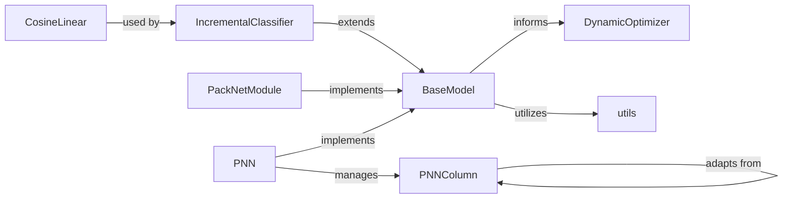

## Details

The `avalanche.models` subsystem provides a robust framework for building and managing dynamic neural network architectures in continual learning scenarios. At its core, `BaseModel` defines the abstract interface for adaptable models, which can be extended by specialized implementations like `PackNetModule` and `PNN`. The `DynamicOptimizer` works in conjunction with these models to ensure that optimizer states are correctly managed as the model architecture evolves. `PNN` orchestrates the creation and management of `PNNColumn` instances, where each new column adapts its learning by leveraging knowledge from previous columns. `IncrementalClassifier` dynamically adjusts classification heads, often utilizing specialized layers like `CosineLinear` to handle new classes. The `utils` module provides essential helper functions for various model manipulation tasks, supporting the overall dynamic adaptation process. This interconnected design allows for flexible and efficient model evolution, crucial for mitigating catastrophic forgetting in sequential learning tasks.

### BaseModel
Serves as the core abstraction for models that can adapt their architecture during continual learning, providing a unified interface for dynamic model adaptation.

**Related Classes/Methods**:

- <a href="https://github.com/ContinualAI/avalanche/blob/master/avalanche/models/base_model.py#L4-L13" target="_blank" rel="noopener noreferrer">`avalanche.models.base_model.BaseModel`:4-13</a>

### IncrementalClassifier
Manages the dynamic addition and selection of classification heads, crucial for scenarios where new classes are encountered over time without retraining the entire model.

**Related Classes/Methods**:

- <a href="https://github.com/ContinualAI/avalanche/blob/master/avalanche/models/dynamic_modules.py#L217-L294" target="_blank" rel="noopener noreferrer">`avalanche.models.dynamic_modules.IncrementalClassifier`:217-294</a>

### DynamicOptimizer
Dynamically adjusts optimizer parameters and state to accommodate architectural changes in the model, ensuring training stability and efficiency during adaptation.

**Related Classes/Methods**:

- <a href="https://github.com/ContinualAI/avalanche/blob/master/avalanche/models/dynamic_optimizers.py#L36-L98" target="_blank" rel="noopener noreferrer">`avalanche.models.dynamic_optimizers.DynamicOptimizer`:36-98</a>

### PackNetModule
Implements a specific dynamic neural network architecture focused on model compression and task isolation, allowing for efficient multi-task learning by dynamically allocating capacity.

**Related Classes/Methods**:

- <a href="https://github.com/ContinualAI/avalanche/blob/master/avalanche/models/packnet.py#L27-L198" target="_blank" rel="noopener noreferrer">`avalanche.models.packnet.PackNetModule`:27-198</a>

### PNN
Implements the Progressive Neural Network (PNN) architecture, which adds new columns (task-specific sub-networks) for each new task to prevent catastrophic forgetting.

**Related Classes/Methods**:

- <a href="https://github.com/ContinualAI/avalanche/blob/master/avalanche/models/pnn.py#L222-L278" target="_blank" rel="noopener noreferrer">`avalanche.models.pnn.PNN`:222-278</a>

### PNNColumn
Represents a task-specific sub-network within the PNN architecture, designed to learn a new task while leveraging knowledge from previous tasks via lateral connections.

**Related Classes/Methods**:

- <a href="https://github.com/ContinualAI/avalanche/blob/master/avalanche/models/pnn.py#L85-L129" target="_blank" rel="noopener noreferrer">`avalanche.models.pnn.PNNColumn`:85-129</a>

### CosineLinear
Provides a dynamically adaptable linear layer based on cosine similarity, often used in classification tasks for improved feature separation and robustness.

**Related Classes/Methods**:

- <a href="https://github.com/ContinualAI/avalanche/blob/master/avalanche/models/cosine_layer.py#L17-L59" target="_blank" rel="noopener noreferrer">`avalanche.models.cosine_layer.CosineLinear`:17-59</a>

### utils
A module providing common model manipulation utilities, supporting operations like pruning, adding layers, or modifying existing model structures, essential for dynamic adaptation.

**Related Classes/Methods**:

- <a href="https://github.com/ContinualAI/avalanche/blob/master/avalanche/models/utils.py" target="_blank" rel="noopener noreferrer">`avalanche.models.utils`</a>

### [FAQ](https://github.com/CodeBoarding/GeneratedOnBoardings/tree/main?tab=readme-ov-file#faq)