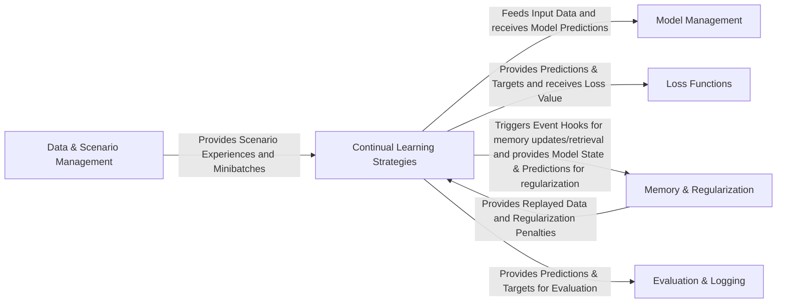

## Details

The Avalanche project is structured around a set of interconnected components designed to facilitate research and development in continual learning. At its core, the Continual Learning Strategies component orchestrates the entire learning process, managing training loops, optimizers, and integrating various continual learning algorithms through a flexible plugin system. It receives structured data from Data & Scenario Management, which handles dataset loading, transformations, and the creation of continual learning scenarios. The strategies interact with Model Management to adapt neural network architectures dynamically and utilize Loss Functions to quantify prediction errors. To combat catastrophic forgetting, Memory & Regularization mechanisms are employed, providing replay data and regularization penalties back to the strategies. Finally, Evaluation & Logging collects and reports performance metrics, offering insights into the learning process. This modular design ensures clear separation of concerns, enabling flexible experimentation and robust continual learning system development.

### Data & Scenario Management [[Expand]](./Data_Scenario_Management.md)
Responsible for loading raw datasets, applying transformations, structuring them into continual learning scenarios (streams of experiences), and providing batched data.

**Related Classes/Methods**:

- <a href="https://github.com/ContinualAI/avalanche/blob/master/avalanche/benchmarks/scenarios/supervised.py#L36-L136" target="_blank" rel="noopener noreferrer">`avalanche.benchmarks.scenarios.supervised.class_incremental_benchmark`:36-136</a>
- <a href="https://github.com/ContinualAI/avalanche/blob/master/avalanche/benchmarks/utils/data_loader.py" target="_blank" rel="noopener noreferrer">`avalanche.benchmarks.utils.data_loader`</a>
- <a href="https://github.com/ContinualAI/avalanche/blob/master/avalanche/benchmarks/scenarios" target="_blank" rel="noopener noreferrer">`avalanche.benchmarks.scenarios`</a>
- <a href="https://github.com/ContinualAI/avalanche/blob/master/avalanche/benchmarks/datasets" target="_blank" rel="noopener noreferrer">`avalanche.benchmarks.datasets`</a>

### Model Management [[Expand]](./Model_Management.md)
Encapsulates neural network architectures and provides mechanisms for dynamic adaptation of these models during continual learning, such as adding new output heads or pruning.

**Related Classes/Methods**:

- <a href="https://github.com/ContinualAI/avalanche/blob/master/avalanche/models" target="_blank" rel="noopener noreferrer">`avalanche.models`</a>
- <a href="https://github.com/ContinualAI/avalanche/blob/master/avalanche/models/dynamic_modules.py" target="_blank" rel="noopener noreferrer">`avalanche.models.dynamic_modules`</a>

### Continual Learning Strategies [[Expand]](./Continual_Learning_Strategies.md)
The central orchestrator of the learning process. It defines the main training loop, manages optimizers, and integrates various continual learning algorithms through a flexible plugin system.

**Related Classes/Methods**:

- <a href="https://github.com/ContinualAI/avalanche/blob/master/avalanche/training/templates/base_sgd.py" target="_blank" rel="noopener noreferrer">`avalanche.training.templates.base_sgd`</a>
- <a href="https://github.com/ContinualAI/avalanche/blob/master/avalanche/training/plugins/strategy_plugin.py" target="_blank" rel="noopener noreferrer">`avalanche.training.plugins.strategy_plugin`</a>
- <a href="https://github.com/ContinualAI/avalanche/blob/master/avalanche/training/plugins" target="_blank" rel="noopener noreferrer">`avalanche.training.plugins`</a>

### Memory & Regularization [[Expand]](./Memory_Regularization.md)
Implements mechanisms for storing and retrieving past experiences (e.g., data samples, features) in a replay buffer and provides various regularization techniques to mitigate catastrophic forgetting.

**Related Classes/Methods**:

- <a href="https://github.com/ContinualAI/avalanche/blob/master/avalanche/training/storage_policy.py" target="_blank" rel="noopener noreferrer">`avalanche.training.storage_policy`</a>
- <a href="https://github.com/ContinualAI/avalanche/blob/master/avalanche/training/regularization.py" target="_blank" rel="noopener noreferrer">`avalanche.training.regularization`</a>

### Loss Functions
Provides a collection of standard and continual learning-specific loss functions used to quantify the discrepancy between model predictions and ground truth.

**Related Classes/Methods**:

- <a href="https://github.com/ContinualAI/avalanche/blob/master/avalanche/training/losses.py" target="_blank" rel="noopener noreferrer">`avalanche.training.losses`</a>

### Evaluation & Logging [[Expand]](./Evaluation_Logging.md)
Computes and aggregates various performance metrics (e.g., accuracy, forgetting) during and after training, and dispatches these metrics to various logging backends for visualization and record-keeping.

**Related Classes/Methods**:

- <a href="https://github.com/ContinualAI/avalanche/blob/master/avalanche/evaluation/metrics" target="_blank" rel="noopener noreferrer">`avalanche.evaluation.metrics`</a>
- <a href="https://github.com/ContinualAI/avalanche/blob/master/avalanche/logging" target="_blank" rel="noopener noreferrer">`avalanche.logging`</a>
- <a href="https://github.com/ContinualAI/avalanche/blob/master/avalanche/evaluation/collector.py" target="_blank" rel="noopener noreferrer">`avalanche.evaluation.collector`</a>

### [FAQ](https://github.com/CodeBoarding/GeneratedOnBoardings/tree/main?tab=readme-ov-file#faq)