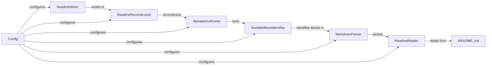

## Component Details

### ReadmeReader
The ReadmeReader component is responsible for reading the content of the README.md file. It opens the file, reads its content, and passes the content as a string to the subsequent components for parsing and sorting. It serves as the entry point for the entire process.
- **Related Classes/Methods**: `readme_sorter/reader.py`

### MarkdownParser
The MarkdownParser component parses the raw README content, identifying different sections, headings, and lists. It extracts sortable blocks of text based on Markdown syntax, such as lists with consistent indentation. This component prepares the data for the sorting process.
- **Related Classes/Methods**: `readme_sorter/parser.py`

### SortableBlockIdentifier
The SortableBlockIdentifier component analyzes the parsed Markdown content to identify specific blocks that are suitable for sorting. It focuses on lists and other structured elements where items can be arranged alphabetically without disrupting the document's overall structure. It determines the boundaries of these sortable blocks.
- **Related Classes/Methods**: `readme_sorter/identifier.py`

### AlphabeticalSorter
The AlphabeticalSorter component takes the identified sortable blocks and arranges the items within each block alphabetically. It uses standard sorting algorithms to ensure that the items are in the correct order. This component performs the core sorting functionality.
- **Related Classes/Methods**: `readme_sorter/sorter.py`

### ReadmeReconstructor
The ReadmeReconstructor component takes the sorted blocks and integrates them back into the original Markdown structure. It combines the sorted content with the unchanged parts of the README file, ensuring that the overall document structure and formatting are preserved. This component effectively merges the sorted content back into the original document.
- **Related Classes/Methods**: `readme_sorter/reconstructor.py`

### ReadmeWriter
The ReadmeWriter component writes the reconstructed content back to the README.md file, overwriting the original content with the sorted version. It ensures that the changes are saved to the file system, completing the sorting process. This component is the final step in the pipeline.
- **Related Classes/Methods**: `readme_sorter/writer.py`

### Config
The Config component manages configuration settings for the ReadmeSorter, such as indentation levels, custom sorting rules, and file paths. It provides a centralized way to configure the behavior of the other components. While not explicitly used in the provided code, it represents a potential area for future expansion and customization.
- **Related Classes/Methods**: `readme_sorter/config.py`
