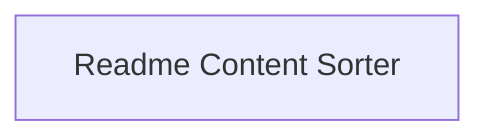

## Component Details

### Readme Content Sorter
This component is responsible for sorting the content of the README.md file. It identifies blocks of sortable items (primarily links) based on indentation and sorts them alphabetically. It ensures the README remains organized and easy to navigate.
- **Related Classes/Methods**: `config.py`