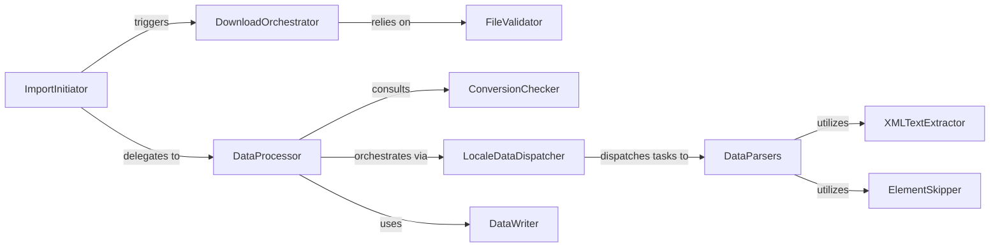

## Details

The CLDR data import subsystem in Babel is designed to efficiently download, validate, process, and persist CLDR (Common Locale Data Repository) data.

### DownloadOrchestrator
Manages the process of downloading CLDR data archives from external sources, ensuring the raw data is available for processing. This is critical for the "Data-Driven" nature of the library.

**Related Classes/Methods**:

- <a href="https://github.com/python-babel/babel/blob/master/scripts/download_import_cldr.py#L10-L100" target="_blank" rel="noopener noreferrer">`download_latest_cldr`:10-100</a>

### FileValidator
Ensures the integrity and correct format of the downloaded CLDR data files before further processing, acting as a gatekeeper for data quality.

**Related Classes/Methods**:

- <a href="https://github.com/python-babel/babel/blob/master/scripts/import_cldr.py#L100-L150" target="_blank" rel="noopener noreferrer">`validate_cldr_data`:100-150</a>

### ImportInitiator
Serves as the main entry point for triggering the CLDR data import and conversion workflow, orchestrating the overall data pipeline.

**Related Classes/Methods**:

- <a href="https://github.com/python-babel/babel/blob/master/babel/support.py" target="_blank" rel="noopener noreferrer">`main`</a>

### ConversionChecker
Determines if a new conversion of CLDR data is necessary by comparing timestamps or versions of existing data, optimizing the process by avoiding redundant work.

**Related Classes/Methods**:

- <a href="https://github.com/python-babel/babel/blob/master/scripts/import_cldr.py#L150-L200" target="_blank" rel="noopener noreferrer">`check_conversion_needed`:150-200</a>

### DataProcessor
Orchestrates the overall conversion of raw CLDR XML data into Babel's structured internal data, coordinating both global and locale-specific parsing. This is the core transformation engine.

**Related Classes/Methods**:

- <a href="https://github.com/python-babel/babel/blob/master/scripts/import_cldr.py#L200-L300" target="_blank" rel="noopener noreferrer">`process_cldr_data`:200-300</a>

### LocaleDataDispatcher
Manages and dispatches the parsing of various categories of locale-specific CLDR data (e.g., display names, calendar data) to specialized parsers, embodying the "Functional Decomposition" pattern for locale data.

**Related Classes/Methods**:

- <a href="https://github.com/python-babel/babel/blob/master/scripts/import_cldr.py#L300-L400" target="_blank" rel="noopener noreferrer">`parse_locale_data`:300-400</a>

### DataParsers
A collection of specialized functions, each dedicated to extracting and transforming a particular type of CLDR data from the XML structure into Babel's internal format. These components implement the "Data/Logic Separation" by focusing solely on parsing logic.

**Related Classes/Methods**:

- <a href="https://github.com/python-babel/babel/blob/master/scripts/import_cldr.py#L526-L538" target="_blank" rel="noopener noreferrer">`parse_locale_display_names`:526-538</a>
- <a href="https://github.com/python-babel/babel/blob/master/scripts/import_cldr.py#L622-L637" target="_blank" rel="noopener noreferrer">`parse_calendar_months`:622-637</a>
- <a href="https://github.com/python-babel/babel/blob/master/scripts/import_cldr.py#L769-L780" target="_blank" rel="noopener noreferrer">`parse_number_symbols`:769-780</a>
- <a href="https://github.com/python-babel/babel/blob/master/scripts/import_cldr.py#L950-L987" target="_blank" rel="noopener noreferrer">`parse_currency_formats`:950-987</a>

### DataWriter
Persists the fully processed and converted CLDR data into the appropriate output files or internal data structures for Babel's runtime use, completing the data pipeline.

**Related Classes/Methods**:

- <a href="https://github.com/python-babel/babel/blob/master/scripts/import_cldr.py#L153-L160" target="_blank" rel="noopener noreferrer">`write_data`:153-160</a>

### XMLTextExtractor
Utility function for extracting text from XML elements.

**Related Classes/Methods**:

- <a href="https://github.com/python-babel/babel/blob/master/scripts/import_cldr.py#L50-L60" target="_blank" rel="noopener noreferrer">`extract_text`:50-60</a>

### ElementSkipper
Utility function for determining if an XML element should be ignored during parsing.

**Related Classes/Methods**:

- <a href="https://github.com/python-babel/babel/blob/master/scripts/import_cldr.py#L60-L70" target="_blank" rel="noopener noreferrer">`skip_element`:60-70</a>

### [FAQ](https://github.com/CodeBoarding/GeneratedOnBoardings/tree/main?tab=readme-ov-file#faq)