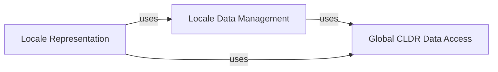

## Details

The `Locale Data & Core API` subsystem is responsible for the foundational aspects of internationalization within the `babel` project, specifically managing the loading, caching, and resolution of locale-specific data and providing a core interface for locale identifiers and general locale information.

### Locale Data Management
This component acts as the low-level manager for loading, caching, and merging raw CLDR locale data from `.dat` files. It handles the intricacies of data inheritance (e.g., `en_US` inheriting from `en` and `root`) and provides utilities for locale identifier normalization and existence checks. It is the primary source for raw, processed locale data.

**Related Classes/Methods**:

- <a href="https://github.com/python-babel/babel/blob/master/babel/localedata.py#L1-L1000" target="_blank" rel="noopener noreferrer">`babel.localedata`:1-1000</a>

### Locale Representation
This component provides the primary object-oriented interface, the `Locale` class, for representing and interacting with a specific locale. It encapsulates the locale's identity (language, territory, script, etc.) and offers structured, high-level access to its associated locale-dependent information (e.g., language names, number formats, date patterns). It serves as the main entry point for consumers of locale data.

**Related Classes/Methods**:

- <a href="https://github.com/python-babel/babel/blob/master/babel/core.py" target="_blank" rel="noopener noreferrer">`babel.core.Locale`</a>

### Global CLDR Data Access
This component is responsible for loading and providing access to global CLDR data that is not specific to any single locale but is crucial for overall locale resolution, aliasing, and data inheritance rules. Examples include `likely_subtags`, `parent_exceptions`, and `zone_aliases`. This data supports the correct interpretation and processing of locale identifiers and data.

**Related Classes/Methods**:

- <a href="https://github.com/python-babel/babel/blob/master/babel/core.py#L67-L110" target="_blank" rel="noopener noreferrer">`babel.core.get_global`:67-110</a>

### [FAQ](https://github.com/CodeBoarding/GeneratedOnBoardings/tree/main?tab=readme-ov-file#faq)