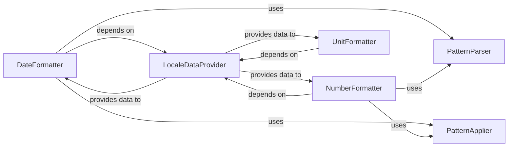

## Details

The `Locale Formatting` subsystem is responsible for providing functionality for formatting and parsing locale-specific data types such as dates, times, numbers, currencies, percentages, and units. It heavily leverages the `Locale Data & Core API` for locale-specific information.

### DateFormatter
Orchestrates the formatting and parsing of date, time, and timedelta values based on locale-specific rules and patterns. It acts as the primary interface for date and time localization.

**Related Classes/Methods**:

- <a href="https://github.com/python-babel/babel/blob/master/babel/dates.py" target="_blank" rel="noopener noreferrer">`babel.dates.DateFormatter`</a>

### NumberFormatter
Manages the formatting and parsing of numerical values, including decimals, currencies, and percentages, adhering to locale conventions. It provides the core functionality for numerical localization.

**Related Classes/Methods**:

- <a href="https://github.com/python-babel/babel/blob/master/babel/numbers.py" target="_blank" rel="noopener noreferrer">`babel.numbers.NumberFormatter`</a>

### UnitFormatter
Provides functionality for formatting single and compound units of measurement according to locale display names and patterns. This component ensures units are presented correctly based on the target locale.

**Related Classes/Methods**:

- <a href="https://github.com/python-babel/babel/blob/master/babel/units.py" target="_blank" rel="noopener noreferrer">`babel.units.UnitFormatter`</a>

### LocaleDataProvider
Serves as the central repository and access layer for all locale-specific data (e.g., date/time formats, number/currency symbols, unit display names) required by the formatting components. This component embodies the Data-Driven (Locale Data) pattern, abstracting data access from formatting logic.

**Related Classes/Methods**:

- <a href="https://github.com/python-babel/babel/blob/master/babel/core.py" target="_blank" rel="noopener noreferrer">`babel.core.LocaleDataProvider`</a>

### PatternParser
Interprets CLDR (Common Locale Data Repository) formatting patterns into an internal, actionable representation. This is an internal helper component crucial for translating human-readable patterns into machine-processable instructions.

**Related Classes/Methods**:

- <a href="https://github.com/python-babel/babel/blob/master/babel/dates.py" target="_blank" rel="noopener noreferrer">`babel.dates.PatternParser`</a>
- <a href="https://github.com/python-babel/babel/blob/master/babel/numbers.py" target="_blank" rel="noopener noreferrer">`babel.numbers.PatternParser`</a>

### PatternApplier
Applies the internally parsed formatting patterns to raw data values to produce formatted strings. This is an internal helper component that executes the formatting logic based on the parsed patterns.

**Related Classes/Methods**:

- <a href="https://github.com/python-babel/babel/blob/master/babel/dates.py" target="_blank" rel="noopener noreferrer">`babel.dates.PatternApplier`</a>
- <a href="https://github.com/python-babel/babel/blob/master/babel/numbers.py" target="_blank" rel="noopener noreferrer">`babel.numbers.PatternApplier`</a>

### [FAQ](https://github.com/CodeBoarding/GeneratedOnBoardings/tree/main?tab=readme-ov-file#faq)