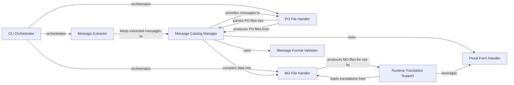

## Details

The babel.messages subsystem provides a comprehensive framework for internationalization and localization. The CLI Orchestrator serves as the primary user interface, initiating workflows such as message extraction, catalog management, and compilation. The Message Extractor identifies translatable strings from source code, feeding them into the Message Catalog Manager, which acts as the central repository for translation units. The PO File Handler facilitates human-readable translation editing by converting catalogs to and from PO files. For runtime efficiency, the Message Catalog Manager compiles data into MO files via the MO File Handler. The Runtime Translation Support component then utilizes these MO files and leverages the Plural Form Handler to provide dynamic translation and pluralization capabilities to applications. Additionally, the Message Format Validator ensures the integrity of message strings within the Message Catalog Manager.

### CLI Orchestrator
Provides the command-line interface (pybabel) for users to initiate and manage message extraction, catalog updates, and compilation processes. It acts as the primary user-facing entry point for translation workflows.

**Related Classes/Methods**:

- <a href="https://github.com/python-babel/babel/blob/master/babel/messages/frontend.py" target="_blank" rel="noopener noreferrer">`babel.messages.frontend`</a>

### Message Extractor
Scans various source code files (e.g., Python, JavaScript) to identify and extract translatable messages based on defined extraction methods.

**Related Classes/Methods**:

- <a href="https://github.com/python-babel/babel/blob/master/babel/messages/extract.py" target="_blank" rel="noopener noreferrer">`babel.messages.extract`</a>

### Message Catalog Manager
Serves as the central in-memory data structure for managing message catalogs. It handles the addition, retrieval, updating, and validation of translation units (messages and their translations).

**Related Classes/Methods**:

- <a href="https://github.com/python-babel/babel/blob/master/babel/messages/catalog.py" target="_blank" rel="noopener noreferrer">`babel.messages.catalog`</a>

### PO File Handler
Manages the reading and writing of Gettext Portable Object (PO) files. It bridges between the standard human-readable translation file format and the Message Catalog Manager's in-memory representation.

**Related Classes/Methods**:

- <a href="https://github.com/python-babel/babel/blob/master/babel/messages/pofile.py" target="_blank" rel="noopener noreferrer">`babel.messages.pofile`</a>

### MO File Handler
Handles the compilation of message catalogs into Gettext Machine Object (MO) files. These files are optimized for efficient runtime lookup of translations by applications.

**Related Classes/Methods**:

- <a href="https://github.com/python-babel/babel/blob/master/babel/messages/mofile.py" target="_blank" rel="noopener noreferrer">`babel.messages.mofile`</a>

### Runtime Translation Support
Provides the public API for applications to perform translations at runtime. This includes looking up translated messages, handling pluralization, and offering lazy translation proxies.

**Related Classes/Methods**:

- <a href="https://github.com/python-babel/babel/blob/master/babel/support.py#L629-L636" target="_blank" rel="noopener noreferrer">`babel.support.__init__`:629-636</a>

### Message Format Validator
A utility component that validates the syntax and placeholders within message strings to prevent errors and ensure consistency across translations.

**Related Classes/Methods**:

- <a href="https://github.com/python-babel/babel/blob/master/babel/messages/checkers.py" target="_blank" rel="noopener noreferrer">`babel.messages.checkers`</a>

### Plural Form Handler
Encapsulates the complex logic for determining the correct plural form of a message based on a given number and locale-specific rules, adhering to CLDR data.

**Related Classes/Methods**:

- <a href="https://github.com/python-babel/babel/blob/master/babel/messages/plurals.py" target="_blank" rel="noopener noreferrer">`babel.messages.plurals`</a>

### [FAQ](https://github.com/CodeBoarding/GeneratedOnBoardings/tree/main?tab=readme-ov-file#faq)