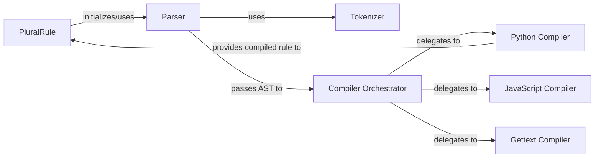

## Details

The Plural Rule Engine subsystem is responsible for interpreting and compiling CLDR plural rules into executable code for various target languages, which is crucial for correct pluralization in formatting and message translation within the babel library. The subsystem is primarily encapsulated within the babel.plural module, located in the babel/plural.py file.

### PluralRule
The primary public interface for consumers. It encapsulates a compiled plural rule, handling its initialization, parsing, and execution to determine the correct plural category for a given number.

**Related Classes/Methods**:

- <a href="https://github.com/python-babel/babel/blob/master/babel/plural.py#L80-L170" target="_blank" rel="noopener noreferrer">`babel.plural.PluralRule`:80-170</a>

### Tokenizer
Performs lexical analysis of plural rule strings, breaking them down into a sequence of meaningful tokens.

**Related Classes/Methods**:

- <a href="https://github.com/python-babel/babel/blob/master/babel/plural.py#L346-L361" target="_blank" rel="noopener noreferrer">`babel.plural.tokenize_rule`:346-361</a>

### Parser
Performs syntactic and semantic analysis of the token stream, constructing an Abstract Syntax Tree (AST) representing the rule's structure. It orchestrates the tokenization and AST construction process.

**Related Classes/Methods**:

- <a href="https://github.com/python-babel/babel/blob/master/babel/plural.py#L396-L515" target="_blank" rel="noopener noreferrer">`babel.plural._Parser`:396-515</a>
- <a href="https://github.com/python-babel/babel/blob/master/babel/plural.py#L130-L140" target="_blank" rel="noopener noreferrer">`babel.plural.parse`:130-140</a>

### Compiler Orchestrator
The core compilation function that takes an AST and dispatches it to the appropriate specialized compiler based on the target format (Python, JavaScript, Gettext).

**Related Classes/Methods**:

- <a href="https://github.com/python-babel/babel/blob/master/babel/plural.py#L536-L538" target="_blank" rel="noopener noreferrer">`babel.plural.compile`:536-538</a>

### Python Compiler
A specialized compiler that traverses the AST and generates executable Python code.

**Related Classes/Methods**:

- <a href="https://github.com/python-babel/babel/blob/master/babel/plural.py#L560-L570" target="_blank" rel="noopener noreferrer">`babel.plural._PythonCompiler`:560-570</a>

### JavaScript Compiler
A specialized compiler that traverses the AST and generates JavaScript code from the AST.

**Related Classes/Methods**:

- <a href="https://github.com/python-babel/babel/blob/master/babel/plural.py#L595-L612" target="_blank" rel="noopener noreferrer">`babel.plural._JavaScriptCompiler`:595-612</a>

### Gettext Compiler
A specialized compiler that generates a Gettext-compatible C-style expression from the AST.

**Related Classes/Methods**:

- <a href="https://github.com/python-babel/babel/blob/master/babel/plural.py#L573-L592" target="_blank" rel="noopener noreferrer">`babel.plural._GettextCompiler`:573-592</a>

### [FAQ](https://github.com/CodeBoarding/GeneratedOnBoardings/tree/main?tab=readme-ov-file#faq)