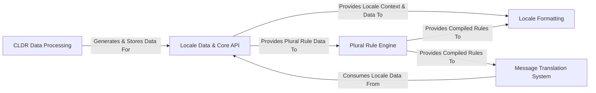

## Details

The Babel library's architecture is characterized by a clear separation of concerns, enabling robust internationalization and localization capabilities. It begins with an offline CLDR Data Processing pipeline that prepares locale-specific data. This data is then consumed at runtime by the Locale Data & Core API, which serves as the central repository and interface for all locale-related information. Specialized components like Locale Formatting leverage this core data to handle diverse formatting needs (dates, numbers, units). A dedicated Plural Rule Engine processes CLDR plural rules, providing essential logic for both formatting and the comprehensive Message Translation System. This system encompasses message extraction, catalog management, file I/O (PO/MO), and runtime translation support, forming a complete Gettext integration. This modular design ensures extensibility, maintainability, and clear data flow, making it ideal for diagrammatic representation where each component's role and interactions are distinctly visible.

### CLDR Data Processing [[Expand]](./CLDR_Data_Processing.md)
Handles the offline ingestion, parsing, and conversion of raw CLDR XML data into Babel's internal data structures.

**Related Classes/Methods**:

- <a href="https://github.com/python-babel/babel/blob/master/scripts/import_cldr.py" target="_blank" rel="noopener noreferrer">`scripts.import_cldr`</a>
- <a href="https://github.com/python-babel/babel/blob/master/scripts/download_import_cldr.py" target="_blank" rel="noopener noreferrer">`scripts.download_import_cldr`</a>

### Locale Data & Core API [[Expand]](./Locale_Data_Core_API.md)
Manages the loading, caching, and resolution of locale-specific data at runtime, providing the foundational data and a core interface for locale identifiers and general locale information.

**Related Classes/Methods**:

- <a href="https://github.com/python-babel/babel/blob/master/babel/localedata.py" target="_blank" rel="noopener noreferrer">`babel.localedata`</a>
- <a href="https://github.com/python-babel/babel/blob/master/babel/core.py" target="_blank" rel="noopener noreferrer">`babel.core`</a>
- <a href="https://github.com/python-babel/babel/blob/master/babel/languages.py" target="_blank" rel="noopener noreferrer">`babel.languages`</a>
- <a href="https://github.com/python-babel/babel/blob/master/babel/lists.py" target="_blank" rel="noopener noreferrer">`babel.lists`</a>

### Locale Formatting [[Expand]](./Locale_Formatting.md)
Provides functionality for formatting and parsing locale-specific data types such as dates, times, numbers, currencies, percentages, and units, leveraging the `Locale Data & Core API`.

**Related Classes/Methods**:

- <a href="https://github.com/python-babel/babel/blob/master/babel/dates.py" target="_blank" rel="noopener noreferrer">`babel.dates`</a>
- <a href="https://github.com/python-babel/babel/blob/master/babel/numbers.py" target="_blank" rel="noopener noreferrer">`babel.numbers`</a>
- <a href="https://github.com/python-babel/babel/blob/master/babel/units.py" target="_blank" rel="noopener noreferrer">`babel.units`</a>

### Plural Rule Engine [[Expand]](./Plural_Rule_Engine.md)
Interprets and compiles CLDR plural rules into executable code for various target languages, essential for correct pluralization in both formatting and message translation.

**Related Classes/Methods**:

- <a href="https://github.com/python-babel/babel/blob/master/babel/plural.py" target="_blank" rel="noopener noreferrer">`babel.plural`</a>

### Message Translation System [[Expand]](./Message_Translation_System.md)
A comprehensive system for managing translatable messages, including extraction from source code, in-memory catalog management, reading/writing Gettext PO/MO files, and providing runtime translation support. It also includes the `pybabel` CLI tools.

**Related Classes/Methods**:

- <a href="https://github.com/python-babel/babel/blob/master/babel/messages/catalog.py" target="_blank" rel="noopener noreferrer">`babel.messages.catalog`</a>
- <a href="https://github.com/python-babel/babel/blob/master/babel/messages/pofile.py" target="_blank" rel="noopener noreferrer">`babel.messages.pofile`</a>
- <a href="https://github.com/python-babel/babel/blob/master/babel/messages/mofile.py" target="_blank" rel="noopener noreferrer">`babel.messages.mofile`</a>
- <a href="https://github.com/python-babel/babel/blob/master/babel/messages/extract.py" target="_blank" rel="noopener noreferrer">`babel.messages.extract`</a>
- <a href="https://github.com/python-babel/babel/blob/master/babel/messages/frontend.py" target="_blank" rel="noopener noreferrer">`babel.messages.frontend`</a>
- <a href="https://github.com/python-babel/babel/blob/master/babel/support.py" target="_blank" rel="noopener noreferrer">`babel.support`</a>

### [FAQ](https://github.com/CodeBoarding/GeneratedOnBoardings/tree/main?tab=readme-ov-file#faq)