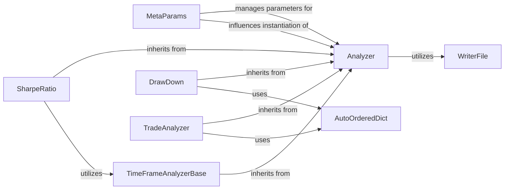

## Component Details

The `Analyzer` subsystem in `backtrader` is designed to calculate and aggregate various performance metrics and statistics of a trading strategy during or after a backtest. Analyzers are attached to `Cerebro` or `Strategy` instances and process data as the simulation runs, providing valuable insights into strategy performance.

### Analyzer
This is the abstract base class (`backtrader.analyzer.Analyzer`) for all analyzers. It defines the essential interface and lifecycle methods (`start`, `stop`, `next`, `prenext`, `notify_trade`, `notify_order`, `notify_cashvalue`, `notify_fund`) that specialized analyzers must implement. It acts as the primary hook into the backtesting process, allowing data collection and processing. It also provides methods (`get_analysis`, `print`, `pprint`) for retrieving and presenting analysis results.

**Related Classes/Methods**:

- <a href="https://github.com/mementum/backtrader/blob/master/backtrader/analyzer.py#L88-L285" target="_blank" rel="noopener noreferrer">`backtrader.analyzer.Analyzer` (88:285)</a>
- <a href="https://github.com/mementum/backtrader/blob/master/backtrader/analyzer.py#L236-L239" target="_blank" rel="noopener noreferrer">`backtrader.analyzer.Analyzer:start` (236:239)</a>
- <a href="https://github.com/mementum/backtrader/blob/master/backtrader/analyzer.py#L241-L244" target="_blank" rel="noopener noreferrer">`backtrader.analyzer.Analyzer:stop` (241:244)</a>
- <a href="https://github.com/mementum/backtrader/blob/master/backtrader/analyzer.py#L217-L220" target="_blank" rel="noopener noreferrer">`backtrader.analyzer.Analyzer:next` (217:220)</a>
- <a href="https://github.com/mementum/backtrader/blob/master/backtrader/analyzer.py#L222-L228" target="_blank" rel="noopener noreferrer">`backtrader.analyzer.Analyzer:prenext` (222:228)</a>
- <a href="https://github.com/mementum/backtrader/blob/master/backtrader/analyzer.py#L213-L215" target="_blank" rel="noopener noreferrer">`backtrader.analyzer.Analyzer:notify_trade` (213:215)</a>
- <a href="https://github.com/mementum/backtrader/blob/master/backtrader/analyzer.py#L209-L211" target="_blank" rel="noopener noreferrer">`backtrader.analyzer.Analyzer:notify_order` (209:211)</a>
- <a href="https://github.com/mementum/backtrader/blob/master/backtrader/analyzer.py#L201-L203" target="_blank" rel="noopener noreferrer">`backtrader.analyzer.Analyzer:notify_cashvalue` (201:203)</a>
- <a href="https://github.com/mementum/backtrader/blob/master/backtrader/analyzer.py#L205-L207" target="_blank" rel="noopener noreferrer">`backtrader.analyzer.Analyzer:notify_fund` (205:207)</a>
- <a href="https://github.com/mementum/backtrader/blob/master/backtrader/analyzer.py#L254-L267" target="_blank" rel="noopener noreferrer">`backtrader.analyzer.Analyzer:get_analysis` (254:267)</a>
- <a href="https://github.com/mementum/backtrader/blob/master/backtrader/analyzer.py#L269-L279" target="_blank" rel="noopener noreferrer">`backtrader.analyzer.Analyzer:print` (269:279)</a>
- <a href="https://github.com/mementum/backtrader/blob/master/backtrader/analyzer.py#L281-L285" target="_blank" rel="noopener noreferrer">`backtrader.analyzer.Analyzer:pprint` (281:285)</a>
- <a href="https://github.com/mementum/backtrader/blob/master/backtrader/writer.py#L42-L217" target="_blank" rel="noopener noreferrer">`backtrader.writer.WriterFile` (42:217)</a>

### MetaParams
A metaclass (`backtrader.metabase.MetaParams`) that underpins the parameter management system for `backtrader` components, including analyzers. It ensures that parameters defined within an analyzer class are correctly processed, inherited, and made accessible to instances. This provides a robust and consistent configuration mechanism for all analyzers.

**Related Classes/Methods**:

- <a href="https://github.com/mementum/backtrader/blob/master/backtrader/metabase.py#L202-L292" target="_blank" rel="noopener noreferrer">`backtrader.metabase.MetaParams` (202:292)</a>

### WriterFile
This utility class (`backtrader.writer.WriterFile`) is responsible for flexible output of data to various streams, such as `sys.stdout` or a specified file. It supports different formatting options, including CSV and structured dictionary output, making it crucial for presenting the results generated by analyzers in a readable and customizable format.

**Related Classes/Methods**:

- <a href="https://github.com/mementum/backtrader/blob/master/backtrader/writer.py#L42-L217" target="_blank" rel="noopener noreferrer">`backtrader.writer.WriterFile` (42:217)</a>

### AutoOrderedDict
An extended version of `collections.OrderedDict` (`backtrader.utils.autodict.AutoOrderedDict`) that automatically creates nested dictionary structures upon accessing missing keys. This feature significantly simplifies the process of building complex, hierarchical data structures for storing analysis results within concrete analyzers. It also includes a `_close` method to prevent further key creation after the analysis is finalized.

**Related Classes/Methods**:

- <a href="https://github.com/mementum/backtrader/blob/master/backtrader/utils/autodict.py#L79-L144" target="_blank" rel="noopener noreferrer">`backtrader.utils.autodict.AutoOrderedDict` (79:144)</a>
- <a href="https://github.com/mementum/backtrader/blob/master/backtrader/utils/autodict.py#L82-L86" target="_blank" rel="noopener noreferrer">`backtrader.utils.autodict.AutoOrderedDict:_close` (82:86)</a>

### TimeFrameAnalyzerBase
An abstract base class (`backtrader.analyzer.TimeFrameAnalyzerBase`) that extends `Analyzer` to provide specialized functionality for analyses that are sensitive to specific timeframes (e.g., daily, weekly, monthly). It introduces logic to detect the beginning of new timeframe periods (`_dt_over`) and offers `on_dt_over` hooks for subclasses to perform calculations at these precise intervals.

**Related Classes/Methods**:

- <a href="https://github.com/mementum/backtrader/blob/master/backtrader/analyzer.py#L298-L445" target="_blank" rel="noopener noreferrer">`backtrader.analyzer.TimeFrameAnalyzerBase` (298:445)</a>
- <a href="https://github.com/mementum/backtrader/blob/master/backtrader/analyzer.py#L345-L358" target="_blank" rel="noopener noreferrer">`backtrader.analyzer.TimeFrameAnalyzerBase:_dt_over` (345:358)</a>
- <a href="https://github.com/mementum/backtrader/blob/master/backtrader/analyzer.py#L342-L343" target="_blank" rel="noopener noreferrer">`backtrader.analyzer.TimeFrameAnalyzerBase:on_dt_over` (342:343)</a>

### DrawDown
A concrete implementation of an analyzer (`backtrader.analyzers.drawdown.DrawDown`) focused on calculating and tracking the maximum drawdown and other related statistics of a portfolio's equity curve. It overrides `create_analysis` to initialize an `AutoOrderedDict` for its results and implements `notify_fund` and `next` to perform its calculations based on portfolio value.

**Related Classes/Methods**:

- <a href="https://github.com/mementum/backtrader/blob/master/backtrader/analyzers/drawdown.py#L30-L109" target="_blank" rel="noopener noreferrer">`backtrader.analyzers.drawdown.DrawDown` (30:109)</a>
- <a href="https://github.com/mementum/backtrader/blob/master/backtrader/analyzers/drawdown.py#L73-L84" target="_blank" rel="noopener noreferrer">`backtrader.analyzers.drawdown.DrawDown:create_analysis` (73:84)</a>
- <a href="https://github.com/mementum/backtrader/blob/master/backtrader/analyzers/drawdown.py#L89-L95" target="_blank" rel="noopener noreferrer">`backtrader.analyzers.drawdown.DrawDown:notify_fund` (89:95)</a>
- <a href="https://github.com/mementum/backtrader/blob/master/backtrader/analyzers/drawdown.py#L97-L109" target="_blank" rel="noopener noreferrer">`backtrader.analyzers.drawdown.DrawDown:next` (97:109)</a>
- <a href="https://github.com/mementum/backtrader/blob/master/backtrader/utils/autodict.py#L79-L144" target="_blank" rel="noopener noreferrer">`backtrader.utils.autodict.AutoOrderedDict` (79:144)</a>

### SharpeRatio
A concrete analyzer (`backtrader.analyzers.sharpe.SharpeRatio`) that computes the Sharpe Ratio, a key measure of risk-adjusted return. It can be configured with various timeframes and risk-free rates. It often relies on other analyzers, such as `TimeReturn` (a `TimeFrameAnalyzerBase` subclass), to gather the necessary return data for its calculations, which are finalized in its `stop` method.

**Related Classes/Methods**:

- <a href="https://github.com/mementum/backtrader/blob/master/backtrader/analyzers/sharpe.py#L32-L205" target="_blank" rel="noopener noreferrer">`backtrader.analyzers.sharpe.SharpeRatio` (32:205)</a>
- <a href="https://github.com/mementum/backtrader/blob/master/backtrader/analyzers/sharpe.py#L142-L205" target="_blank" rel="noopener noreferrer">`backtrader.analyzers.sharpe.SharpeRatio:stop` (142:205)</a>
- <a href="https://github.com/mementum/backtrader/blob/master/backtrader/analyzer.py#L298-L445" target="_blank" rel="noopener noreferrer">`backtrader.analyzer.TimeFrameAnalyzerBase` (298:445)</a>
- <a href="https://github.com/mementum/backtrader/blob/master/backtrader/analyzers/timereturn.py#L26-L141" target="_blank" rel="noopener noreferrer">`backtrader.analyzers.timereturn.TimeReturn` (26:141)</a>

### TradeAnalyzer
A concrete analyzer (`backtrader.analyzers.tradeanalyzer.TradeAnalyzer`) that provides comprehensive statistics for individual trades executed during a backtest. This includes metrics like profit/loss, trade duration, winning/losing streaks, and average trade performance. It heavily leverages `AutoOrderedDict` to manage its complex, nested result structure and processes trade-related events via its `notify_trade` method.

**Related Classes/Methods**:

- <a href="https://github.com/mementum/backtrader/blob/master/backtrader/analyzers/tradeanalyzer.py#L30-L207" target="_blank" rel="noopener noreferrer">`backtrader.analyzers.tradeanalyzer.TradeAnalyzer` (30:207)</a>
- <a href="https://github.com/mementum/backtrader/blob/master/backtrader/analyzers/tradeanalyzer.py#L75-L207" target="_blank" rel="noopener noreferrer">`backtrader.analyzers.tradeanalyzer.TradeAnalyzer:notify_trade` (75:207)</a>
- <a href="https://github.com/mementum/backtrader/blob/master/backtrader/utils/autodict.py#L79-L144" target="_blank" rel="noopener noreferrer">`backtrader.utils.autodict.AutoOrderedDict` (79:144)</a>

### [FAQ](https://github.com/CodeBoarding/GeneratedOnBoardings/tree/main?tab=readme-ov-file#faq)