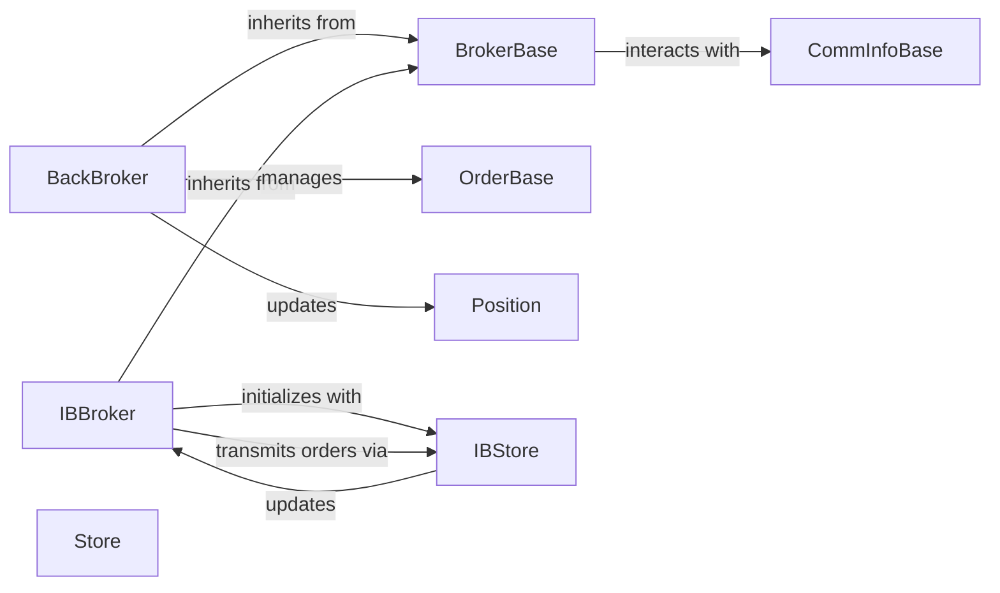

## Component Details

The Broker subsystem in backtrader is responsible for simulating or connecting to a real trading account, managing cash and portfolio value, and executing trading orders. It processes order requests from Strategies and notifies them of order status changes and trade executions.

### BrokerBase
The abstract base class that defines the fundamental interface and common functionalities for all broker implementations. It establishes how brokers manage cash, portfolio value, commissions, and the lifecycle of orders (submission, execution, cancellation, notification).

**Related Classes/Methods**:

- <a href="https://github.com/mementum/backtrader/blob/master/backtrader/broker.py#L48-L165" target="_blank" rel="noopener noreferrer">`backtrader.broker.BrokerBase` (48:165)</a>

### BackBroker
A concrete implementation of BrokerBase specifically designed for backtesting. It simulates order execution, cash management, and position tracking based on historical data, handling various order types and managing their states.

**Related Classes/Methods**:

- <a href="https://github.com/mementum/backtrader/blob/master/backtrader/brokers/bbroker.py#L35-L1232" target="_blank" rel="noopener noreferrer">`backtrader.brokers.bbroker.BackBroker` (35:1232)</a>

### IBBroker
A concrete implementation of BrokerBase for live trading with Interactive Brokers (IB). It translates backtrader orders into IB-specific requests, processes real-time updates from the IB TWS/Gateway, and manages account information, order status, and executions.

**Related Classes/Methods**:

- <a href="https://github.com/mementum/backtrader/blob/master/backtrader/brokers/ibbroker.py#L239-L574" target="_blank" rel="noopener noreferrer">`backtrader.brokers.ibbroker.IBBroker` (239:574)</a>

### OrderBase
The base class for all order types (e.g., BuyOrder, SellOrder, Market, Limit, Stop). It defines the common attributes (status, size, price) and methods for an order, serving as a fundamental data structure processed by brokers.

**Related Classes/Methods**:

- <a href="https://github.com/mementum/backtrader/blob/master/backtrader/order.py#L221-L524" target="_blank" rel="noopener noreferrer">`backtrader.order.OrderBase` (221:524)</a>

### CommInfoBase
A base class for defining commission schemes. Brokers use instances of this class to calculate commissions for trades, ensuring accurate financial reporting and realistic simulation.

**Related Classes/Methods**:

- <a href="https://github.com/mementum/backtrader/blob/master/backtrader/comminfo.py#L29-L304" target="_blank" rel="noopener noreferrer">`backtrader.comminfo.CommInfoBase` (29:304)</a>

### Position
Represents an open position for a specific instrument. Brokers manage and update these positions as trades are executed, reflecting the current holdings of the trading account.

**Related Classes/Methods**:

- <a href="https://github.com/mementum/backtrader/blob/master/backtrader/position.py#L27-L205" target="_blank" rel="noopener noreferrer">`backtrader.position.Position` (27:205)</a>

### Store
The abstract base class for Store modules that act as the low-level communication layer with external trading platforms, handling API calls and data parsing, and often functioning as data feeds.

**Related Classes/Methods**:

- <a href="https://github.com/mementum/backtrader/blob/master/backtrader/store.py#L43-L93" target="_blank" rel="noopener noreferrer">`backtrader.store.Store` (43:93)</a>

### IBStore
A concrete implementation of Store for Interactive Brokers. It handles the direct communication with the IB API, managing data requests (historical and real-time) and receiving execution and account updates.

**Related Classes/Methods**:

- <a href="https://github.com/mementum/backtrader/blob/master/backtrader/stores/ibstore.py#L104-L1511" target="_blank" rel="noopener noreferrer">`backtrader.stores.ibstore.IBStore` (104:1511)</a>

### [FAQ](https://github.com/CodeBoarding/GeneratedOnBoardings/tree/main?tab=readme-ov-file#faq)