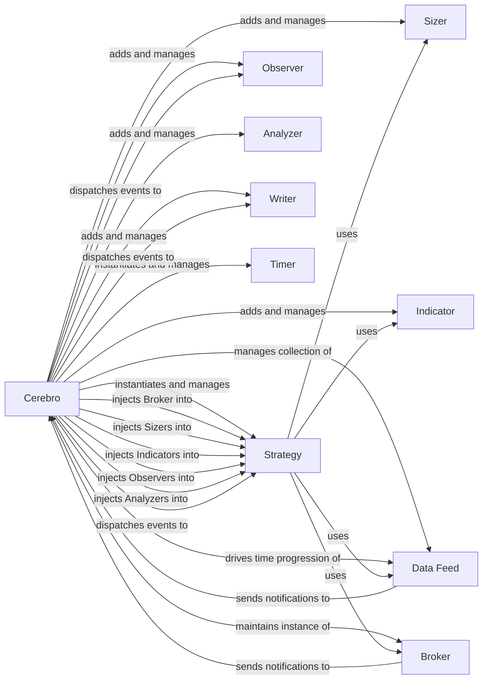

## Component Details

The Cerebro component in backtrader serves as the central orchestrator and execution engine for backtesting and live trading simulations. It manages the lifecycle and interactions of all other core components, driving the simulation process by advancing time and coordinating events.

### Cerebro
The core engine responsible for setting up, running, and managing the entire backtesting or live trading simulation. It acts as the central hub, connecting and coordinating data feeds, strategies, brokers, and other analytical or observational components.

**Related Classes/Methods**:

- <a href="https://github.com/mementum/backtrader/blob/master/backtrader/cerebro.py#L59-L1715" target="_blank" rel="noopener noreferrer">`Cerebro` (59:1715)</a>

### Strategy
Encapsulates the trading logic, defining when to buy, sell, or hold assets based on market data and indicators. Cerebro instantiates and executes strategies.

**Related Classes/Methods**:

- <a href="https://github.com/mementum/backtrader/blob/master/backtrader/strategy.py#L106-L1468" target="_blank" rel="noopener noreferrer">`Strategy` (106:1468)</a>

### Data Feed
Provides historical or live market data (e.g., OHLCV). Cerebro manages the data feeds, advancing them bar by bar or tick by tick, and making this data available to strategies.

**Related Classes/Methods**:

- `Data Feed` (1:1)

### Broker
Simulates or connects to a real trading broker, handling order execution, position management, and cash/portfolio tracking. Cerebro maintains an instance of the broker and interacts with it for trade operations.

**Related Classes/Methods**:

- <a href="https://github.com/mementum/backtrader/blob/master/backtrader/broker.py#L1-L1" target="_blank" rel="noopener noreferrer">`Broker` (1:1)</a>

### Observer
Monitors and collects information during the backtest or live trading, such as portfolio value, trade details, or specific metric changes. Cerebro adds and manages observers, which then receive notifications during the simulation.

**Related Classes/Methods**:

- <a href="https://github.com/mementum/backtrader/blob/master/backtrader/observer.py#L45-L67" target="_blank" rel="noopener noreferrer">`Observer` (45:67)</a>

### Analyzer
Performs statistical analysis on the results of a backtest, providing metrics like returns, drawdown, or Sharpe ratio. Cerebro adds and manages analyzers, which process data collected during the run.

**Related Classes/Methods**:

- <a href="https://github.com/mementum/backtrader/blob/master/backtrader/analyzer.py#L88-L285" target="_blank" rel="noopener noreferrer">`Analyzer` (88:285)</a>

### Sizer
Determines the quantity (size) of an asset to trade when an order is placed. Cerebro can set a default sizer or assign specific sizers to individual strategies.

**Related Classes/Methods**:

- <a href="https://github.com/mementum/backtrader/blob/master/backtrader/sizer.py#L28-L80" target="_blank" rel="noopener noreferrer">`Sizer` (28:80)</a>

### Indicator
Implements technical analysis calculations (e.g., Moving Averages, RSI). While indicators are often used within strategies, Cerebro can also add them globally to be available to all strategies.

**Related Classes/Methods**:

- <a href="https://github.com/mementum/backtrader/blob/master/backtrader/indicator.py#L89-L135" target="_blank" rel="noopener noreferrer">`Indicator` (89:135)</a>

### Writer
Logs detailed information about the simulation to various outputs (e.g., CSV files, console). Cerebro manages the writers and feeds them data during the simulation.

**Related Classes/Methods**:

- <a href="https://github.com/mementum/backtrader/blob/master/backtrader/writer.py#L1-L1" target="_blank" rel="noopener noreferrer">`Writer` (1:1)</a>

### Timer
Schedules time-based events within the simulation, allowing for actions to be triggered at specific times or intervals. Cerebro manages and notifies these timers.

**Related Classes/Methods**:

- <a href="https://github.com/mementum/backtrader/blob/master/backtrader/timer.py#L41-L224" target="_blank" rel="noopener noreferrer">`Timer` (41:224)</a>

### [FAQ](https://github.com/CodeBoarding/GeneratedOnBoardings/tree/main?tab=readme-ov-file#faq)