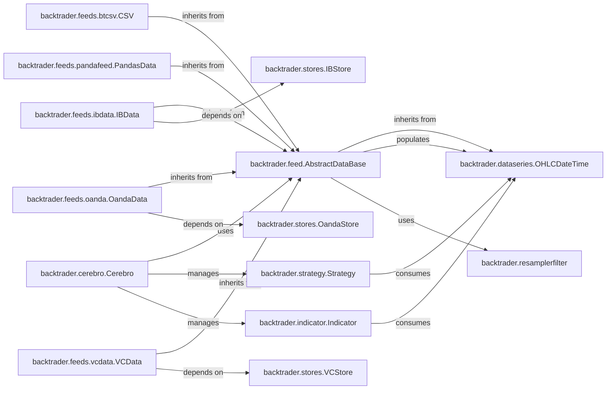

## Component Details

The `Data Feed` subsystem in `backtrader` is crucial for providing time-series market data to the core `Cerebro` engine, which then disseminates it to `Strategies` and `Indicators`. This subsystem is designed to handle various data sources, manage data synchronization, and ensure data integrity through features like resampling.

### backtrader.feed.AbstractDataBase
This is the abstract base class for all data feeds in `backtrader`. It defines the fundamental interface and common functionalities for ingesting and managing time-series data. It handles parameters such as `dataname`, `compression`, `timeframe`, and date/time filtering (`fromdate`, `todate`, `sessionstart`, `sessionend`). It also manages internal data structures for filter operations and integrates with resampling/replaying capabilities.

**Related Classes/Methods**:

- <a href="https://github.com/mementum/backtrader/blob/master/backtrader/feed.py#L121-L595" target="_blank" rel="noopener noreferrer">`backtrader.feed.AbstractDataBase` (121:595)</a>

### backtrader.feeds.btcsv.CSV
A concrete implementation of a data feed specifically designed to read market data from CSV files. This component is essential for backtesting, allowing users to easily load historical data from widely available CSV formats.

**Related Classes/Methods**:

- <a href="https://github.com/mementum/backtrader/blob/master/backtrader/feeds/btcsv.py#L1-L1" target="_blank" rel="noopener noreferrer">`backtrader.feeds.btcsv.CSV` (1:1)</a>

### backtrader.feeds.pandafeed.PandasData
This data feed class enables the direct consumption of market data from Pandas DataFrames. It offers significant flexibility, allowing users to integrate custom data processing pipelines or pre-existing data in DataFrame format into `backtrader`.

**Related Classes/Methods**:

- <a href="https://github.com/mementum/backtrader/blob/master/backtrader/feeds/pandafeed.py#L106-L272" target="_blank" rel="noopener noreferrer">`backtrader.feeds.pandafeed.PandasData` (106:272)</a>

### backtrader.feeds.ibdata.IBData
This component provides live market data by integrating with Interactive Brokers (IB). It's crucial for real-time trading scenarios, fetching data directly from the IB platform.

**Related Classes/Methods**:

- <a href="https://github.com/mementum/backtrader/blob/master/backtrader/feeds/ibdata.py#L44-L703" target="_blank" rel="noopener noreferrer">`backtrader.feeds.ibdata.IBData` (44:703)</a>

### backtrader.feeds.oanda.OandaData
A data feed component that connects to Oanda to provide live market data. Similar to `IBData`, it facilitates live trading operations by streaming real-time data from the Oanda platform.

**Related Classes/Methods**:

- <a href="https://github.com/mementum/backtrader/blob/master/backtrader/feeds/oanda.py#L43-L448" target="_blank" rel="noopener noreferrer">`backtrader.feeds.oanda.OandaData` (43:448)</a>

### backtrader.feeds.vcdata.VCData
This data feed component is responsible for handling data streams from Visual Chart, a charting and trading platform. It allows integration with Visual Chart's data sources for analysis and trading.

**Related Classes/Methods**:

- <a href="https://github.com/mementum/backtrader/blob/master/backtrader/feeds/vcdata.py#L46-L594" target="_blank" rel="noopener noreferrer">`backtrader.feeds.vcdata.VCData` (46:594)</a>

### backtrader.cerebro.Cerebro
The central orchestrator of the `backtrader` framework. `Cerebro` is responsible for adding and managing data feeds, running strategies, and coordinating the entire backtesting or live trading process. It acts as the primary consumer of data from the `Data Feed` components.

**Related Classes/Methods**:

- <a href="https://github.com/mementum/backtrader/blob/master/backtrader/cerebro.py#L59-L1715" target="_blank" rel="noopener noreferrer">`backtrader.cerebro.Cerebro` (59:1715)</a>

### backtrader.strategy.Strategy
This is the core component where users implement their trading logic. Strategies consume market data provided by `Cerebro` (via `DataSeries`) to analyze market conditions, generate signals, and execute trades.

**Related Classes/Methods**:

- <a href="https://github.com/mementum/backtrader/blob/master/backtrader/strategy.py#L106-L1468" target="_blank" rel="noopener noreferrer">`backtrader.strategy.Strategy` (106:1468)</a>

### backtrader.indicator.Indicator
Components used for technical analysis. Indicators consume market data from `DataSeries` (provided by `Cerebro`) to calculate and generate technical signals or values (e.g., Moving Averages, RSI).

**Related Classes/Methods**:

- <a href="https://github.com/mementum/backtrader/blob/master/backtrader/indicator.py#L89-L135" target="_blank" rel="noopener noreferrer">`backtrader.indicator.Indicator` (89:135)</a>

### backtrader.dataseries.OHLCDateTime
Represents the actual time-series data lines (Open, High, Low, Close, Volume, DateTime) that are populated by `Data Feed` components. These `DataSeries` instances are then consumed by `Strategies` and `Indicators` for their calculations and decision-making.

**Related Classes/Methods**:

- <a href="https://github.com/mementum/backtrader/blob/master/backtrader/dataseries.py#L110-L111" target="_blank" rel="noopener noreferrer">`backtrader.dataseries.OHLCDateTime` (110:111)</a>

### backtrader.resamplerfilter
This component provides functionalities for resampling and replaying historical data within data feeds. It is crucial for handling different timeframes (e.g., converting tick data to 1-minute bars) and ensuring data consistency during backtesting or live trading.

**Related Classes/Methods**:

- <a href="https://github.com/mementum/backtrader/blob/master/backtrader/resamplerfilter.py#L1-L1" target="_blank" rel="noopener noreferrer">`backtrader.resamplerfilter` (1:1)</a>

### backtrader.stores.IBStore
Manages the underlying connection and data retrieval mechanisms for Interactive Brokers. It serves as a backend for the `IBData` feed, handling the complexities of API communication and data streaming.

**Related Classes/Methods**:

- `backtrader.stores.IBStore` (1:1)

### backtrader.stores.OandaStore
Manages the connection and data retrieval from Oanda, serving as a backend for the `OandaData` feed. It handles the specifics of Oanda's API for real-time data.

**Related Classes/Methods**:

- `backtrader.stores.OandaStore` (1:1)

### backtrader.stores.VCStore
Manages the connection and data retrieval from Visual Chart, serving as a backend for the `VCData` feed. It handles the specific communication protocols for Visual Chart data.

**Related Classes/Methods**:

- `backtrader.stores.VCStore` (1:1)

### [FAQ](https://github.com/CodeBoarding/GeneratedOnBoardings/tree/main?tab=readme-ov-file#faq)