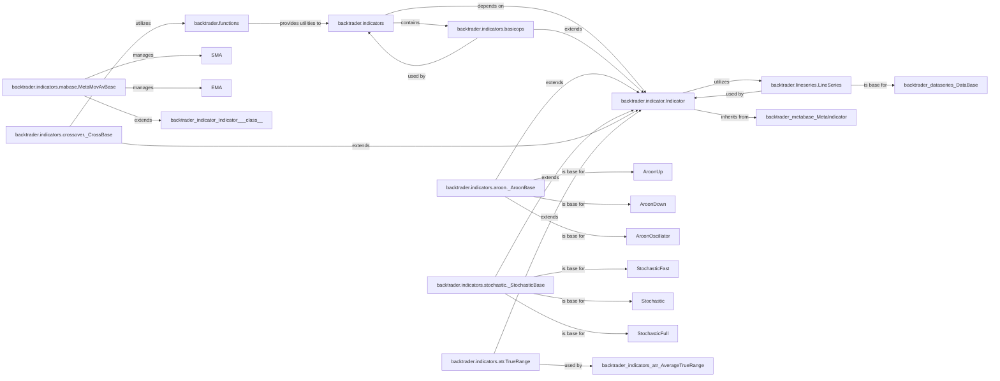

## Component Details

Analysis of the `Indicator` subsystem in `backtrader`, focusing on its core components, their responsibilities, and interactions for implementing technical analysis calculations. The subsystem is built around the `Indicator` base class and `LineSeries` for data handling, supported by a `functions` module and organized into various specialized indicator modules and base classes for common patterns like moving averages, Aroon, Stochastic, and Crossover indicators. This structure promotes modularity, reusability, and consistency in developing technical analysis tools within `backtrader`.

### backtrader.indicator.Indicator
This is the foundational abstract base class for all technical indicators within `backtrader`. It provides the core mechanism for processing data lines, managing the indicator's state over time, and defining the `next` and `prenext` methods for iterative calculations. All concrete indicators inherit from this class, ensuring a consistent interface and lifecycle.

**Related Classes/Methods**:

- <a href="https://github.com/mementum/backtrader/blob/master/backtrader/indicator.py#L1-L1" target="_blank" rel="noopener noreferrer">`backtrader.indicator.Indicator:next` (1:1)</a>
- <a href="https://github.com/mementum/backtrader/blob/master/backtrader/indicator.py#L1-L1" target="_blank" rel="noopener noreferrer">`backtrader.indicator.Indicator:prenext` (1:1)</a>

### backtrader.lineseries.LineSeries
This component represents a generic series of data points over time. It is the primary data structure that indicators operate on (as input) and produce (as output). It provides methods for accessing historical data points and managing the series' length and synchronization, crucial for time-series analysis.

**Related Classes/Methods**: _None_

### backtrader.functions
This module provides a collection of common mathematical and statistical functions (e.g., `Max`, `Min`, `Sum`, `Average`, `Div`) that are frequently used by various indicators for their calculations. These functions are designed to operate efficiently on `LineSeries` objects or their underlying data.

**Related Classes/Methods**:

- <a href="https://github.com/mementum/backtrader/blob/master/backtrader/functions.py#L240-L241" target="_blank" rel="noopener noreferrer">`backtrader.functions.Max` (240:241)</a>
- <a href="https://github.com/mementum/backtrader/blob/master/backtrader/functions.py#L244-L245" target="_blank" rel="noopener noreferrer">`backtrader.functions.Min` (244:245)</a>
- <a href="https://github.com/mementum/backtrader/blob/master/backtrader/functions.py#L248-L249" target="_blank" rel="noopener noreferrer">`backtrader.functions.Sum` (248:249)</a>
- <a href="https://github.com/mementum/backtrader/blob/master/backtrader/functions.py#L1-L1" target="_blank" rel="noopener noreferrer">`backtrader.functions.Average` (1:1)</a>
- <a href="https://github.com/mementum/backtrader/blob/master/backtrader/functions.py#L1-L1" target="_blank" rel="noopener noreferrer">`backtrader.functions.Div` (1:1)</a>

### backtrader.indicators
This is the main package containing all concrete technical indicator implementations. Each file within this directory typically represents a specific indicator (e.g., SMA, MACD, RSI) or a base class for a family of indicators. These indicators inherit from `backtrader.indicator.Indicator` and utilize `LineSeries` and functions from `backtrader.functions` for their operations.

**Related Classes/Methods**: _None_

### backtrader.indicators.basicops
This module contains fundamental operational indicators like `PeriodN`, `SumN`, `Average`, `ExponentialSmoothing`, and `WeightedAverage`. These are often used as low-level building blocks or helper indicators for constructing more complex technical indicators.

**Related Classes/Methods**:

- <a href="https://github.com/mementum/backtrader/blob/master/backtrader/indicators/basicops.py#L32-L43" target="_blank" rel="noopener noreferrer">`backtrader.indicators.basicops.PeriodN` (32:43)</a>
- <a href="https://github.com/mementum/backtrader/blob/master/backtrader/indicators/basicops.py#L160-L171" target="_blank" rel="noopener noreferrer">`backtrader.indicators.basicops.SumN` (160:171)</a>
- <a href="https://github.com/mementum/backtrader/blob/master/backtrader/indicators/basicops.py#L340-L363" target="_blank" rel="noopener noreferrer">`backtrader.indicators.basicops.Average` (340:363)</a>
- <a href="https://github.com/mementum/backtrader/blob/master/backtrader/indicators/basicops.py#L366-L411" target="_blank" rel="noopener noreferrer">`backtrader.indicators.basicops.ExponentialSmoothing` (366:411)</a>
- <a href="https://github.com/mementum/backtrader/blob/master/backtrader/indicators/basicops.py#L457-L493" target="_blank" rel="noopener noreferrer">`backtrader.indicators.basicops.WeightedAverage` (457:493)</a>

### backtrader.indicators.mabase.MetaMovAvBase
This metaclass is specifically involved in the registration and management of moving average indicators. Its `__new__` method intercepts class creation to register new moving average classes, providing a unified approach to their creation and configuration.

**Related Classes/Methods**:

- <a href="https://github.com/mementum/backtrader/blob/master/backtrader/indicators/mabase.py#L78-L85" target="_blank" rel="noopener noreferrer">`backtrader.indicators.mabase.MetaMovAvBase:__new__` (78:85)</a>

### backtrader.indicators.aroon._AroonBase
A specialized base class for the Aroon family of indicators (`AroonUp`, `AroonDown`, `AroonOscillator`). It encapsulates common logic, initialization, and calculation patterns shared by these related indicators, promoting code reuse and a consistent structure.

**Related Classes/Methods**: _None_

### backtrader.indicators.stochastic._StochasticBase
Similar to `_AroonBase`, this is a specialized base class for the Stochastic family of indicators (`StochasticFast`, `Stochastic`, `StochasticFull`). It provides shared initialization and calculation logic, streamlining the implementation of these related indicators.

**Related Classes/Methods**: _None_

### backtrader.indicators.crossover._CrossBase
A specialized base class for indicators that detect when one data line crosses another. It provides the core logic for identifying crossover events, often utilizing internal components like `NonZeroDifference` to determine the crossing condition.

**Related Classes/Methods**:

- <a href="https://github.com/mementum/backtrader/blob/master/backtrader/functions.py#L228-L229" target="_blank" rel="noopener noreferrer">`backtrader.functions.And` (228:229)</a>

### backtrader.indicators.atr.TrueRange
A specific indicator that calculates the True Range, which is a crucial component for other indicators like the Average True Range (ATR). It demonstrates the compositional nature of indicators, where simpler indicators can be used as building blocks for more complex ones.

**Related Classes/Methods**: _None_

### [FAQ](https://github.com/CodeBoarding/GeneratedOnBoardings/tree/main?tab=readme-ov-file#faq)