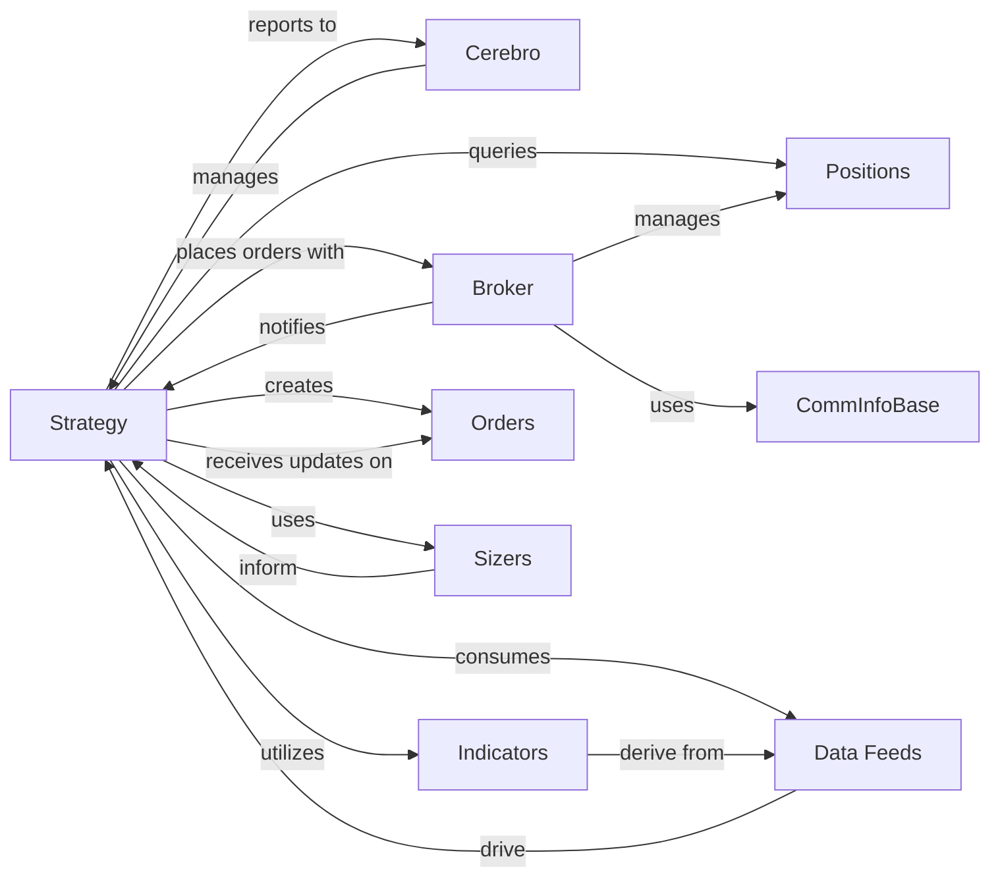

## Component Details

The `backtrader` project is a Pythonic algorithmic trading library. The `Strategy` component is central to this system, as it encapsulates the user's trading logic and interacts with other core components to execute and manage trades.

### Strategy
The `Strategy` component (`backtrader.strategy.Strategy`) is the primary abstraction where users define their trading algorithms. It provides methods to interact with market data, place orders, manage positions, and incorporate technical indicators. It acts as the decision-making unit, reacting to market events and orchestrating trading operations.

**Related Classes/Methods**:

- <a href="https://github.com/mementum/backtrader/blob/master/backtrader/strategy.py#L106-L1468" target="_blank" rel="noopener noreferrer">`backtrader.strategy.Strategy` (106:1468)</a>

### Cerebro
`Cerebro` (`backtrader.cerebro.Cerebro`) is the core engine of `backtrader`. It orchestrates the entire backtesting or live trading process. It feeds market data to the `Strategy`, manages the lifecycle of strategies, brokers, data feeds, and other components, and handles the overall execution flow.

**Related Classes/Methods**:

- <a href="https://github.com/mementum/backtrader/blob/master/backtrader/cerebro.py#L59-L1715" target="_blank" rel="noopener noreferrer">`backtrader.cerebro.Cerebro` (59:1715)</a>

### Broker
The `Broker` component (`backtrader.broker.BrokerBase`) is responsible for simulating or executing trading orders. It manages cash, portfolio value, and positions, and notifies the `Strategy` about order status changes (e.g., filled, canceled, rejected).

**Related Classes/Methods**:

- <a href="https://github.com/mementum/backtrader/blob/master/backtrader/broker.py#L48-L165" target="_blank" rel="noopener noreferrer">`backtrader.broker.BrokerBase` (48:165)</a>

### Data Feeds
`Data Feeds` (represented by classes like `backtrader.feed.Feed` and its subclasses, though `Feed` itself is an abstract base) provide market data (e.g., OHLCV bars, tick data) to the `Strategy`. They are responsible for loading and delivering historical or live data in a structured format.

**Related Classes/Methods**:

- <a href="https://github.com/mementum/backtrader/blob/master/backtrader/feed.py#L1-L1" target="_blank" rel="noopener noreferrer">`backtrader.feed.Feed` (1:1)</a>

### Indicators
`Indicators` (`backtrader.indicator.Indicator`) are technical analysis tools that process market data to generate signals or insights (e.g., Moving Averages, RSI, MACD). They are typically calculated based on `Data Feeds` or other indicators.

**Related Classes/Methods**:

- <a href="https://github.com/mementum/backtrader/blob/master/backtrader/indicator.py#L89-L135" target="_blank" rel="noopener noreferrer">`backtrader.indicator.Indicator` (89:135)</a>

### Orders
`Orders` (`backtrader.order.OrderBase`) represent trading instructions (buy/sell) with specific parameters (e.g., size, price, execution type). They are created by the `Strategy` and managed by the `Broker`.

**Related Classes/Methods**:

- <a href="https://github.com/mementum/backtrader/blob/master/backtrader/order.py#L221-L524" target="_blank" rel="noopener noreferrer">`backtrader.order.OrderBase` (221:524)</a>

### Positions
`Positions` (`backtrader.position.Position`) track the current holdings of an asset (size and average entry price). They are managed by the `Broker` and provide the `Strategy` with information about its open trades.

**Related Classes/Methods**:

- <a href="https://github.com/mementum/backtrader/blob/master/backtrader/position.py#L27-L205" target="_blank" rel="noopener noreferrer">`backtrader.position.Position` (27:205)</a>

### Sizers
`Sizers` (`backtrader.sizer.Sizer`) determine the quantity of assets to trade for an order. They encapsulate the logic for calculating appropriate order sizes based on various factors (e.g., risk, capital, position).

**Related Classes/Methods**:

- <a href="https://github.com/mementum/backtrader/blob/master/backtrader/sizer.py#L28-L80" target="_blank" rel="noopener noreferrer">`backtrader.sizer.Sizer` (28:80)</a>

### CommInfoBase
`CommInfoBase` (`backtrader.comminfo.CommInfoBase`) defines the commission scheme and other financial parameters (e.g., margin, leverage, interest) associated with trading instruments. This information is used by the `Broker` to calculate costs and by the `Strategy` (implicitly through the Broker) for profit/loss calculations.

**Related Classes/Methods**:

- <a href="https://github.com/mementum/backtrader/blob/master/backtrader/comminfo.py#L29-L304" target="_blank" rel="noopener noreferrer">`backtrader.comminfo.CommInfoBase` (29:304)</a>

### [FAQ](https://github.com/CodeBoarding/GeneratedOnBoardings/tree/main?tab=readme-ov-file#faq)