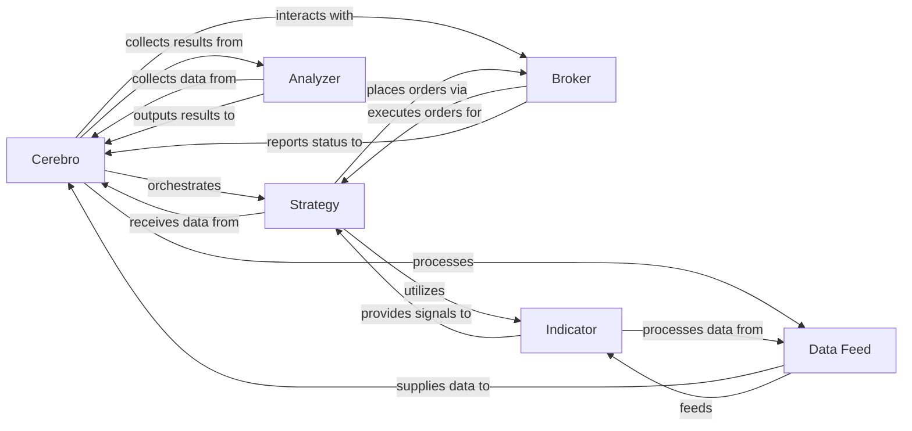

## Component Details

The `backtrader` architecture is built around a core set of components that interact to simulate or execute trading strategies.

### Cerebro
The central orchestrator and execution engine of `backtrader`. It manages the lifecycle of all other components, including data feeds, strategies, brokers, analyzers, and observers, driving the simulation or live trading process by advancing time and coordinating interactions.

**Related Classes/Methods**:

- <a href="https://github.com/mementum/backtrader/blob/master/backtrader/cerebro.py#L1-L1" target="_blank" rel="noopener noreferrer">`backtrader.cerebro` (1:1)</a>

### Strategy
Encapsulates the user's trading logic. Users define their buy/sell rules, indicator usage, and order management within a `Strategy` subclass. It reacts to new market data and interacts with the `Broker` to place orders.

**Related Classes/Methods**:

- <a href="https://github.com/mementum/backtrader/blob/master/backtrader/strategy.py#L1-L1" target="_blank" rel="noopener noreferrer">`backtrader.strategy` (1:1)</a>

### Data Feed
Provides time-series market data (e.g., OHLCV bars, ticks) to `Cerebro` and subsequently to `Strategies` and `Indicators`. It handles loading data from various sources (CSV, Pandas DataFrames, live feeds) and manages data synchronization.

**Related Classes/Methods**:

- <a href="https://github.com/mementum/backtrader/blob/master/backtrader/feed.py#L1-L1" target="_blank" rel="noopener noreferrer">`backtrader.feed` (1:1)</a>
- `backtrader.feeds.csvfeed` (1:1)
- <a href="https://github.com/mementum/backtrader/blob/master/backtrader/feeds/pandafeed.py#L1-L1" target="_blank" rel="noopener noreferrer">`backtrader.feeds.pandafeed` (1:1)</a>

### Broker
Simulates or connects to a real trading account. It manages cash, portfolio value, and the execution of trading orders. It processes order requests from `Strategies` and notifies them of order status changes and trade executions.

**Related Classes/Methods**:

- <a href="https://github.com/mementum/backtrader/blob/master/backtrader/broker.py#L1-L1" target="_blank" rel="noopener noreferrer">`backtrader.broker` (1:1)</a>
- `backtrader.brokers.backbroker` (1:1)

### Indicator
Implements technical analysis calculations (e.g., Moving Averages, MACD, RSI). Indicators operate on `Data Feeds` or other `Indicators`, producing new data series that `Strategies` can use.

**Related Classes/Methods**:

- <a href="https://github.com/mementum/backtrader/blob/master/backtrader/indicator.py#L1-L1" target="_blank" rel="noopener noreferrer">`backtrader.indicator` (1:1)</a>
- <a href="https://github.com/mementum/backtrader/blob/master/backtrader/indicators/sma.py#L1-L1" target="_blank" rel="noopener noreferrer">`backtrader.indicators.sma` (1:1)</a>
- <a href="https://github.com/mementum/backtrader/blob/master/backtrader/indicators/macd.py#L1-L1" target="_blank" rel="noopener noreferrer">`backtrader.indicators.macd` (1:1)</a>

### Analyzer
Calculates and aggregates various performance metrics and statistics of the trading strategy during or after a backtest. Analyzers are attached to `Cerebro` or `Strategy` and process data as the simulation runs.

**Related Classes/Methods**:

- <a href="https://github.com/mementum/backtrader/blob/master/backtrader/analyzer.py#L1-L1" target="_blank" rel="noopener noreferrer">`backtrader.analyzer` (1:1)</a>
- <a href="https://github.com/mementum/backtrader/blob/master/backtrader/analyzers/drawdown.py#L1-L1" target="_blank" rel="noopener noreferrer">`backtrader.analyzers.drawdown` (1:1)</a>
- <a href="https://github.com/mementum/backtrader/blob/master/backtrader/analyzers/sharpe.py#L1-L1" target="_blank" rel="noopener noreferrer">`backtrader.analyzers.sharpe` (1:1)</a>

### [FAQ](https://github.com/CodeBoarding/GeneratedOnBoardings/tree/main?tab=readme-ov-file#faq)