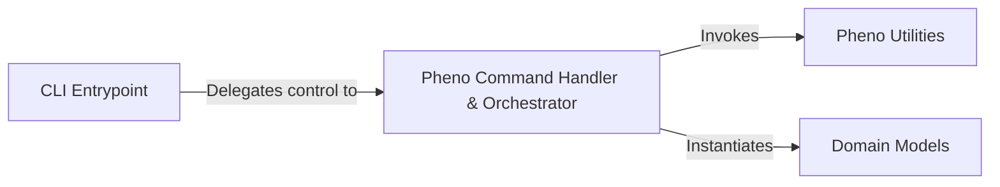

## Details

An overview of the abstract components and their relationships in the application.

### CLI Entrypoint
The primary entry point of the application, built using Typer. It is responsible for defining the CLI structure, commands (e.g., `pheno`), and parsing initial user inputs and options.

**Related Classes/Methods**:

- `bagel.cli`

### Pheno Command Handler & Orchestrator
Acts as the bridge between the CLI and the core application logic. It handles the `pheno` command, orchestrates the sequence of operations by invoking utility functions, and transforms the processed data into the final BIDS-compliant data model.

**Related Classes/Methods**:

- <a href="https://github.com/neurobagel/bagel-cli/blob/main/bagel/cli.py#L131-L303" target="_blank" rel="noopener noreferrer">`bagel.cli.pheno` (131:303)</a>

### Pheno Utilities
A collection of helper functions that perform the detailed data processing tasks. Its responsibilities include validating the input data dictionary, mapping phenotypic columns to standardized categories, and transforming individual data points.

**Related Classes/Methods**:

- `bagel.utilities.pheno_utils`

### Domain Models
A collection of Pydantic classes that define the data contracts for the application. These models are used for data validation and for instantiation by the `Pheno Command Handler & Orchestrator`.

**Related Classes/Methods**:

- `bagel.models`

### [FAQ](https://github.com/CodeBoarding/GeneratedOnBoardings/tree/main?tab=readme-ov-file#faq)