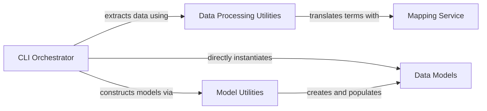

## Details

One paragraph explaining the functionality which is represented by this graph. What the main flow is and what is its purpose.

### CLI Orchestrator
A unified component that serves as the user-facing command-line interface and the central orchestrator for the data processing pipeline. It parses the pheno command, manages the workflow, and directs the extraction, transformation, and model instantiation processes.

**Related Classes/Methods**:

- `bagel/cli.py`

### Data Processing Utilities
A collection of specialized modules that perform the "Extract" and "Transform" phases for different data types (phenotypic, BIDS). They handle reading source files and applying initial transformations, including semantic mapping of terms.

**Related Classes/Methods**:

- `bagel/utilities/pheno_utils.py`
- `bagel/utilities/bids_utils.py`

### Mapping Service
A shared service responsible for semantic mapping. It translates terms from input files into the standardized Neurobagel vocabulary, ensuring data consistency. It is utilized by the data processing utilities during the transformation stage.

**Related Classes/Methods**:

- `bagel/mappings.py`

### Data Models
A set of Pydantic models defining the formal schema for the output "bagel." These models are instantiated directly by the orchestrator and populated via model utilities to ensure the final data structure is valid.

**Related Classes/Methods**:

- `bagel/models.py`

### Model Utilities
Provides helper functions that facilitate the creation and population of the Pydantic Data Models. It acts as a bridge between raw processed data and the final structured models.

**Related Classes/Methods**:

- `bagel/utilities/model_utils.py`

### [FAQ](https://github.com/CodeBoarding/GeneratedOnBoardings/tree/main?tab=readme-ov-file#faq)