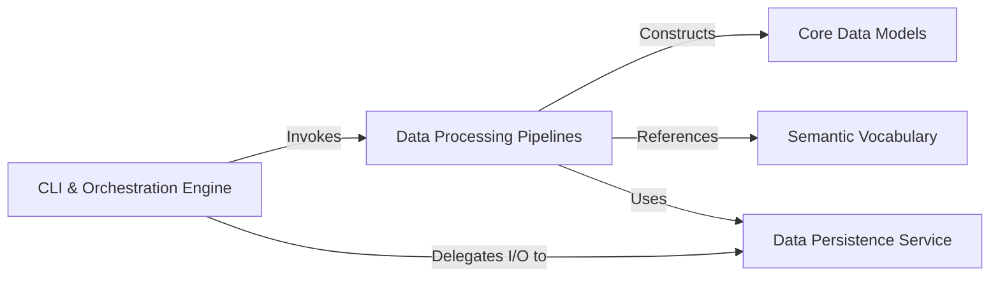

## Details

One paragraph explaining the functionality which is represented by this graph. What the main flow is and what is its purpose.

### CLI & Orchestration Engine [[Expand]](./CLI_Orchestration_Engine.md)
The primary entry point and central controller of the application. It uses Typer to define the CLI commands and orchestrates the entire data processing workflow by invoking the appropriate pipelines and services.

**Related Classes/Methods**:

- `bagel.cli.app`

### Data Processing Pipelines [[Expand]](./Data_Processing_Pipelines.md)
A collection of modules responsible for the core ETL logic. Each pipeline handles a specific data type (phenotypic, BIDS, derivatives), performing the necessary validation, transformation, and mapping.

**Related Classes/Methods**:

- `bagel.utilities.pheno_utils.get_subject_sessions`
- `bagel.utilities.bids_utils.get_bids_files`

### Core Data Models
Defines the canonical, validated data structures for the application using Pydantic. These models (e.g., Subject, ImagingSession) represent the target knowledge graph schema and ensure data integrity.

**Related Classes/Methods**:

- <a href="https://github.com/neurobagel/bagel-cli/blob/main/bagel/models.py#L84-L87" target="_blank" rel="noopener noreferrer">`bagel.models.Subject` (84:87)</a>
- <a href="https://github.com/neurobagel/bagel-cli/blob/main/bagel/models.py#L63-L64" target="_blank" rel="noopener noreferrer">`bagel.models.Session` (63:64)</a>

### Semantic Vocabulary
Provides a centralized and decoupled mapping of controlled terms and standardized identifiers. This ensures that the generated knowledge graph is interoperable and uses consistent terminology.

**Related Classes/Methods**:

- `bagel.mappings.SEX_MAP`
- <a href="https://github.com/neurobagel/bagel-cli/blob/main/bagel/dictionary_models.py#L158-L163" target="_blank" rel="noopener noreferrer">`bagel.dictionary_models.DataDictionary` (158:163)</a>

### Data Persistence Service
An abstraction layer that handles all file system interactions. It is responsible for reading source data from tabular and JSON files and for serializing the final in-memory graph of data models to a JSON-LD file.

**Related Classes/Methods**:

- <a href="https://github.com/neurobagel/bagel-cli/blob/main/bagel/utilities/file_utils.py#L64-L78" target="_blank" rel="noopener noreferrer">`bagel.utilities.file_utils.load_json` (64:78)</a>
- <a href="https://github.com/neurobagel/bagel-cli/blob/main/bagel/utilities/file_utils.py#L92-L95" target="_blank" rel="noopener noreferrer">`bagel.utilities.file_utils.save_jsonld` (92:95)</a>

### [FAQ](https://github.com/CodeBoarding/GeneratedOnBoardings/tree/main?tab=readme-ov-file#faq)